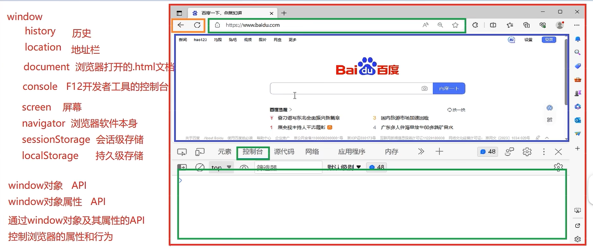
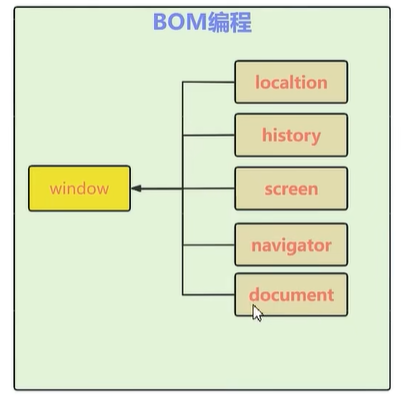
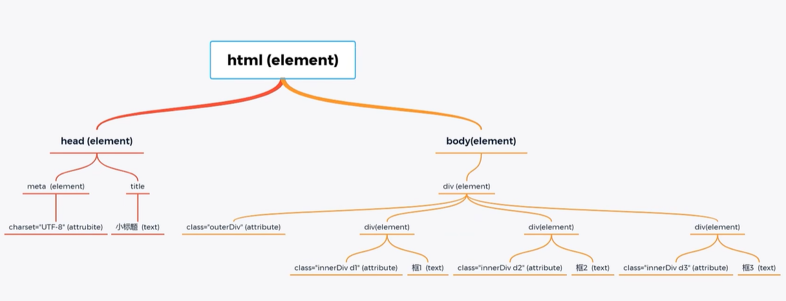

# JavaScript         

## GPTintroduction

### JavaScript 概述

**JavaScript** 是一种广泛使用的编程语言，主要用于在网页上实现动态效果和交互。它是 **Web 开发** 中的重要技术之一，通常与 **HTML** 和 **CSS** 一起使用。JavaScript 主要用于客户端编程，但也可以用于服务器端编程，尤其是在使用 **Node.js** 时。

JavaScript 是一种 **解释型语言**，通常通过浏览器的 JavaScript 引擎执行代码。它最初由 **Netscape** 开发，并且已经成为 Web 浏览器中标准的脚本语言，几乎所有现代的 Web 浏览器都支持 JavaScript。

### JavaScript 的作用和功能

JavaScript 在 Web 开发中具有以下几个主要功能：

1. **网页交互**：
   - JavaScript 使得网页能够与用户互动，处理用户的输入、点击事件、滚动事件等。
   - 通过 DOM（文档对象模型）操作，JavaScript 可以动态更新页面内容，控制 HTML 元素的样式或属性。

2. **动态内容生成**：
   - JavaScript 可以根据用户的输入或操作来动态地修改网页的内容。比如，AJAX 请求可以在不刷新页面的情况下从服务器获取数据并更新页面。

3. **验证表单**：
   - 在客户端验证用户输入（例如验证表单字段是否为空或是否符合格式）可以通过 JavaScript 实现，减少对服务器的请求。

4. **异步编程**：
   - JavaScript 提供了异步编程的能力，例如通过 **Promises**、**async/await** 等来处理异步操作，如网络请求、文件读写等。

5. **动画效果**：
   - JavaScript 可以用于实现网页中的动画效果，控制页面元素的移动、透明度变化、旋转等。

6. **构建单页应用（SPA）**：
   - 使用 JavaScript 可以构建复杂的单页应用，借助 **前端框架**（如 **React**、**Vue**、**Angular**）和 JavaScript 的路由控制实现页面间的切换，而无需每次都重新加载整个页面。

### JavaScript 的应用场景

1. **前端开发**：
   - **Web 页面交互**：如表单验证、动态内容更新、事件处理、动画效果等。
   - **AJAX 请求**：通过 JavaScript 发起异步 HTTP 请求，从服务器获取数据，并动态更新网页内容，而无需刷新整个页面。
   - **前端框架**：如 **React**、**Vue.js**、**Angular** 等前端框架都依赖于 JavaScript 来构建现代的单页应用（SPA）。

2. **后端开发**（Node.js）：
   - **Node.js** 是一个基于 Chrome V8 引擎的 JavaScript 运行环境，使得 JavaScript 可以在服务器端运行，提供了异步 I/O 处理能力，用于构建高性能的后端应用。
   - 通过 Node.js，开发者可以使用 JavaScript 编写服务器端代码，处理请求、数据库交互、文件操作等。

3. **桌面应用**（Electron）：
   - **Electron** 是一个基于 Web 技术（HTML、CSS、JavaScript）开发桌面应用的框架。使用 JavaScript 可以构建跨平台的桌面应用，如 Visual Studio Code 就是基于 Electron 开发的。

4. **移动应用**（React Native）：
   - 使用 JavaScript 通过 **React Native** 可以开发原生移动应用，支持跨平台开发（iOS 和 Android）。

5. **游戏开发**：
   - JavaScript 也可以用于开发浏览器游戏，许多游戏框架（如 Phaser）都使用 JavaScript 编写。

### JavaScript 语法和特性

1. ***变量声明***
JavaScript 使用 `var`、`let` 和 `const` 来声明变量：
- `var`：传统的声明方式，作用域是函数级别。
- `let`：块级作用域，现代 JavaScript 中推荐使用 `let`。
- `const`：常量声明，声明后值不可改变。

```javascript
let name = 'John'; // 声明一个变量
const age = 30;    // 声明一个常量
```

2. ***数据类型***
JavaScript 中的基本数据类型包括：
- **字符串**（String）
- **数字**（Number）
- **布尔值**（Boolean）
- **null 和 undefined**
- **对象**（Object）
- **数组**（Array）

```javascript
let str = 'Hello, world!';
let num = 100;
let isActive = true;
let person = { name: 'John', age: 30 };
let arr = [1, 2, 3, 4];
```

3. ***函数***
JavaScript 使用函数来组织代码，可以定义普通函数或匿名函数：
```javascript
function greet(name) {
    console.log('Hello, ' + name);
}

const sum = (a, b) => a + b; // 箭头函数
```

4. ***条件语句和循环***
JavaScript 支持常见的条件判断和循环：
```javascript
if (age > 18) {
    console.log('Adult');
} else {
    console.log('Not an adult');
}

for (let i = 0; i < 5; i++) {
    console.log(i);
}
```

5. ***事件处理***
JavaScript 可以处理用户交互的事件（如点击、提交表单等）：
```javascript
document.getElementById('myButton').addEventListener('click', function() {
    alert('Button clicked');
});
```

### JavaScript 的优势

1. **跨平台**：JavaScript 是浏览器原生支持的语言，几乎所有主流浏览器都支持它，因此开发的 Web 应用可以跨平台运行。
2. **高效性**：通过异步编程，JavaScript 可以高效地处理大量 I/O 操作，尤其是在 Node.js 环境中，能够处理高并发请求。
3. **社区支持**：JavaScript 拥有庞大的开发者社区和丰富的开源库，可以大大提高开发效率。
4. **与其他技术的兼容性**：JavaScript 可以与 HTML、CSS、服务器端技术等良好配合，构建复杂的 Web 应用。

### 总结

JavaScript 是 Web 开发不可或缺的核心技术，适用于构建动态网页、处理用户交互、构建前后端应用等。通过现代 JavaScript 技术栈（如 Node.js、React、Vue.js 等），它不仅可以用于浏览器端编程，还可以用于后端开发、桌面应用和移动应用开发。JavaScript 的灵活性、广泛的生态系统和跨平台特性使它成为 Web 开发中最常用的语言之一。


## Course Notes

### JavaScrpt
***JavaScript特点***

- JavaScript是一种 ***解释型脚本语言***， 在程序运行过程中对源文件逐行解释
- ***基于对象***：
    - JavaScript是一种基于对象的脚本语言，可以创建对象，使用现有对象，但是不完全具备面向对象的三大特性（封装，继承，多态），可以封装、模拟继承，不具备多态，所以不是一种面向对象的编程语言
- 弱类型 （如python）
- 事件驱动：不需要经过Web服务器就能对用户输入作出响应
- 跨平台性 （如java）

***JavaScript组成***
JavaScript 作为一种编程语言，主要由以下几个部分组成：

- ECMA Script (ECMAScript)：这是 JavaScript 的**核心规范**，定义了 JavaScript 的基本语法、数据类型、控制结构、函数、对象等功能。
- BOM (Browser Object Model)：**浏览器对象模型**，定义了 JavaScript 与浏览器窗口、浏览器的各种功能（如地址栏、历史记录、屏幕尺寸等）的交互。
- DOM (Document Object Model)：**文档对象模型**，定义了 JavaScript 如何与网页的结构、内容进行交互。通过 DOM，JavaScript 可以动态地修改 HTML 和 CSS


#### JS的引入方式
- `<script></script>`
- `alert("output content")`
- `function`

#### JS的基本数据类型
- `console.log()`

#### JS的分支节后
- `prompt`
- `if (expression) {} else {}`
- `switch(expresion) { case value: statements; break; case ...; default: break}`


#### JS的循环结构

#### JS的函数声明语法

#### JS_JSON


#### JS 常见对象

常见对象的API

#### 常见事件

event： 可以使浏览器行为、用户行为
这些行为发生会自动触发 对应的 JS函数运行，即 `事件发生`
JS的事件驱动就是指行为触发代码运行的特点


***常见的有三大类***
- 鼠标事件
- 键盘事件
- 表单事件

#### DOM编程绑定和触发JS 事件

事件的触发： 
- 通过DOM编程动态绑定
- 行为触发
- DOM编程触发


#### BOM编程

即 Windows对象 及其各个属性的API 能做什么

<div style="text-align:center">
    
    <p>BOM编程概念</p>
</div>

#### BOM 编程常见API
- Windows对象相关API
- Windows属性相关api


#### DOM编程
Document Object Model 就是使用 document对象的API完成对网页HTML文档的动态修改，从而实现网页数据和样式动态变化效果的编程


实际开发中，开发完成后 html 页面上（在服务器上）的 元素不再变动

客户端的浏览器接收到所请求的 html文档后会将其抽象为一个 document对象（存于浏览器内存中）
浏览器展示、操作的都是 document对象
所以用户可以在本地浏览器修改 document对象，即页面内容，但是服务器中原文档是不变的

- ***DOM编程的核心在于：使用JavaScript操作DOM对象***
- document对象代表整个html文档

<div style="text-align:center">
    
    <p>window对象、BOM、DOM之间的关系</p>
</div>

- document是树形结构对象，成为 DOM树，
- 每个元素（如 `<div>, <p>, <span>`、文本内容、注释等）都是一个节点
   - 每个节点都有其属性和方法，可以通过JavaScript访问和操作

- 根节点是document对象，它代表整个HTML文档。
- 子节点可以是元素节点（如<div>）、文本节点（如Hello）、注释节点等。
- 元素节点可以包含其他元素节点或文本节点，形成嵌套关系。


<div style="text-align:center">
    
    <p>DOM树结构举例</p>
</div>


##### 获取元素的几种方式

##### 操作元素属性

##### 创建增加替换删除元素
[对应小结网课](https://www.bilibili.com/video/BV1UN411x7xe?vd_source=a702a01e1846917f653c366933ef2676&spm_id_from=333.788.player.switch&p=48)
示例笔记
```txt
4 操作元素的属性
   1. 获取和设置属性
      var attrValue = el1.getAttribute('id'); // 获取元素的属性值
      el1.setAttribute('id', 'newId'); // 设置元素的属性值
      el1.removeAttribute('id'); // 删除元素的属性

   2. 获取和设置样式属性
      el1.style.color = 'red'; // 设置元素的内联样式
      var styleValue = el1.style.color; // 获取元素的内联样式值

   3. 类操作
      el1.classList.add('new-class'); // 给元素添加类
      el1.classList.remove('existing-class'); // 从元素移除类
      el1.classList.toggle('class-to-toggle'); // 切换元素的类

5 创建、增加、替换、删除元素
   1. 创建元素
      var newElement = document.createElement('p'); // 创建一个新的<p>元素

   2. 增加元素
      parent.appendChild(newElement); // 将新元素添加到父元素的子元素列表的末尾
      parent.insertBefore(newElement, referenceElement); // 在参考元素前插入新元素

   3. 替换元素
      var oldElement = parent.querySelector('p');
      parent.replaceChild(newElement, oldElement); // 用新元素替换旧元素

   4. 删除元素
      parent.removeChild(oldElement); // 从父元素中移除子元素
```

#### 正则表达式
[正则表达式](https://www.bilibili.com/video/BV1UN411x7xe?vd_source=a702a01e1846917f653c366933ef2676&spm_id_from=333.788.player.switch&p=50)
```txt
正则表达式（Regular Expressions）笔记

1. 正则表达式概述
   - 正则表达式是一种用于字符串搜索和操作的强大工具。
   - 它使用单个字符串来描述、匹配一系列符合某个句法规则的字符串。

2. 正则表达式的基本语法
   - 字面量字符：直接匹配指定的字符。
     例如：'abc' 匹配字符串 'abc'。
   - 特殊字符：
     . (点)：匹配任意单个字符（除了换行符）。
     *：匹配前面的子表达式零次或多次。
     +：匹配前面的子表达式一次或多次。
     ?：匹配前面的子表达式零次或一次。
     |：逻辑“或”，匹配两个表达式中的一个。
     ^：匹配输入字符串的开始位置。
     $：匹配输入字符串的结束位置。
     \s：匹配任何空白字符（包括空格、制表符、换行符等）。
     \d：匹配任何数字，等同于[0-9]。
     \w：匹配任何字母数字字符，等同于[a-zA-Z0-9_]。

3. 字符集合
   - 方括号[]用于定义字符集合，匹配集合中的任意一个字符。
     例如：[abc] 匹配 'a'、'b' 或 'c' 中的任意一个字符。
   - 范围表示法：
     例如：[0-9] 匹配任意一个数字。
     例如：[a-z] 匹配任意一个小写字母。

4. 量词
   - {n}：恰好匹配n次。
   - {n,}：至少匹配n次。
   - {n,m}：最少匹配n次且最多匹配m次。

5. 分组和捕获
   - 圆括号()用于分组，将多个表达式组合成一个子表达式。
   - 捕获组：圆括号内的表达式可以被捕获，以便后续引用。
     例如：(\d{3})-(\d{3})-(\d{4}) 匹配电话号码，并捕获三个部分。

6. 断言
   - 正向先行断言 (?=...)：确保某个位置后面跟着指定的模式。
   - 负向先行断言 (?!...)：确保某个位置后面不跟着指定的模式。
   - 正向后行断言 (?<=...)：确保某个位置前面是指定的模式。
   - 负向后行断言 (?<!...)：确保某个位置前面不是指定的模式。

7. JavaScript中的正则表达式
   - 创建正则表达式对象：var regex = /pattern/flags;
   - 常用方法：
     test(str)：测试字符串是否匹配正则表达式，返回布尔值。
     exec(str)：执行搜索匹配并返回匹配结果数组。
     match(str)：在字符串中搜索匹配正则表达式的子串，返回匹配结果数组。
     replace(str, newSubStr)：替换字符串中的匹配项。
     search(str)：在字符串中搜索匹配正则表达式的子串，返回匹配项的索引。

8. 正则表达式的应用场景
   - 验证输入：如验证邮箱、电话号码、密码等。
   - 搜索和替换：在文本中搜索特定模式并替换。
   - 数据提取：从字符串中提取特定信息，如从日志文件中提取时间戳。
   - 文本格式化：如去除多余的空格、转换大小写等。

9. 注意事项
   - 正则表达式的性能：复杂的正则表达式可能会影响性能，特别是在处理大文本时。
   - 可读性：复杂的正则表达式可能难以理解和维护，建议使用注释和拆分表达式。
```

