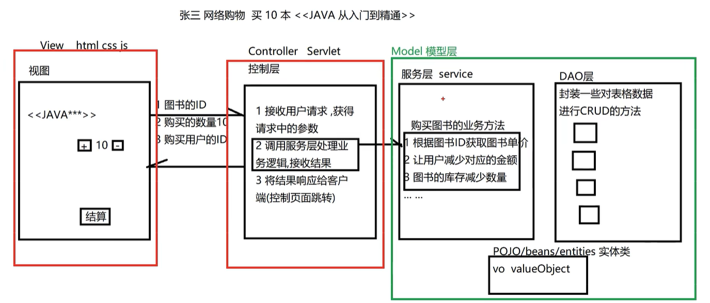
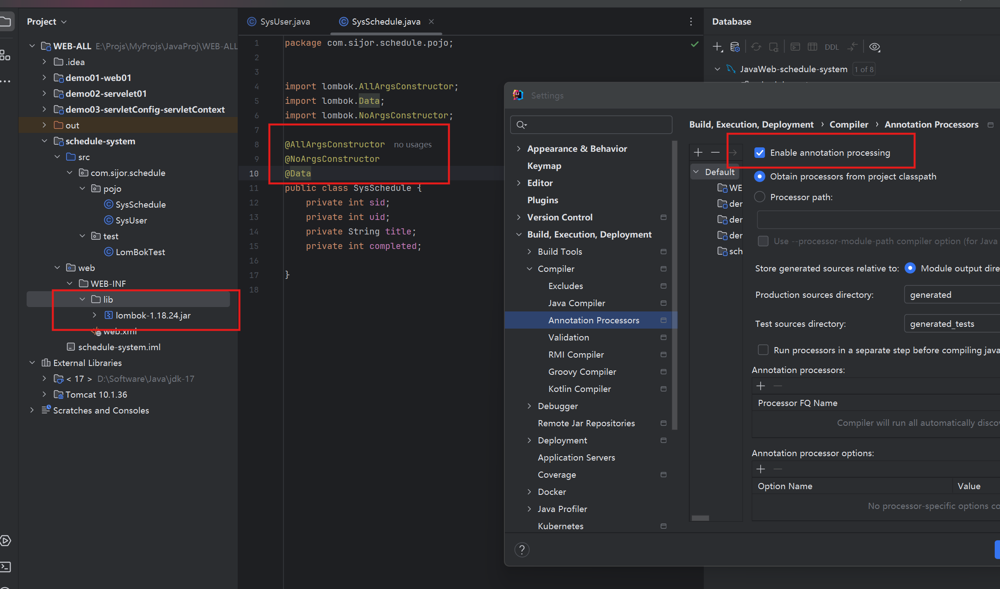

# MVC架构模式

***MVC（Model View Controller）是软件工程中的一种软件架构模式，它把软件系统分为模型、视图和控制器三个基本部分***。用一种业务逻辑、数据、界面显示分离的方法组织代码，将业务逻辑聚集到一个部件里面，在改进和个性化定制界面及用户交互的同时，不需要重新编写业务逻辑。

- M：Model 模型层，具体功能如下
  1. 存放和数据库对象的实体类以及一些用于存储非数据库表完整相关的VO对象
  2. 存放一些对数据进行逻辑运算操作的一些业务处理代码

- V：View 视图层，具体功能如下
  1. 存放一些视图文件相关的代码 html css js等
  2. 在前后端分离的项目中,后端已经没有视图文件,该层次已经衍化成独立的前端项目

- C：Controller 控制层，具体功能如下
  1. 接收客户端请求,获得请求数据
  2. 将准备好的数据响应给客户端

***MVC模式下,项目中的常见包***

- M:
  1. 实体类 (pojo / entity / bean) 专门存放和数据库对应的实体类和一些VO对象
  2. 数据库访问包 (dao / mapper) 专门存放对数据库不同表格CURD方法封装的一些类
  3. 服务包 (service) 专门存放对数据进行业务逻辑预算的一些类

- C:
  1. 控制层包 (controller)

- V:
  1. web目录下的视图资源 html css js img 等
  2. 前端工程化后,在后端项目中已经不存在了


***MVC架构模式示意***

<div style="text-align:center">
    
    <p>MVC架构模式</p>
</div>

# 日程管理


***根据上述MVC架构的示例图进行项目构造

## 项目搭建 
### 数据库准备
- 创还能 `schedule_system`数据库并执行如下语句
```sql
SET NAMES utf8mb4;
SET FOREIGN_KEY_CHECKS = 0;

DROP TABLE IF EXISTS `sys_schedule`;
CREATE TABLE `sys_schedule` (
  `sid` int NOT NULL AUTO_INCREMENT,
  `uid` int NULL DEFAULT NULL,
  `title` varchar(20) CHARACTER SET utf8mb4 COLLATE utf8mb4_0900_ai_ci NULL DEFAULT NULL,
  `completed` int(1) NULL DEFAULT NULL,
  PRIMARY KEY (`sid`) USING BTREE
) ENGINE = InnoDB AUTO_INCREMENT = 1 CHARACTER SET = utf8mb4 COLLATE = utf8mb4_0900_ai_ci ROW_FORMAT = Dynamic;

-- -------------------------
-- 插入日程数据
-- -------------------------

-- -------------------------
-- 创建用户表
-- -------------------------
DROP TABLE IF EXISTS `sys_user`;
CREATE TABLE `sys_user` (
  `uid` int NOT NULL AUTO_INCREMENT,
  `username` varchar(10) CHARACTER SET utf8mb4 COLLATE utf8mb4_0900_ai_ci NULL DEFAULT NULL,
  `user_pwd` varchar(100) CHARACTER SET utf8mb4 COLLATE utf8mb4_0900_ai_ci NULL DEFAULT NULL,
  PRIMARY KEY (`uid`) USING BTREE,
  UNIQUE INDEX `username` (`username`) USING BTREE
) ENGINE = InnoDB CHARACTER SET = utf8mb4 COLLATE = utf8mb4_0900_ai_ci ROW_FORMAT = Dynamic;

-- -------------------------
-- 插入用户数据
-- -------------------------
INSERT INTO `sys_user` VALUES (1, 'zhangsan', 'e10adc3949ba59abbe56e057f20f883e');
INSERT INTO `sys_user` VALUES (2, 'lisi', 'e10adc3949ba59abbe56e057f20f883e');

SET FOREIGN_KEY_CHECKS = 1;
```
### WEB 项目创建
根据 MySQL表中的字段属性，创建对应的类
- `src.com.sijor.schedule.pojo`目录下创建ORM模型对应与SQLTables 的 Java Bean类
  - `sys_user -> SysUser`
  - `sys_schedule -> SysSchedule`
  - 要求：
    - 类名见名知意对应表明
    - 类的属性和表达 列名对应
    - 类的属性均为私有
    - 每个私有属性具有 setter、getter
    - 必须具备无参构造器
    - ***应该实现序列化接口***
    - ***应该重写 类的hashCode和equals方法***
  - 使用 `lombok` 快捷构建 JavaBean类，可以关注一下差异如下：
    ```java
    public class SysUser {
      private int uid;
      private String username;
      private String user_pwd;
      // 手动使用 IDEA 快捷键添加 setter、getter、hashCode、Constructot(有参无参数)、equals
      public SysUser() {}
      public SysUser(int uid, String username, String user_pwd) { ... }
      public int getUid() { return uid; }
      public void setUid(int uid) { this.uid = uid; }
      public String getUser_pwd() { return user_pwd; }
      public void setUser_pwd(String user_pwd) { this.user_pwd = user_pwd; }
      public String getUsername() { return username; }
      public void setUsername(String username) { this.username = username; }
      @Override
      public boolean equals(Object o) { ... }
      @Override
      public int hashCode() { ... }
      @Override
      public String toString() { ... }
    }
    ```

    ```java
    // 使用 lombok
    @AllArgsConstructor
    @NoArgsConstructor
    @Data
    public class SysSchedule {
        private int sid;
        private int uid;
        private String title;
        private int completed;
    }
    ```
    <div style="text-align:center">
      
      <p>使用lombok</p>
  </div>
  - lombok的IDEA使用步骤（还有另一种 Maven方式）
    - 1. `settings -> plugins` 中搜索并下载 `Lombok` 插件
    - 2. `enable annotation processing` 勾选应用（右边红框）
    - 3. `WEB-INF.lib` 目录下添加lombok依赖，并将 `lib` 添加为 模块的库
    - 4. JavaBean 代码类实现

### DAO 层

- dao层中主要定义 DAO类的相关接口，在子目录 `impl` 中定义实现类
- 如 `SysUserDao` 是一个接口，其实现类为 `impl` 下的 `SysUserDaoImpl`
  - 对接口要写一些良好的文档说明
  ```java
  /**
   * 类介绍: ... ...
   * 作者：
   * 时间： ... ...
  */
  ```
- ***`service` 调用 DAO类只关心有什么功能，能做什么，不关心是如何实现的（使用JDBC 或 MyBaits）***

### 会话管理

***会话管理就是对 通信状态的管理，通过 cookie 和 session 来进行管理***

### 过滤器

***过滤器的工作位置在 "项目中所有目标资源之前"，即可以对请求作出过滤，也可以在 目标资源响应之前，对响应再次处理"***


