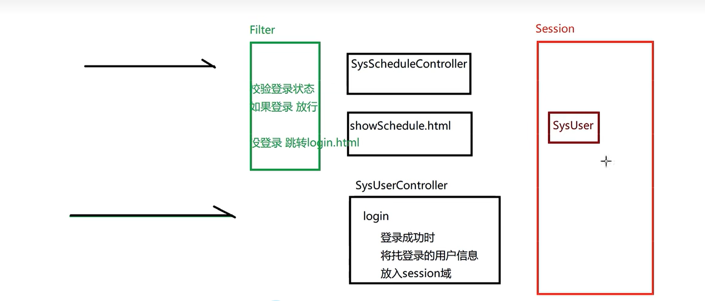

# MVC架构模式

***MVC（Model View Controller）是软件工程中的一种软件架构模式，它把软件系统分为模型、视图和控制器三个基本部分***。用一种业务逻辑、数据、界面显示分离的方法组织代码，将业务逻辑聚集到一个部件里面，在改进和个性化定制界面及用户交互的同时，不需要重新编写业务逻辑。

- M：Model 模型层，具体功能如下
  1. 存放和数据库对象的实体类以及一些用于存储非数据库表完整相关的VO对象
  2. 存放一些对数据进行逻辑运算操作的一些业务处理代码

- V：View 视图层，具体功能如下
  1. 存放一些视图文件相关的代码 html css js等
  2. 在前后端分离的项目中,后端已经没有视图文件,该层次已经衍化成独立的前端项目

- C：Controller 控制层，具体功能如下
  1. 接收客户端请求,获得请求数据
  2. 将准备好的数据响应给客户端

***MVC模式下,项目中的常见包***

- M:
  1. 实体类 (pojo / entity / bean) 专门存放和数据库对应的实体类和一些VO对象
  2. 数据库访问包 (dao / mapper) 专门存放对数据库不同表格CURD方法封装的一些类
  3. 服务包 (service) 专门存放对数据进行业务逻辑预算的一些类

- C:
  1. 控制层包 (controller)

- V:
  1. web目录下的视图资源 html css js img 等
  2. 前端工程化后,在后端项目中已经不存在了


***MVC架构模式示意***

<div style="text-align:center">
    
    <p>MVC架构模式</p>
</div>

# 日程管理


***根据上述MVC架构的示例图进行项目构造

## 日程管理第一二期
### 数据库准备
- 创还能 `schedule_system`数据库并执行如下语句
```sql
SET NAMES utf8mb4;
SET FOREIGN_KEY_CHECKS = 0;

DROP TABLE IF EXISTS `sys_schedule`;
CREATE TABLE `sys_schedule` (
  `sid` int NOT NULL AUTO_INCREMENT,
  `uid` int NULL DEFAULT NULL,
  `title` varchar(20) CHARACTER SET utf8mb4 COLLATE utf8mb4_0900_ai_ci NULL DEFAULT NULL,
  `completed` int(1) NULL DEFAULT NULL,
  PRIMARY KEY (`sid`) USING BTREE
) ENGINE = InnoDB AUTO_INCREMENT = 1 CHARACTER SET = utf8mb4 COLLATE = utf8mb4_0900_ai_ci ROW_FORMAT = Dynamic;

-- -------------------------
-- 插入日程数据
-- -------------------------

-- -------------------------
-- 创建用户表
-- -------------------------
DROP TABLE IF EXISTS `sys_user`;
CREATE TABLE `sys_user` (
  `uid` int NOT NULL AUTO_INCREMENT,
  `username` varchar(10) CHARACTER SET utf8mb4 COLLATE utf8mb4_0900_ai_ci NULL DEFAULT NULL,
  `user_pwd` varchar(100) CHARACTER SET utf8mb4 COLLATE utf8mb4_0900_ai_ci NULL DEFAULT NULL,
  PRIMARY KEY (`uid`) USING BTREE,
  UNIQUE INDEX `username` (`username`) USING BTREE
) ENGINE = InnoDB CHARACTER SET = utf8mb4 COLLATE = utf8mb4_0900_ai_ci ROW_FORMAT = Dynamic;

-- -------------------------
-- 插入用户数据
-- -------------------------
INSERT INTO `sys_user` VALUES (1, 'zhangsan', 'e10adc3949ba59abbe56e057f20f883e');
INSERT INTO `sys_user` VALUES (2, 'lisi', 'e10adc3949ba59abbe56e057f20f883e');

SET FOREIGN_KEY_CHECKS = 1;
```
### WEB 项目创建
根据 MySQL表中的字段属性，创建对应的类
- `src.com.sijor.schedule.pojo`目录下创建ORM模型对应与SQLTables 的 Java Bean类
  - `sys_user -> SysUser`
  - `sys_schedule -> SysSchedule`
  - 要求：
    - 类名见名知意对应表明
    - 类的属性和表达 列名对应
    - 类的属性均为私有
    - 每个私有属性具有 setter、getter
    - 必须具备无参构造器
    - ***应该实现序列化接口***
    - ***应该重写 类的hashCode和equals方法***
  - 使用 `lombok` 快捷构建 JavaBean类，可以关注一下差异如下：
    ```java
    public class SysUser {
      private int uid;
      private String username;
      private String user_pwd;
      // 手动使用 IDEA 快捷键添加 setter、getter、hashCode、Constructot(有参无参数)、equals
      public SysUser() {}
      public SysUser(int uid, String username, String user_pwd) { ... }
      public int getUid() { return uid; }
      public void setUid(int uid) { this.uid = uid; }
      public String getUser_pwd() { return user_pwd; }
      public void setUser_pwd(String user_pwd) { this.user_pwd = user_pwd; }
      public String getUsername() { return username; }
      public void setUsername(String username) { this.username = username; }
      @Override
      public boolean equals(Object o) { ... }
      @Override
      public int hashCode() { ... }
      @Override
      public String toString() { ... }
    }
    ```

    ```java
    // 使用 lombok
    @AllArgsConstructor
    @NoArgsConstructor
    @Data
    public class SysSchedule {
        private int sid;
        private int uid;
        private String title;
        private int completed;
    }
    ```
    <div style="text-align:center">
      
      <p>使用lombok</p>
  </div>
  - lombok的IDEA使用步骤（还有另一种 Maven方式）
    - 1. `settings -> plugins` 中搜索并下载 `Lombok` 插件
    - 2. `enable annotation processing` 勾选应用（右边红框）
    - 3. `WEB-INF.lib` 目录下添加lombok依赖，并将 `lib` 添加为 模块的库
    - 4. JavaBean 代码类实现

### DAO 层

- dao层中主要定义 DAO类的相关接口，在子目录 `impl` 中定义实现类
- 如 `SysUserDao` 是一个接口，其实现类为 `impl` 下的 `SysUserDaoImpl`
  - 对接口要写一些良好的文档说明
  ```java
  /**
   * 类介绍: ... ...
   * 作者：
   * 时间： ... ...
  */
  ```
- ***`service` 调用 DAO类只关心有什么功能，能做什么，不关心是如何实现的（使用JDBC 或 MyBaits）***

### 会话管理

***会话管理就是对 通信状态的管理，通过 cookie 和 session 来进行管理***

### 过滤器

***过滤器的工作位置在 "项目中所有目标资源之前"，即可以对请求作出过滤，也可以在 目标资源响应之前，对响应再次处理"***

### 监听器
了解您的问题，让我详细解释监听器是如何在 Java Web 应用中捕获和响应事件的。

#### 监听器的注册

首先，监听器需要在应用中注册。这可以通过两种方式完成：

1. **注解方式**：在监听器类上使用特定的注解（如 `@WebListener`）来自动注册监听器。
2. **XML配置**：在 `web.xml` 文件中配置监听器。

#### 事件的触发

当应用的生命周期事件发生时（如应用启动、会话创建、请求开始等），Servlet 容器（如 Tomcat）会检测到这些事件，并自动触发相应的监听器方法。

#### 监听器的执行

一旦事件被触发，容器会调用监听器中相应的方法来处理这些事件。例如：

- 当应用启动时，容器会调用所有注册的应用域监听器的 `contextInitialized` 方法。
- 当会话创建时，容器会调用所有注册的会话域监听器的 `sessionCreated` 方法。
- 当请求开始时，容器会调用所有注册的请求域监听器的 `requestInitialized` 方法。

#### 实践示例：ServletContextListener

假设我们有一个 `ServletContextListener` 来监听应用的启动和关闭事件：

```java
import javax.servlet.ServletContextEvent;
import javax.servlet.ServletContextListener;
import javax.servlet.annotation.WebListener;

@WebListener
public class AppListener implements ServletContextListener {

    @Override
    public void contextInitialized(ServletContextEvent sce) {
        System.out.println("Application is starting...");
        // 初始化代码，如数据库连接等
    }

    @Override
    public void contextDestroyed(ServletContextEvent sce) {
        System.out.println("Application is stopping...");
        // 清理代码，如关闭数据库连接等
    }
}
```

#### 容器如何捕获事件并调用监听器

1. **应用启动**：
   - 当应用部署到 Servlet 容器（如 Tomcat）并启动时，容器会创建 `ServletContext`。
   - 容器会查找所有使用 `@WebListener` 注解的类，或者在 `web.xml` 中配置的监听器类。
   - 容器实例化这些监听器类，并调用它们的 `contextInitialized` 方法。

2. **应用关闭**：
   - 当应用被卸载或容器关闭时，容器会调用所有注册的应用域监听器的 `contextDestroyed` 方法。

3. **会话和请求事件**：
   - 类似地，当会话创建或销毁时，容器会调用会话域监听器的 `sessionCreated` 和 `sessionDestroyed` 方法。
   - 当请求开始或结束时，容器会调用请求域监听器的 `requestInitialized` 和 `requestDestroyed` 方法。

#### 总结

监听器是 Java Web 应用中监听和响应生命周期事件的重要机制。**通过在监听器类中实现相应的方法，开发者可以在应用的关键时刻执行特定的初始化和清理工作**。**Servlet 容器自动捕获生命周期事件，并调用相应的监听器方法，使得监听器能够响应这些事件**。这种机制有助于确保应用的资源被正确管理，并在关键时刻执行必要的操作。

## 日程管理第三期

### 过滤器控制登录校验

当项目运行起来后，直接访问其中的 html资源（`showSchedule.html`），依然能够展示

***但是并不希望这些资源在 没有登录的状态下，外部可以访问到，故需要使用 过滤器 进行登录校验后 方能访问一些资源***

<div style="text-align:center">
      
      <p>过滤器控制登录校验</p>
  </div>

如过程图示：`SysUserController` 中的 `login` 仅仅执行了 校验登录用户名存在与否，密码正确与否，并没有任何对属于用户的资源的访问限制

- 添加过滤器，检测登录状态，已登录，则放行允许访问 schedule资源，否则跳转回到登录界面
- 那么如果登录成功，**Filter 如何检测到这个登陆成功的状态呢？**
  - 使用 Session 会话域：登录成功时（`login`校验账户密码通过）将用户信息放入会话域（即创建包含用户信息的 User 对象加入到会话域的键值对变量中）


#### 响应规范化

使用 JSON 格式规范请求响应交互中的数据信息格式
（使用 `jackson` 包）

```txt
{
  "code": 100/200/400/401/.. （自定义状态码）业务状态码，本次请求的业务是否成功？若失败，原因？（不是 响应报文中的响应码）
  "message": 业务状态码的补充说明
  "data":{} 本次响应的数据
  ... ...

}
```

# 前端工程化

<div style="text-align:center">
    
    <p>前后端分离</p>
</div>


## npm基本命令
`npm`（Node Package Manager）是 Node.js 的包管理器，它允许你安装、共享和管理项目依赖。`npm` 是 Node.js 生态系统的核心部分，提供了一个命令行工具来交互操作在线的 npm 注册表。

以下是 `npm` 的一些基本用法：

### 初始化项目

在一个新的项目目录中，运行以下命令来初始化一个新的 `package.json` 文件：

```sh
npm init
```

或者使用 `npm init` 的简写形式：

```sh
npm i
```

这将创建一个包含项目元数据的 `package.json` 文件，如项目名称、版本、依赖等。

### 安装依赖

你可以使用 `npm install` 命令来安装项目依赖。这可以是本地开发依赖或全局安装。

#### 安装本地依赖

```sh
npm install <package-name>
```

或者简写形式：

```sh
npm i <package-name>
```

这将安装指定的包下载到 `node_modules` 文件夹中，并在 `package.json` 文件中添加一个条目。

#### 全局安装

```sh
npm install -g <package-name>
```

或者简写形式：

```sh
npm g i -g <package-name>
```

这将安装包到全局 `node_modules` 文件夹中，不仅限于当前项目。

### 列出依赖

你可以使用以下命令列出项目依赖：

```sh
npm list
```

或者简写形式：

```sh
npm ls
```

这将显示项目中所有安装的包及其版本。

### 更新依赖

更新项目中的包到最新版本：

```sh
npm update
```

或者更新特定的包：

```sh
npm update <package-name>
```

### 卸载依赖

卸载不再需要的包：

```sh
npm uninstall <package-name>
```

或者简写形式：

```sh
npm rm <package-name>
```

### 发布包

如果你想要发布你自己的包到 npm 注册表，你可以使用以下命令：

```sh
npm publish
```

在发布之前，确保你的 `package.json` 文件中的所有信息都是正确的，并且你已经运行了 `npm test` 来验证你的包。

### 运行脚本

`npm` 允许你在 `package.json` 文件的 `scripts` 部分定义自定义脚本。例如，你可以定义一个 `start` 脚本来启动你的应用：

```json
{
  "scripts": {
    "start": "node app.js"
  }
}
```

然后，你可以通过运行以下命令来执行这个脚本：

```sh
npm start
```

或者简写形式：

```sh
npm run start
```

### 总结

`npm` 是 Node.js 开发中不可或缺的工具，它提供了一种简单的方式来管理项目依赖。以上只是 `npm` 的一些基本用法，`npm` 还有许多其他功能，如管理 npm 脚本、查看包的详细信息等。

## Vue

***Vue的两个核心功能***
- 声明式渲染
- 响应性

<div style="text-align:center">
    
    <p>声明式渲染</p>
</div>

***组件***

<div style="text-align:center">
    
    <p>组件概念</p>
</div>

### 模板语法
在 Vue 中，将组件的数据（包括普通变量和响应式变量）绑定到 DOM 上确实是 Vue 的核心功能之一

1. **数据绑定到 DOM**：
   - 在 Vue 中，您可以使用 `{{ expression }}` 语法在模板中绑定数据。这允许您将 JavaScript 变量直接插入到 HTML 中。
   - ***对于响应式变量，Vue 会自动跟踪其变化，并在变量更新时重新渲染相关的 DOM 部分。这意味着您可以通过交互直接修改变量，并实时看到更新反映在界面上***。

2. **方法绑定到事件处理器**：
   - 除了数据绑定，Vue ***还允许将方法绑定到 DOM 事件处理器上***。例如，您可以使用 `@click="methodName"` 语法将一个方法绑定到按钮的点击事件上。
   - 当事件触发时，Vue 将调用绑定的方法，您可以在方法中执行任何逻辑，包括修改数据、调用 API 等。

3. **响应式状态**：
   - 响应式状态是指使用 `ref` 创建的变量。***这些变量是响应式的，意味着它们的变化会自动触发视图的更新。***
   - 响应式状态通常用于存储组件的内部状态，如计数器、用户输入等。

4. **组件实例化过程**：
   - 当 Vue 应用启动时，它会创建组件的实例，并调用 `setup` 函数来初始化状态和方法。
   - 在 `setup` 函数中，您可以定义响应式状态、计算属性、侦听器和生命周期钩子等。
   - 定义完成后，Vue 会将这些状态和方法暴露给模板，以便在模板中使用。

5. **数据流**：
   - Vue 使用单向数据流，这意味着数据总是从父组件流向子组件。父组件可以通过 props 向子组件传递数据，子组件可以通过事件向父组件发送消息。
   - 这种数据流确保了状态的一致性和可预测性，使得调试和维护变得更加容易。

总结来说， Vue 允许将组件的数据（包括普通变量和响应式变量）绑定到 DOM 上，从而将数据呈现到界面上。同时，您还可以将方法绑定到事件处理器上，以便在用户交互时执行特定的逻辑。Vue 的响应式系统确保了数据变化时视图的自动更新，使得开发动态用户界面变得更加简单和高效。
