# XML
## 介绍
Extensible Markup Language 缩写，即 `可扩展标记语言`，和HTML一样都是标记语言，基本语法都是标签。

XML 被设计用于存储和传输数据，常用作配置文件。无需从头编写，在第三方应用程序、框架所提供的配置文件基础上修改即可

***常见配置文件类型***
1. properties文件，例如druid连接池就是使用properties文件作为配置文件
2. XML文件，例如Tomcat就是使用XML文件作为配置文件
3. YAML文件，例如SpringBoot就是使用YAML作为配置文件
4. json文件，通常用来做文件传输，也可以用来做前端或者移动端的配置文件

<div style="text-align:center">
    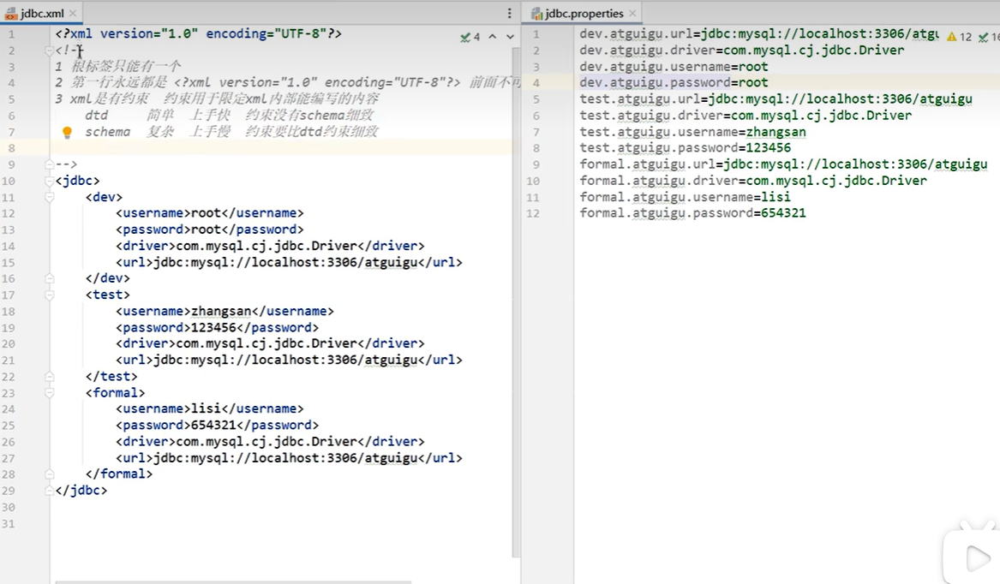
    <p>XML和Properties区别</p>
</div>

## XML约束
在 XML（可扩展标记语言）中，**约束（Constraint）** 是指用于定义和限制 XML 文档结构的规则。约束确保 XML 文档符合预期的格式和数据要求，从而提高数据的规范性和可验证性。XML 约束通常通过以下两种方式实现：

1. **DTD（Document Type Definition，文档类型定义）**
2. **XML Schema（XML 模式）**


大部分时候不需要亲自写约束，在 Web.xml 中想要添加标签，由于约束的存在，IDEA会自动提示可以添加的标签

---
### DTD

DTD 是一种较早的 XML 约束方式，用于定义 XML 文档的结构和元素规则。

1.1 **DTD 的作用**
- 定义 XML 文档中允许的元素和属性。
- 定义元素的嵌套关系和顺序。
- 定义元素的类型（如文本、空元素等）。

---

### XML Schema
XML Schema 是一种更强大、更灵活的 XML 约束方式，支持更复杂的数据类型和规则。

2.1 **XML Schema 的作用**
- 定义 XML 文档的结构、元素和属性。
- 支持数据类型定义（如字符串、整数、日期等）。
- 支持命名空间，避免元素名冲突。

2.2 **XML Schema 的语法**
- **定义元素**：
  ```xml
  <xs:element name="元素名" type="数据类型"/>
  ```
  例如：
  ```xml
  <xs:element name="title" type="xs:string"/>
  ```

- **定义复杂类型**：
  ```xml
  <xs:complexType name="类型名">
      <xs:sequence>
          <xs:element name="子元素名" type="数据类型"/>
      </xs:sequence>
  </xs:complexType>
  ```
  例如：
  ```xml
  <xs:complexType name="bookType">
      <xs:sequence>
          <xs:element name="title" type="xs:string"/>
          <xs:element name="author" type="xs:string"/>
          <xs:element name="price" type="xs:decimal"/>
      </xs:sequence>
      <xs:attribute name="id" type="xs:integer" use="required"/>
  </xs:complexType>
  ```

2.3 **XML Schema 的示例**
```xml
<xs:schema xmlns:xs="http://www.w3.org/2001/XMLSchema">
    <xs:element name="bookstore">
        <xs:complexType>
            <xs:sequence>
                <xs:element name="book" type="bookType" maxOccurs="unbounded"/>
            </xs:sequence>
        </xs:complexType>
    </xs:element>

    <xs:complexType name="bookType">
        <xs:sequence>
            <xs:element name="title" type="xs:string"/>
            <xs:element name="author" type="xs:string"/>
            <xs:element name="price" type="xs:decimal"/>
        </xs:sequence>
        <xs:attribute name="id" type="xs:integer" use="required"/>
    </xs:complexType>
</xs:schema>
```

对应的 XML 文档：
```xml
<bookstore xmlns:xsi="http://www.w3.org/2001/XMLSchema-instance"
           xsi:noNamespaceSchemaLocation="bookstore.xsd">
    <book id="1">
        <title>XML Guide</title>
        <author>John Doe</author>
        <price>29.99</price>
    </book>
</bookstore>
```

---

### 区别
| 特性                | DTD                          | XML Schema                     |
|---------------------|------------------------------|--------------------------------|
| **数据类型支持**     | 仅支持简单类型（如文本）      | 支持复杂类型（如整数、日期等） |
| **命名空间支持**     | 不支持                       | 支持                           |
| **扩展性**          | 较弱                         | 较强                           |
| **语法**            | 基于 SGML 语法               | 基于 XML 语法                  |
| **可读性**          | 较差                         | 较好                           |

---


- **XML 约束** 是用于定义和限制 XML 文档结构的规则，主要包括 DTD 和 XML Schema。
- **DTD** 是一种简单的约束方式，适合定义基本的文档结构。
- **XML Schema** 是一种更强大的约束方式，支持复杂的数据类型和命名空间。
- 使用 XML 约束可以提高数据的规范性、可验证性和可读性，是 XML 技术中的重要组成部分。


## 添加Web项目配置文件
Web项目中会有一个 Web.xml 文件，需要添加框架支持，新版IDEA中无法通过 `右键项目->添加框架支持(Add Framework Support)`

需要手动添加一下：
- `设置 -> 菜单与工具栏 -> 项目视图弹出窗口 -> 点击搜索框右侧 + 号 -> 搜索 “添加框架支持” -> 确定 -> 应用 -> 确定`
- `双击 shift -> 搜索 “添加框架与支持” -> 选择 Java EE 下的 Web应用程序`

<div style="text-align:center">
    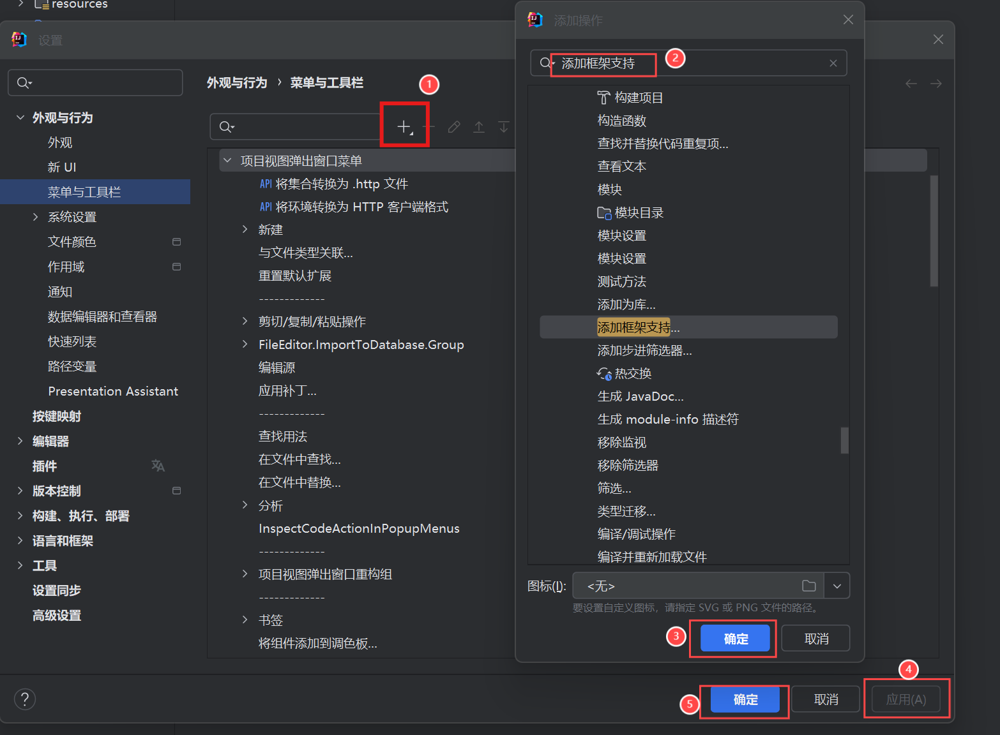
    <p>添加框架支持1</p>
</div>

<div style="text-align:center">
    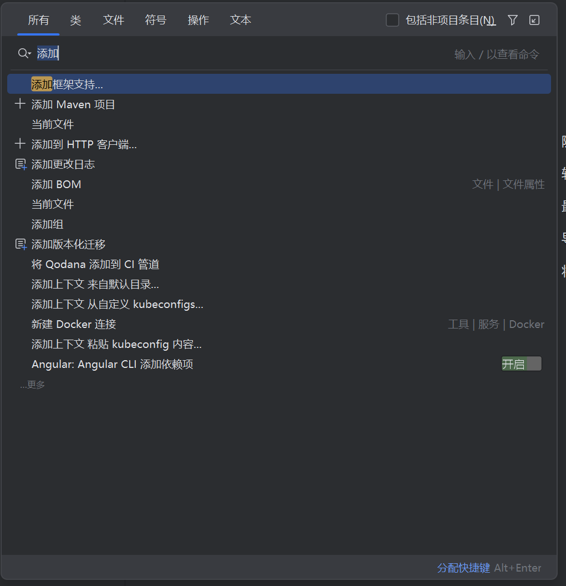
    <p>添加框架支持2</p>
</div>

## DOM4J进行XML解析
### DOM4J的使用步骤
1. 导入jar包的dom4j.jar
2. 创建解析器对象（SAXReader）
3. 解析xml 获得 Document 对象
4. 获取根节点RootElement
5. 获取根节点下的子节点

### jdbc信息的xml配置文件
```xml
<?xml version="1.0" encoding="UTF-8" ?>
<!--
1. 根标签只能有一个
2. 第一行永远是 <?xml version="1.0" encoding="UTF-8" ?>
3. XML 是有约束的，用于限定 XML 内部能编写的内容，有如下两种约束：
    dtd     简单，上手快
    schema  复杂，上手慢，约束更加细致 (Web 支持框架中WEB-INF下的Web.xml 中的 xsi:... 就是 schema约束)


PS:
    dev, test, formal 分别代表 开发、测试、正式商用的环境配置
-->
<jdbc>
    <dev id="001">
        <username>root</username>
        <password>123456</password>
        <driver>com.mysql.jdbc.Driver</driver>
        <url>jdbc:mysql://localhost:3306/atguigudb</url>
    </dev>
    <test id="002">
        <username>root</username>
        <password>123456</password>
        <driver>com.mysql.jdbc.Driver</driver>
        <url>jdbc:mysql://localhost:3306/atguigudb</url>
    </test>
    <formal id="003">
        <username>root</username>
        <password>123456</password>
        <driver>com.mysql.jdbc.Driver</driver>
        <url>jdbc:mysql://localhost:3306/atguigudb</url>
    </formal>
</jdbc>
```
### jdbc.xml 文件的解析
```java

package com.sijor.test;

import org.dom4j.Attribute;
import org.dom4j.Document;
import org.dom4j.DocumentException;
import org.dom4j.Element;
import org.dom4j.io.SAXReader;
import org.junit.Test;

import java.io.FileInputStream;
import java.io.InputStream;
import java.util.List;

public class TestDom4J {

    @Test
    public void testRead() throws DocumentException {
        // 1. 读取 jdbc.xml 配置文件，获取document 对象
        SAXReader saxReader = new SAXReader();

        // 2. 通过类加载器获得指向字节码根路径下的指定文件的 输入流
        InputStream resourceAsStream = TestDom4J.class.getClassLoader().getResourceAsStream("jdbc.xml");

        // 3. 通过输入流获得 配置文件， 解析成DOM对象
        Document document = saxReader.read(resourceAsStream);

        // 4. 从 document 对象中读取配置信息
        /*
        * Node 结点
        *   Element     元素结点
        *   Attribute   属性结点
        *   Text        文本结点
        * */

        // 4.1 获取根结点
        Element rootElement = document.getRootElement();   // 获取root Element
        System.out.println(rootElement.getName());

        // 4.2 获取根结点的子元素（子节点）
        List<Element> elements = rootElement.elements();
        for (Element element : elements) {
            System.out.println("\t" + element.getName());

            // 从元素上获取属性
            Attribute idAttribute = element.attribute("id");
            System.out.println("\t\t" + idAttribute.getName() + "=" + idAttribute.getValue());

            // 继续读取子元素
            List<Element> elems = element.elements();
            for (Element elem : elems) {
                System.out.println("\t\t" + elem.getName() + ":" + elem.getText());
            }
        }
    }
}

```

# Tomcat
[Tomcat官网](https://tomcat.apache.org/)

Tomcat 是专门运行WEB的 **服务器软件**

安装后能提供给网络中的其他计算机，将本地文件映射成一个虚拟的url地址供其他人访问

<div style="text-align:center">
    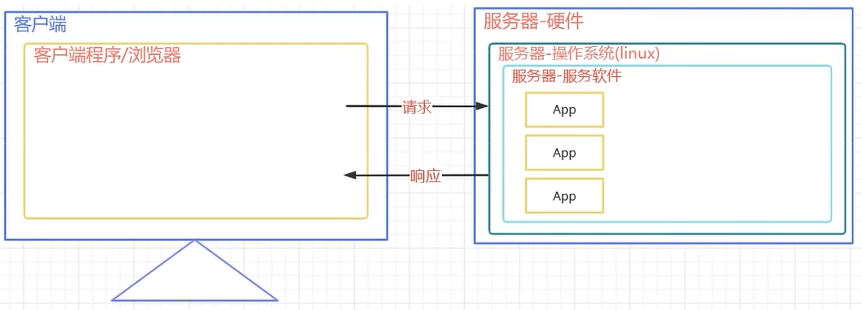
    <p>Tomcat角色</p>
</div>


***目录简介***
- `bin` 命令目录，其中开启关闭Tomcat的 .bat 命令文件，可以在配置环境变量之后直接在控制台中运行
- `conf` 各类配置文件
- `logs` 日志文件目录，可以定期清理
- `webapps` 非常重要的目录
    - 运行Tomcat 之后，输入 `webapps\examples\index.html`对应的URL到浏览器中，可以访问对应界面
    <div style="text-align:center">
        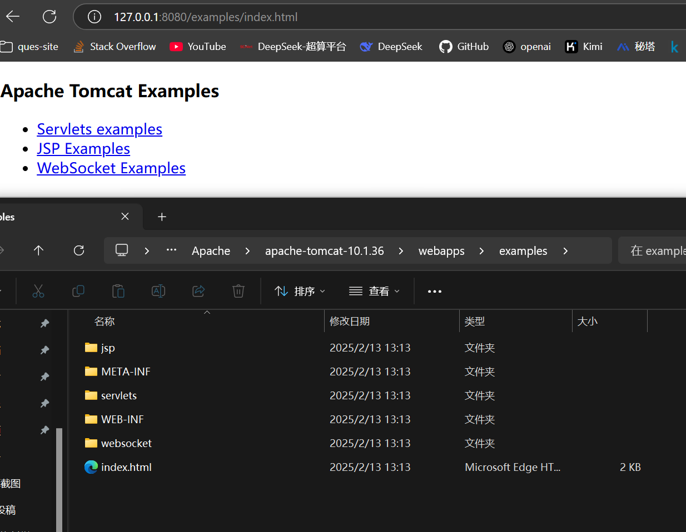
        <p>服务器资源访问</p>
    </div>

## 下载安装

- 直接官网下载 压缩包，并解压到目录下
- bin 目录下点击运行 startup.bat 则启动 Tomcat，出现一个终端框； 点击运行 shutdown.bat 的关闭 Tomcat
- 本地访问 localhost:8080 跳转图中界面，则成功启动
- ***乱码问题***
    - 在 `apache-tomcat-10.1.36\conf\logging.properties` 中进行修改
    - `Ctrl+F` 找到和 `Console` 相关的设置，将其 `encoding` 改为 `GBK`
        - `java.util.logging.ConsoleHandler.encoding = GBK`


<div style="text-align:center">
    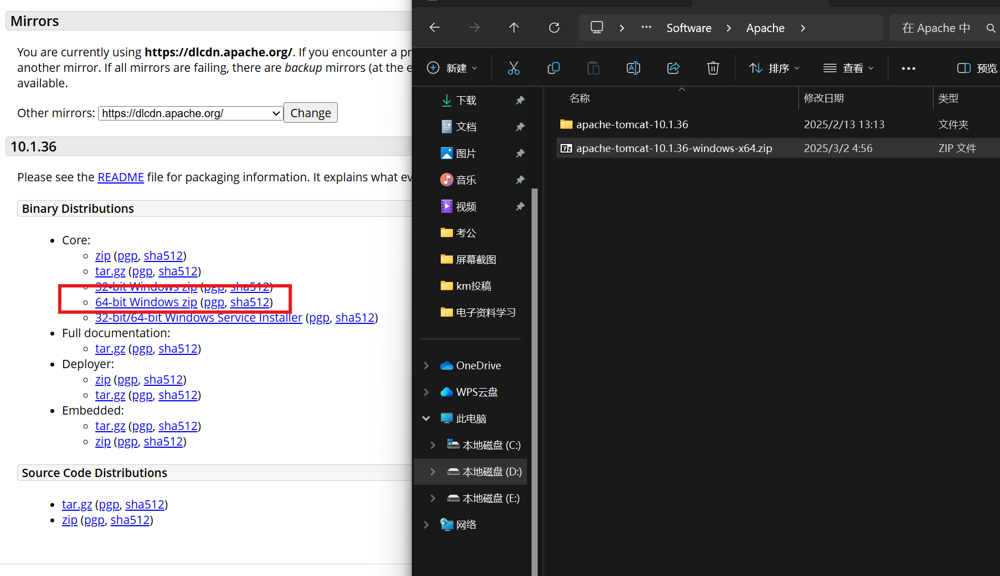
    <p>Tomcat下载</p>
</div>


<div style="text-align:center">
    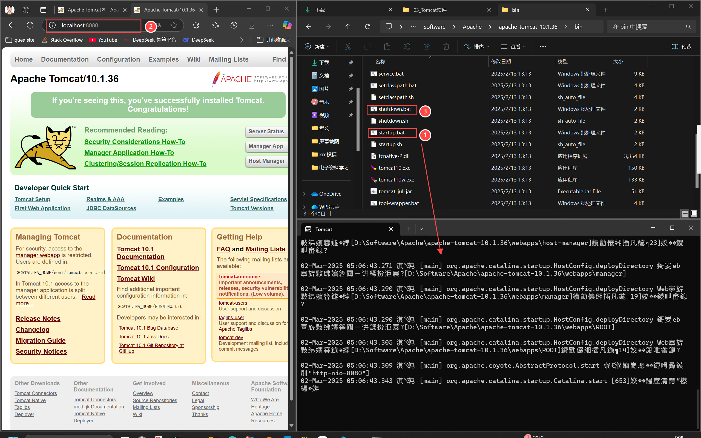
    <p>Tomcat运行</p>
</div>


## WEB项目结构

<div style="text-align:center">
        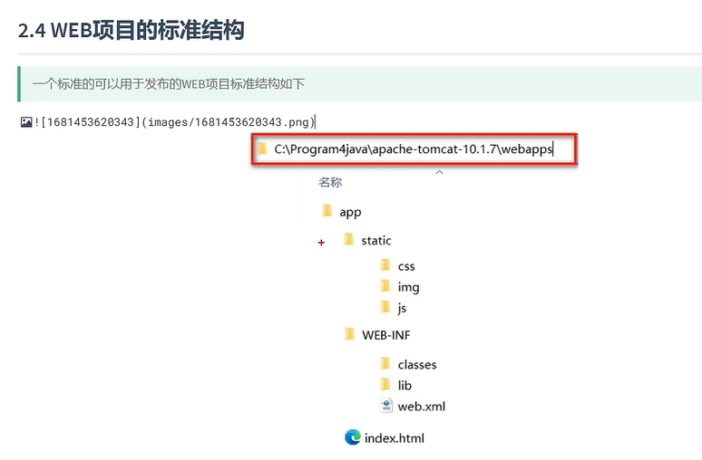
        <p>WEB项目标准结构</p>
</div>

在 **Tomcat** 中发布的项目需要遵循一定的目录结构，以确保 Tomcat 能够正确识别和运行应用程序。以下是标准的 **Web 项目结构** 及其详细说明：

---

###  标准 Web 项目结构
一个典型的 Web 项目结构如下：

```
MyWebApp/
├── WEB-INF/
│   ├── web.xml                # 部署描述文件（必需）
│   ├── classes/               # 编译后的 Java 类文件
│   └── lib/                   # 第三方库文件（JAR 文件）
├── index.html                 # 静态资源文件（HTML、CSS、JS 等）
├── css/
│   └── style.css
├── js/
│   └── script.js
└── images/
    └── logo.png
```

---

#### `WEB-INF` 目录 
- **作用**：存放 Web 应用程序的配置文件和私有资源。
- **特点**：
  - 该目录下的内容对客户端不可见，只能通过服务器端访问。
  - 必须包含 `web.xml` 文件（除非使用注解配置）。
- **子目录**：
  - **`classes`**：存放编译后的 Java 类文件（如 `.class` 文件）。
  - **`lib`**：存放项目依赖的第三方库文件（如 `.jar` 文件）。

---

#### `web.xml` 文件 
- **作用**：Web 应用程序的部署描述文件，用于配置 Servlet、Filter、Listener 等。
- **位置**：`WEB-INF/web.xml`。
- **示例**：
  ```xml
  <web-app xmlns="http://xmlns.jcp.org/xml/ns/javaee"
           xmlns:xsi="http://www.w3.org/2001/XMLSchema-instance"
           xsi:schemaLocation="http://xmlns.jcp.org/xml/ns/javaee
                               http://xmlns.jcp.org/xml/ns/javaee/web-app_3_1.xsd"
           version="3.1">
      <servlet>
          <servlet-name>HelloServlet</servlet-name>
          <servlet-class>com.example.HelloServlet</servlet-class>
      </servlet>
      <servlet-mapping>
          <servlet-name>HelloServlet</servlet-name>
          <url-pattern>/hello</url-pattern>
      </servlet-mapping>
  </web-app>
  ```

---

#### 静态资源文件 
- **位置**：项目根目录或子目录（如 `css/`、`js/`、`images/`）。
- **作用**：存放 HTML、CSS、JavaScript、图片等静态资源。
- **示例**：
  - `index.html`：首页文件。
  - `css/style.css`：样式表文件。
  - `js/script.js`：JavaScript 文件。
  - `images/logo.png`：图片文件。

---

#### Java 类文件 
- **位置**：`WEB-INF/classes/`。
- **作用**：存放编译后的 Java 类文件（如 Servlet、Filter、Listener）。
- **示例**：
  - `com/example/HelloServlet.class`：Servlet 类文件。

---

#### 第三方库文件 
- **位置**：`WEB-INF/lib/`。
- **作用**：存放项目依赖的第三方库文件（JAR 文件）。
- **示例**：
  - `mysql-connector-java-8.0.26.jar`：MySQL 数据库驱动。

---

### 打包为 WAR 文件 
- **WAR 文件**：Web 应用程序的打包格式，可以直接部署到 Tomcat。
- **打包方式**：
  - 使用 Maven 或 Gradle 构建工具打包。
  - 手动将项目目录压缩为 `.war` 文件。
- **部署方式**：
  - ***将 WAR 文件复制到 Tomcat 的 `webapps` 目录下，Tomcat 会自动解压并部署***。

---

### 示例项目结构 
以下是一个完整的 Web 项目示例：

#### 项目目录结构 
```
MyWebApp/
├── WEB-INF/
│   ├── web.xml
│   ├── classes/
│   │   └── com/
│   │       └── example/
│   │           └── HelloServlet.class
│   └── lib/
│       └── mysql-connector-java-8.0.26.jar
├── index.html
├── css/
│   └── style.css
├── js/
│   └── script.js
└── images/
    └── logo.png
```

#### `web.xml` 文件 
```xml
<web-app xmlns="http://xmlns.jcp.org/xml/ns/javaee"
         xmlns:xsi="http://www.w3.org/2001/XMLSchema-instance"
         xsi:schemaLocation="http://xmlns.jcp.org/xml/ns/javaee
                             http://xmlns.jcp.org/xml/ns/javaee/web-app_3_1.xsd"
         version="3.1">
    <servlet>
        <servlet-name>HelloServlet</servlet-name>
        <servlet-class>com.example.HelloServlet</servlet-class>
    </servlet>
    <servlet-mapping>
        <servlet-name>HelloServlet</servlet-name>
        <url-pattern>/hello</url-pattern>
    </servlet-mapping>
</web-app>
```

#### `HelloServlet.java` 文件**
```java
package com.example;

import java.io.IOException;
import java.io.PrintWriter;
import javax.servlet.ServletException;
import javax.servlet.http.HttpServlet;
import javax.servlet.http.HttpServletRequest;
import javax.servlet.http.HttpServletResponse;

public class HelloServlet extends HttpServlet {
    protected void doGet(HttpServletRequest request, HttpServletResponse response)
            throws ServletException, IOException {
        response.setContentType("text/html");
        PrintWriter out = response.getWriter();
        out.println("<html><body>");
        out.println("<h1>Hello, World!</h1>");
        out.println("</body></html>");
    }
}
```

#### `index.html` 文件 
```html
<!DOCTYPE html>
<html>
<head>
    <title>My Web App</title>
    <link rel="stylesheet" href="css/style.css">
    <script src="js/script.js"></script>
</head>
<body>
    <h1>Welcome to My Web App</h1>
    
    <a href="/hello">Go to HelloServlet</a>
</body>
</html>
```

---

### 部署到 Tomcat 
1. **打包为 WAR 文件**：
   - 使用 Maven 或 Gradle 打包，生成 `MyWebApp.war`。
2. **部署到 Tomcat**：
   - 将 `MyWebApp.war` 复制到 Tomcat 的 `webapps` 目录下。
3. **启动 Tomcat**：
   - 运行 `bin/startup.sh`（Linux/macOS）或 `bin/startup.bat`（Windows）。
4. **访问应用程序**：
   - 打开浏览器，访问 `http://localhost:8080/MyWebApp`。

---

## Tomcat WEB项目部署方式1

<div style="text-align:center">
    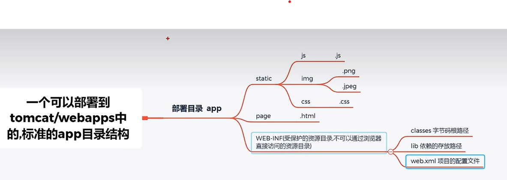
    <p>可发布Tomcat的标准项目结构</p>
</div>

在 `webapps` 中新建一个 `app` 目录，创建和添加内容如下

<div style="text-align:center">
    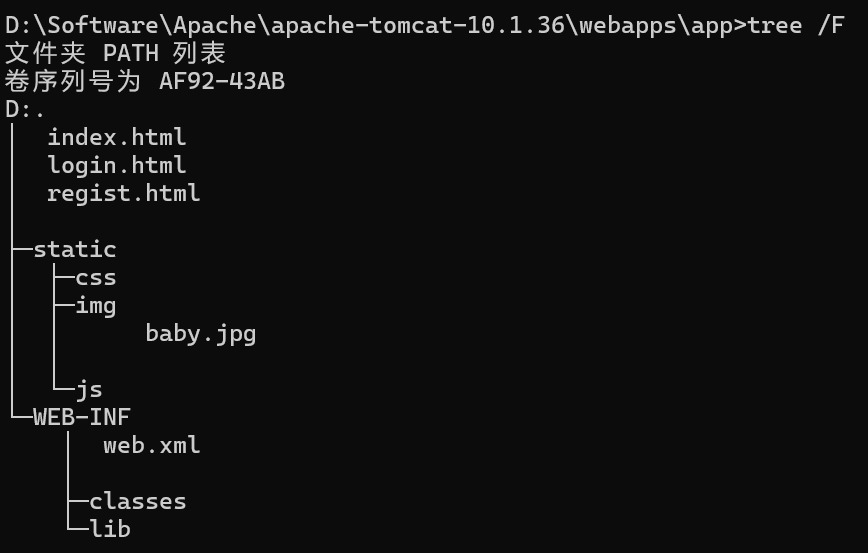
    <p>项目创建实操</p>
</div>

- 运行 Tomcat 服务器
- 浏览器中访问服务器资源，输入对应资源路径，均能访问到相应内容
    - `http://localhost:8080/app/login.html`
    - `http://localhost:8080/app/regist.html`
    - `http://localhost:8080/app/static/img/baby.jpg`

<div style="text-align:center">
    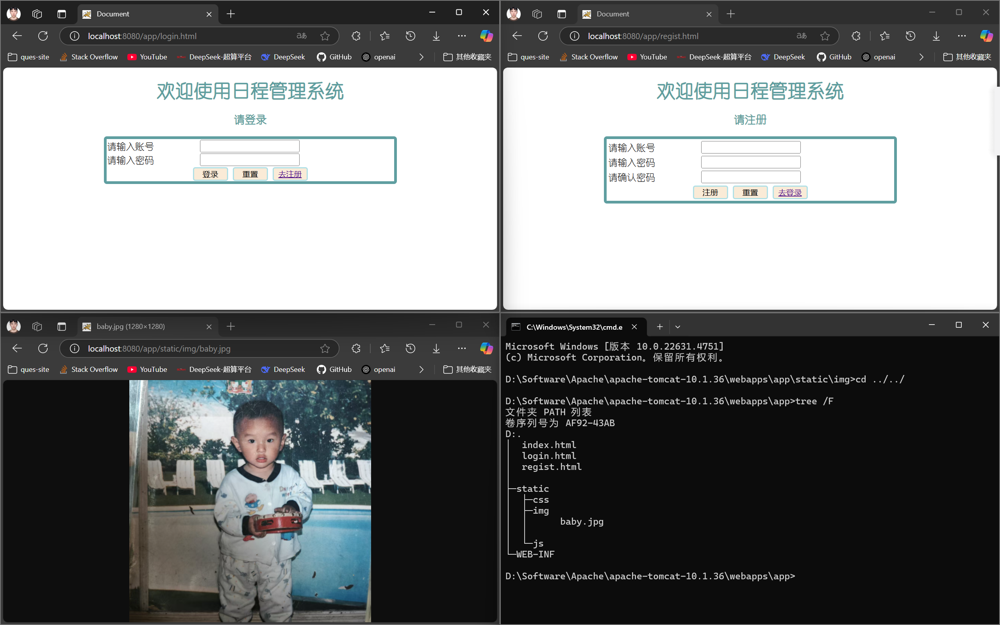
    <p>资源访问结果</p>
</div>

---

## Tomcat WEB项目部署方式2

### 项目部署路径配置

- `app` 项目文件不一定非要在 `webapps` 目录中

- 假如在 D 盘当中想要 Tomcat能够访问 app的资源：***需要在Tomcat的conf/Catalina/localhost 中配置一个app.xml文件***

- 其中内容为：`<Context path="app" docBase="E:\文件杂物\Test\app"/>`

### Tomcat 服务器用户信息配置
在 `conf/tomcat-users.xml` 文件中的 添加如下代码：
```xml
<role rolename="admin-gui"/>
<role rolename="admin-script"/>
<role rolename="manager-gui"/>
<role rolename="manager-script"/>
<role rolename="manager-jmx"/>
<role rolename="manager-status"/>
<user username="admin" password="123456" roles="admin-gui,admin-script,manager-gui,manager-script,manager-jmx,manager-status"/>
```

然后浏览器访问 `localhost:8080/manager` 输入密码范文管理员界面


## IDEA中开发部署运行WEB项目

***目标：*** 
***IDEA创建WEB工程 -> 转化成可以发布的项目 -> 部署到Tomcat服务器***

<div style="text-align:center">
    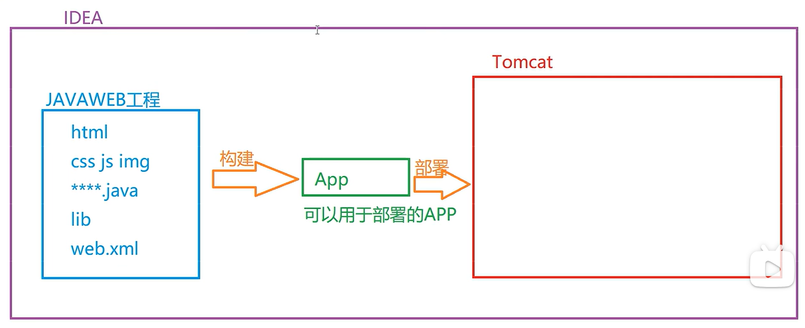
    <p>IDEA开发部署运行WEB项目</p>
</div>

- 建立 ***tomcat 和 idea 的关联***
    - `设置 -> 构建、执行、部署 -> 应用程序性服务器 -> + Tomcat服务器`
- 使用 idea 创建 JavaWEB 工程， 在 WEB工程中开发代码
    - 创建JavaWEB工程：
        - 创建 Java项目
        - 添加WEB配置信息（参考前面，但是IDEA中WEB应用程序的依赖库版本4.0，要使用Tomcat至少5.0，***需要先在项目结构的该项目module中添加tomcat的依赖库，再次添加WEB配置信息则为6.0***）
        - 特别操作：
        <div style="text-align:center">
            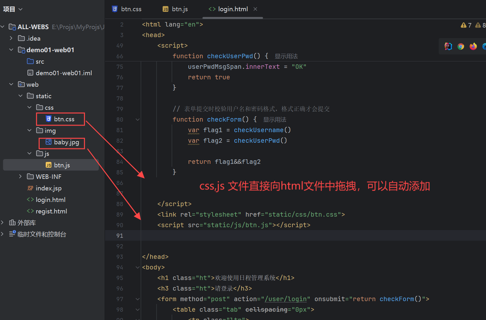
            <p>WEB项目特别操作01</p>
        </div>
        - ***添加jar包***，要放在Web.WEB-INF下的lib中，并且需要邮件设为 Library（添加库）
        <div style="text-align:center">
            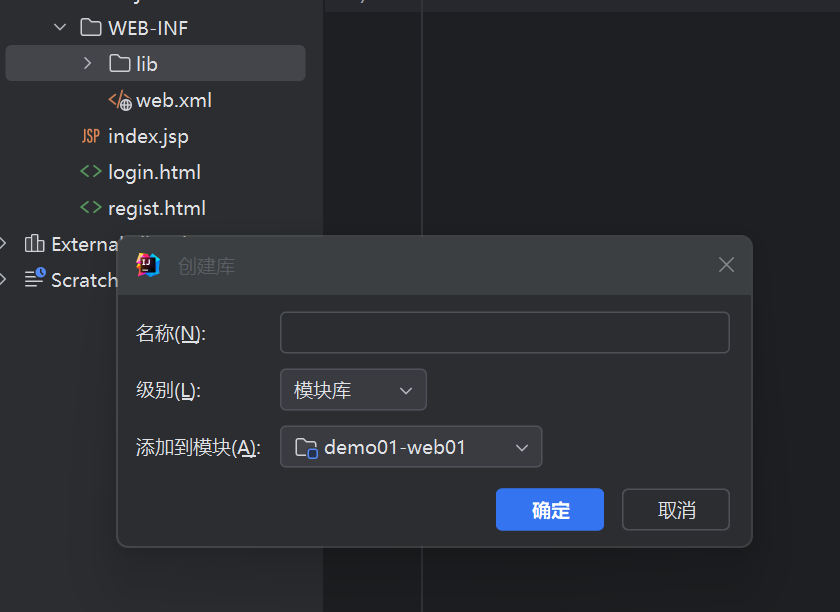
            <p>创建库</p>
        </div>
- 使用idea 将工程构建成可以发布的app
- 使用idea 将构建好的app部署到 tomcat中运行
