# XML
## 介绍
Extensible Markup Language 缩写，即 `可扩展标记语言`，和HTML一样都是标记语言，基本语法都是标签。

XML 被设计用于存储和传输数据，常用作配置文件。无需从头编写，在第三方应用程序、框架所提供的配置文件基础上修改即可

***常见配置文件类型***
1. properties文件，例如druid连接池就是使用properties文件作为配置文件
2. XML文件，例如Tomcat就是使用XML文件作为配置文件
3. YAML文件，例如SpringBoot就是使用YAML作为配置文件
4. json文件，通常用来做文件传输，也可以用来做前端或者移动端的配置文件

<div style="text-align:center">
    
    <p>XML和Properties区别</p>
</div>

## XML约束
在 XML（可扩展标记语言）中，**约束（Constraint）** 是指用于定义和限制 XML 文档结构的规则。约束确保 XML 文档符合预期的格式和数据要求，从而提高数据的规范性和可验证性。XML 约束通常通过以下两种方式实现：

1. **DTD（Document Type Definition，文档类型定义）**
2. **XML Schema（XML 模式）**


大部分时候不需要亲自写约束，在 Web.xml 中想要添加标签，由于约束的存在，IDEA会自动提示可以添加的标签

---
### DTD

DTD 是一种较早的 XML 约束方式，用于定义 XML 文档的结构和元素规则。

1.1 **DTD 的作用**
- 定义 XML 文档中允许的元素和属性。
- 定义元素的嵌套关系和顺序。
- 定义元素的类型（如文本、空元素等）。

---

### XML Schema
XML Schema 是一种更强大、更灵活的 XML 约束方式，支持更复杂的数据类型和规则。

2.1 **XML Schema 的作用**
- 定义 XML 文档的结构、元素和属性。
- 支持数据类型定义（如字符串、整数、日期等）。
- 支持命名空间，避免元素名冲突。

2.2 **XML Schema 的语法**
- **定义元素**：
  ```xml
  <xs:element name="元素名" type="数据类型"/>
  ```
  例如：
  ```xml
  <xs:element name="title" type="xs:string"/>
  ```

- **定义复杂类型**：
  ```xml
  <xs:complexType name="类型名">
      <xs:sequence>
          <xs:element name="子元素名" type="数据类型"/>
      </xs:sequence>
  </xs:complexType>
  ```
  例如：
  ```xml
  <xs:complexType name="bookType">
      <xs:sequence>
          <xs:element name="title" type="xs:string"/>
          <xs:element name="author" type="xs:string"/>
          <xs:element name="price" type="xs:decimal"/>
      </xs:sequence>
      <xs:attribute name="id" type="xs:integer" use="required"/>
  </xs:complexType>
  ```

2.3 **XML Schema 的示例**
```xml
<xs:schema xmlns:xs="http://www.w3.org/2001/XMLSchema">
    <xs:element name="bookstore">
        <xs:complexType>
            <xs:sequence>
                <xs:element name="book" type="bookType" maxOccurs="unbounded"/>
            </xs:sequence>
        </xs:complexType>
    </xs:element>

    <xs:complexType name="bookType">
        <xs:sequence>
            <xs:element name="title" type="xs:string"/>
            <xs:element name="author" type="xs:string"/>
            <xs:element name="price" type="xs:decimal"/>
        </xs:sequence>
        <xs:attribute name="id" type="xs:integer" use="required"/>
    </xs:complexType>
</xs:schema>
```

对应的 XML 文档：
```xml
<bookstore xmlns:xsi="http://www.w3.org/2001/XMLSchema-instance"
           xsi:noNamespaceSchemaLocation="bookstore.xsd">
    <book id="1">
        <title>XML Guide</title>
        <author>John Doe</author>
        <price>29.99</price>
    </book>
</bookstore>
```

---

### 区别
| 特性                | DTD                          | XML Schema                     |
|---------------------|------------------------------|--------------------------------|
| **数据类型支持**     | 仅支持简单类型（如文本）      | 支持复杂类型（如整数、日期等） |
| **命名空间支持**     | 不支持                       | 支持                           |
| **扩展性**          | 较弱                         | 较强                           |
| **语法**            | 基于 SGML 语法               | 基于 XML 语法                  |
| **可读性**          | 较差                         | 较好                           |

---


- **XML 约束** 是用于定义和限制 XML 文档结构的规则，主要包括 DTD 和 XML Schema。
- **DTD** 是一种简单的约束方式，适合定义基本的文档结构。
- **XML Schema** 是一种更强大的约束方式，支持复杂的数据类型和命名空间。
- 使用 XML 约束可以提高数据的规范性、可验证性和可读性，是 XML 技术中的重要组成部分。


## 添加Web项目配置文件
Web项目中会有一个 Web.xml 文件，需要添加框架支持，新版IDEA中无法通过 `右键项目->添加框架支持(Add Framework Support)`

需要手动添加一下：
- `设置 -> 菜单与工具栏 -> 项目视图弹出窗口 -> 点击搜索框右侧 + 号 -> 搜索 “添加框架支持” -> 确定 -> 应用 -> 确定`
- `双击 shift -> 搜索 “添加框架与支持” -> 选择 Java EE 下的 Web应用程序`

<div style="text-align:center">
    
    <p>添加框架支持1</p>
</div>

<div style="text-align:center">
    
    <p>添加框架支持2</p>
</div>

## DOM4J进行XML解析
### DOM4J的使用步骤
1. 导入jar包的dom4j.jar
2. 创建解析器对象（SAXReader）
3. 解析xml 获得 Document 对象
4. 获取根节点RootElement
5. 获取根节点下的子节点

### jdbc信息的xml配置文件
```xml
<?xml version="1.0" encoding="UTF-8" ?>
<!--
1. 根标签只能有一个
2. 第一行永远是 <?xml version="1.0" encoding="UTF-8" ?>
3. XML 是有约束的，用于限定 XML 内部能编写的内容，有如下两种约束：
    dtd     简单，上手快
    schema  复杂，上手慢，约束更加细致 (Web 支持框架中WEB-INF下的Web.xml 中的 xsi:... 就是 schema约束)


PS:
    dev, test, formal 分别代表 开发、测试、正式商用的环境配置
-->
<jdbc>
    <dev id="001">
        <username>root</username>
        <password>123456</password>
        <driver>com.mysql.jdbc.Driver</driver>
        <url>jdbc:mysql://localhost:3306/atguigudb</url>
    </dev>
    <test id="002">
        <username>root</username>
        <password>123456</password>
        <driver>com.mysql.jdbc.Driver</driver>
        <url>jdbc:mysql://localhost:3306/atguigudb</url>
    </test>
    <formal id="003">
        <username>root</username>
        <password>123456</password>
        <driver>com.mysql.jdbc.Driver</driver>
        <url>jdbc:mysql://localhost:3306/atguigudb</url>
    </formal>
</jdbc>
```
### jdbc.xml 文件的解析
```java

package com.sijor.test;

import org.dom4j.Attribute;
import org.dom4j.Document;
import org.dom4j.DocumentException;
import org.dom4j.Element;
import org.dom4j.io.SAXReader;
import org.junit.Test;

import java.io.FileInputStream;
import java.io.InputStream;
import java.util.List;

public class TestDom4J {

    @Test
    public void testRead() throws DocumentException {
        // 1. 读取 jdbc.xml 配置文件，获取document 对象
        SAXReader saxReader = new SAXReader();

        // 2. 通过类加载器获得指向字节码根路径下的指定文件的 输入流
        InputStream resourceAsStream = TestDom4J.class.getClassLoader().getResourceAsStream("jdbc.xml");

        // 3. 通过输入流获得 配置文件， 解析成DOM对象
        Document document = saxReader.read(resourceAsStream);

        // 4. 从 document 对象中读取配置信息
        /*
        * Node 结点
        *   Element     元素结点
        *   Attribute   属性结点
        *   Text        文本结点
        * */

        // 4.1 获取根结点
        Element rootElement = document.getRootElement();   // 获取root Element
        System.out.println(rootElement.getName());

        // 4.2 获取根结点的子元素（子节点）
        List<Element> elements = rootElement.elements();
        for (Element element : elements) {
            System.out.println("\t" + element.getName());

            // 从元素上获取属性
            Attribute idAttribute = element.attribute("id");
            System.out.println("\t\t" + idAttribute.getName() + "=" + idAttribute.getValue());

            // 继续读取子元素
            List<Element> elems = element.elements();
            for (Element elem : elems) {
                System.out.println("\t\t" + elem.getName() + ":" + elem.getText());
            }
        }
    }
}

```

# Tomcat
[Tomcat官网](https://tomcat.apache.org/)

Tomcat 是专门运行WEB的 **服务器软件**

安装后能提供给网络中的其他计算机，将本地文件映射成一个虚拟的url地址供其他人访问

<div style="text-align:center">
    
    <p>Tomcat角色</p>
</div>


***目录简介***
- `bin` 命令目录，其中开启关闭Tomcat的 .bat 命令文件，可以在配置环境变量之后直接在控制台中运行
- `conf` 各类配置文件
- `logs` 日志文件目录，可以定期清理
- `webapps` 非常重要的目录
    - 运行Tomcat 之后，输入 `webapps\examples\index.html`对应的URL到浏览器中，可以访问对应界面
    <div style="text-align:center">
        
        <p>服务器资源访问</p>
    </div>

## 下载安装

- 直接官网下载 压缩包，并解压到目录下
- bin 目录下点击运行 startup.bat 则启动 Tomcat，出现一个终端框； 点击运行 shutdown.bat 的关闭 Tomcat
- 本地访问 localhost:8080 跳转图中界面，则成功启动
- ***乱码问题***
    - 在 `apache-tomcat-10.1.36\conf\logging.properties` 中进行修改
    - `Ctrl+F` 找到和 `Console` 相关的设置，将其 `encoding` 改为 `GBK`
        - `java.util.logging.ConsoleHandler.encoding = GBK`


<div style="text-align:center">
    
    <p>Tomcat下载</p>
</div>


<div style="text-align:center">
    
    <p>Tomcat运行</p>
</div>


## WEB项目结构

<div style="text-align:center">
        
        <p>WEB项目标准结构</p>
</div>

在 **Tomcat** 中发布的项目需要遵循一定的目录结构，以确保 Tomcat 能够正确识别和运行应用程序。以下是标准的 **Web 项目结构** 及其详细说明：

---

###  标准 Web 项目结构
一个典型的 Web 项目结构如下：

```
MyWebApp/
├── WEB-INF/
│   ├── web.xml                # 部署描述文件（必需）
│   ├── classes/               # 编译后的 Java 类文件
│   └── lib/                   # 第三方库文件（JAR 文件）
├── index.html                 # 静态资源文件（HTML、CSS、JS 等）
├── css/
│   └── style.css
├── js/
│   └── script.js
└── images/
    └── logo.png
```

---

#### `WEB-INF` 目录 
- **作用**：存放 Web 应用程序的配置文件和私有资源。
- **特点**：
  - 该目录下的内容对客户端不可见，只能通过服务器端访问。
  - 必须包含 `web.xml` 文件（除非使用注解配置）。
- **子目录**：
  - **`classes`**：存放编译后的 Java 类文件（如 `.class` 文件）。
  - **`lib`**：存放项目依赖的第三方库文件（如 `.jar` 文件）。

---

#### `web.xml` 文件 
- **作用**：Web 应用程序的部署描述文件，用于配置 Servlet、Filter、Listener 等。
- **位置**：`WEB-INF/web.xml`。
- **示例**：
  ```xml
  <web-app xmlns="http://xmlns.jcp.org/xml/ns/javaee"
           xmlns:xsi="http://www.w3.org/2001/XMLSchema-instance"
           xsi:schemaLocation="http://xmlns.jcp.org/xml/ns/javaee
                               http://xmlns.jcp.org/xml/ns/javaee/web-app_3_1.xsd"
           version="3.1">
      <servlet>
          <servlet-name>HelloServlet</servlet-name>
          <servlet-class>com.example.HelloServlet</servlet-class>
      </servlet>
      <servlet-mapping>
          <servlet-name>HelloServlet</servlet-name>
          <url-pattern>/hello</url-pattern>
      </servlet-mapping>
  </web-app>
  ```

---

#### 静态资源文件 
- **位置**：项目根目录或子目录（如 `css/`、`js/`、`images/`）。
- **作用**：存放 HTML、CSS、JavaScript、图片等静态资源。
- **示例**：
  - `index.html`：首页文件。
  - `css/style.css`：样式表文件。
  - `js/script.js`：JavaScript 文件。
  - `images/logo.png`：图片文件。

---

#### Java 类文件 
- **位置**：`WEB-INF/classes/`。
- **作用**：存放编译后的 Java 类文件（如 Servlet、Filter、Listener）。
- **示例**：
  - `com/example/HelloServlet.class`：Servlet 类文件。

---

#### 第三方库文件 
- **位置**：`WEB-INF/lib/`。
- **作用**：存放项目依赖的第三方库文件（JAR 文件）。
- **示例**：
  - `mysql-connector-java-8.0.26.jar`：MySQL 数据库驱动。

---

### 打包为 WAR 文件 
- **WAR 文件**：Web 应用程序的打包格式，可以直接部署到 Tomcat。
- **打包方式**：
  - 使用 Maven 或 Gradle 构建工具打包。
  - 手动将项目目录压缩为 `.war` 文件。
- **部署方式**：
  - ***将 WAR 文件复制到 Tomcat 的 `webapps` 目录下，Tomcat 会自动解压并部署***。

---

### 示例项目结构 
以下是一个完整的 Web 项目示例：

#### 项目目录结构 
```
MyWebApp/
├── WEB-INF/
│   ├── web.xml
│   ├── classes/
│   │   └── com/
│   │       └── example/
│   │           └── HelloServlet.class
│   └── lib/
│       └── mysql-connector-java-8.0.26.jar
├── index.html
├── css/
│   └── style.css
├── js/
│   └── script.js
└── images/
    └── logo.png
```

#### `web.xml` 文件 
```xml
<web-app xmlns="http://xmlns.jcp.org/xml/ns/javaee"
         xmlns:xsi="http://www.w3.org/2001/XMLSchema-instance"
         xsi:schemaLocation="http://xmlns.jcp.org/xml/ns/javaee
                             http://xmlns.jcp.org/xml/ns/javaee/web-app_3_1.xsd"
         version="3.1">
    <servlet>
        <servlet-name>HelloServlet</servlet-name>
        <servlet-class>com.example.HelloServlet</servlet-class>
    </servlet>
    <servlet-mapping>
        <servlet-name>HelloServlet</servlet-name>
        <url-pattern>/hello</url-pattern>
    </servlet-mapping>
</web-app>
```

#### `HelloServlet.java` 文件**
```java
package com.example;

import java.io.IOException;
import java.io.PrintWriter;
import javax.servlet.ServletException;
import javax.servlet.http.HttpServlet;
import javax.servlet.http.HttpServletRequest;
import javax.servlet.http.HttpServletResponse;

public class HelloServlet extends HttpServlet {
    protected void doGet(HttpServletRequest request, HttpServletResponse response)
            throws ServletException, IOException {
        response.setContentType("text/html");
        PrintWriter out = response.getWriter();
        out.println("<html><body>");
        out.println("<h1>Hello, World!</h1>");
        out.println("</body></html>");
    }
}
```

#### `index.html` 文件 
```html
<!DOCTYPE html>
<html>
<head>
    <title>My Web App</title>
    <link rel="stylesheet" href="css/style.css">
    <script src="js/script.js"></script>
</head>
<body>
    <h1>Welcome to My Web App</h1>
    
    <a href="/hello">Go to HelloServlet</a>
</body>
</html>
```

---

### 部署到 Tomcat 
1. **打包为 WAR 文件**：
   - 使用 Maven 或 Gradle 打包，生成 `MyWebApp.war`。
2. **部署到 Tomcat**：
   - 将 `MyWebApp.war` 复制到 Tomcat 的 `webapps` 目录下。
3. **启动 Tomcat**：
   - 运行 `bin/startup.sh`（Linux/macOS）或 `bin/startup.bat`（Windows）。
4. **访问应用程序**：
   - 打开浏览器，访问 `http://localhost:8080/MyWebApp`。

---

## Tomcat WEB项目部署方式1

<div style="text-align:center">
    
    <p>可发布Tomcat的标准项目结构</p>
</div>

在 `webapps` 中新建一个 `app` 目录，创建和添加内容如下

<div style="text-align:center">
    
    <p>项目创建实操</p>
</div>

- 运行 Tomcat 服务器
- 浏览器中访问服务器资源，输入对应资源路径，均能访问到相应内容
    - `http://localhost:8080/app/login.html`
    - `http://localhost:8080/app/regist.html`
    - `http://localhost:8080/app/static/img/baby.jpg`

<div style="text-align:center">
    
    <p>资源访问结果</p>
</div>

---

## Tomcat WEB项目部署方式2

### 项目部署路径配置

- `app` 项目文件不一定非要在 `webapps` 目录中

- 假如在 D 盘当中想要 Tomcat能够访问 app的资源：***需要在Tomcat的conf/Catalina/localhost 中配置一个app.xml文件***

- 其中内容为：`<Context path="app" docBase="E:\文件杂物\Test\app"/>`

### Tomcat 服务器用户信息配置
在 `conf/tomcat-users.xml` 文件中的 添加如下代码：
```xml
<role rolename="admin-gui"/>
<role rolename="admin-script"/>
<role rolename="manager-gui"/>
<role rolename="manager-script"/>
<role rolename="manager-jmx"/>
<role rolename="manager-status"/>
<user username="admin" password="123456" roles="admin-gui,admin-script,manager-gui,manager-script,manager-jmx,manager-status"/>
```

然后浏览器访问 `localhost:8080/manager` 输入密码范文管理员界面


## IDEA中开发部署运行WEB项目

***目标：*** 
***IDEA创建WEB工程 -> 转化成可以发布的项目 -> 部署到Tomcat服务器***

<div style="text-align:center">
    
    <p>IDEA开发部署运行WEB项目</p>
</div>

- 建立 ***tomcat 和 idea 的关联***
    - `设置 -> 构建、执行、部署 -> 应用程序性服务器 -> + Tomcat服务器`
- 使用 idea 创建 JavaWEB 工程， 在 WEB工程中开发代码
    - 创建JavaWEB工程：
        - 创建 Java项目
        - 添加WEB配置信息（参考前面，但是IDEA中WEB应用程序的依赖库版本4.0，要使用Tomcat至少5.0，***需要先在项目结构的该项目module中添加tomcat的依赖库，再次添加WEB配置信息则为6.0***）
        - 特别操作：
        <div style="text-align:center">
            
            <p>WEB项目特别操作01</p>
        </div>
        
        - ***添加jar包***，要放在Web.WEB-INF下的lib中，并且需要右键设为 Library（添加库）
        <div style="text-align:center">
            
            <p>创建库</p>
        </div>

        
- 使用idea 将工程构建成可以发布的app
    - 构建工件，最后结构如下：
        <div style="text-align:center">
            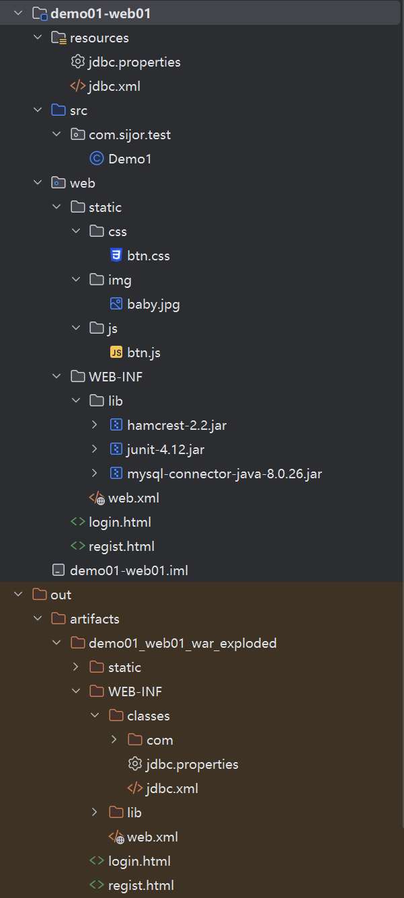
            <p>WEB项目构建结构</p>
        </div>
- 使用idea 将构建好的app部署到 tomcat中运行
    - 菜单栏 -> 运行 -> 编辑配置 
    - 在配置中添加 Tomcat服务器配置 -> 部署选项中添加构建好的项目 -> 回到IDEA点击运行
        <div style="text-align:center">
            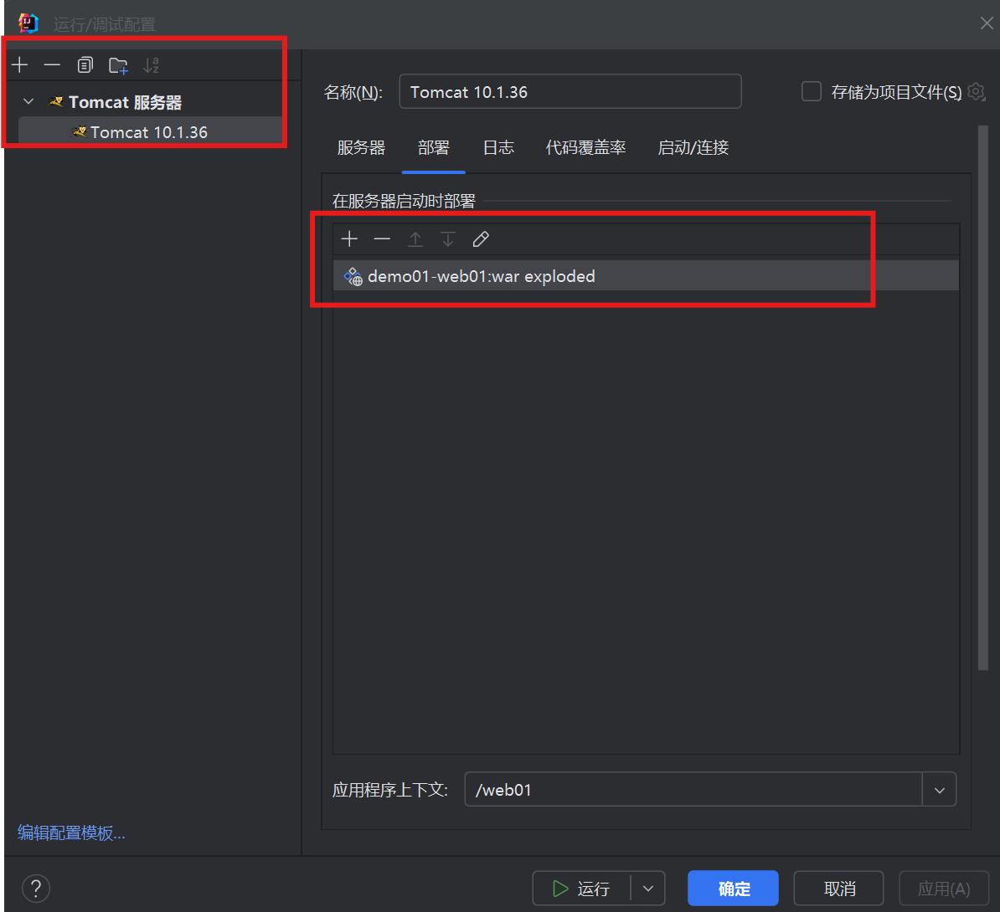
            <p>运行部署构建的WEB项目</p>
        </div>


***IDEA使用Tomcat部署项目原理***
<div style="text-align:center">
    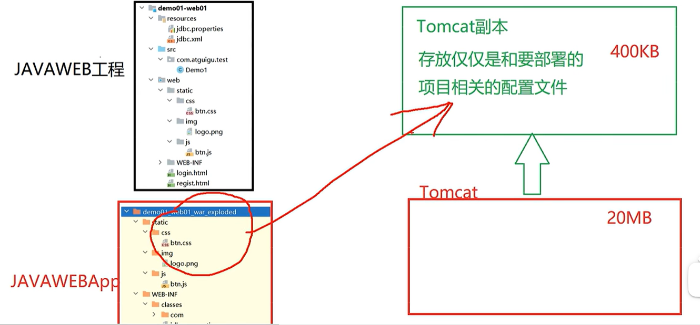
    <p>IDEA使用Tomcat原理</p>
</div>


# HTTP
## HTTP简介
***HTTP简介***
### 请求和响应报文格式 
| 部分         | 描述                                                         |
|------------|--------------------------------------------------------------|
| 请求行       | 包含方法（GET、POST 等）、请求 URI 和 HTTP 版本。                     |
| 请求头       | 包含若干个字段，每个字段名和字段值成对出现，字段之间用冒号分隔，字段结束后换行。 |
| 请求体       | 包含请求的主体数据，通常用于 POST 和 PUT 请求。                     |
| （空行）     | 请求头和请求体之间用一个空行分隔。                                   |
| 状态行       | 包含 HTTP 版本、状态码和状态消息。                                   |
| 响应头       | 包含若干个字段，每个字段名和字段值成对出现，字段之间用冒号分隔，字段结束后换行。 |
| 响应体       | 包含响应的主体数据。                                               |
| （空行）     | 响应头和响应体之间用一个空行分隔。                                   |


### 常见响应状态码
| 状态码 | 类别  | 描述                                                         |
|-------|-----|--------------------------------------------------------------|
| 1xx   | 信息性 | 接收的请求正在处理。                                             |
| 100   |      | 继续。                                                       |
| 101   |      | 切换协议。                                                   |
| 2xx   | 成功   | 请求正常处理完毕。                                               |
| 200   |      | OK。                                                        |
| 201   |      | 创建。                                                       |
| 202   |      | 已接受。                                                     |
| 203   |      | 非授权信息。                                                  |
| 204   |      | 无内容。                                                      |
| 205   |      | 重置内容。                                                    |
| 206   |      | 部分内容。                                                    |
| 3xx   | 重定向 | 请求必须包含更多的信息才能被处理。                                 |
| 300   |      | 多种选择。                                                    |
| 301   |      | 永久移动。                                                    |
| 302   |      | 临时移动。                                                    |
| 303   |      | 查看其他位置。                                                 |
| 304   |      | 未修改。                                                      |
| 307   |      | 临时重定向。                                                  |
| 4xx   | 客户端错误 | 服务器无法处理请求。                                           |
| 400   |      | 错误请求。                                                    |
| 401   |      | 未授权。                                                      |
| 403   |      | 禁止。                                                       |
| 404   |      | 未找到。                                                      |
| 405   |      | 方法禁用。                                                    |
| 408   |      | 请求超时。                                                    |
| 409   |      | 冲突。                                                       |
| 410   |      | 已删除。                                                      |
| 411   |      | 需要有效长度。                                                |
| 412   |      | 未满足前提条件。                                               |
| 413   |      | 请求实体太大。                                                 |
| 414   |      | 请求的 URI 太长。                                              |
| 415   |      | 不支持的媒体类型。                                             |
| 5xx   | 服务器错误 | 服务器处理请求出错。                                           |
| 500   |      | 服务器内部错误。                                               |
| 501   |      | 尚未实施。                                                    |
| 502   |      | 错误网关。                                                    |
| 503   |      | 服务不可用。                                                  |
| 504   |      | 网关超时。                                                    |
| 505   |      | HTTP 版本不受支持。                                            |


## Servlet

[Servlet教程](https://www.w3cschool.cn/servlet/)

### Servlet简介
#### 动态资源 & 静态资源
- ***静态资源***： 无需在程序运行时 “通过代码运行生成” 的资源，在程序运行之前就写好的资源，如 html、css、js、img、音视频等文件
- ***动态资源***：需要在程序运行时 “通过代码运行生成” 的资源，如 **Servlet、Thymeleaf**。

Servlet 是 Java Web 开发中一种重要的服务器端组件，用于扩展 Web 服务器的功能，处理客户端的请求并生成动态响应。以下是关于 Servlet 的详细介绍：

***Servlet 是一个运行在服务器端的 Java 类，用于处理客户端的请求（通常是 HTTP 请求）并生成响应（即运行Java代码的jar包，动态生成所需的请求数据）***。它是一种基于 Java 的通用接口，允许开发者创建动态的、可扩展的 Web 应用程序。

#### Servlet 的工作原理
Servlet 的工作原理基于请求/响应模型。当客户端（如浏览器）发送一个请求到服务器时，服务器会将请求转发给对应的 Servlet。Servlet 处理请求后生成响应，并通过服务器返回给客户端。

***工作流程：***

1. **客户端发送请求**：客户端通过 HTTP 协议向服务器发送请求。
2. **服务器接收请求**：Web 服务器（如 Apache Tomcat）接收请求，将请求报文的信息转换成一个 `HttpServletrequest` 对象，该对象中包含了请求中的所有信息
    - Tomcat 同时创建了一个 `HttpServeletResponse` 对象，用于承装响应客户端的信息，该对象最后会被转换成响应的报文
3. **Servlet 处理请求**：Servlet 接收到请求后，解析请求参数，执行业务逻辑，并生成响应内容。（Tomcat根据请求中的资源路径找到对应的servlet，将service实例化，调用service方法，同时传入 `HttpServletrequest` 和 `HttpServeletResponse` 对象）
4. **服务器返回响应**：Servlet 将响应内容传递给服务器，服务器再将响应返回给客户端。

#### Servlet 的生命周期
Servlet 的生命周期由 Web 容器（如 Tomcat）管理，主要包括以下三个阶段：

（1）**加载与实例化**
- 当第一个请求到达时，容器会加载 Servlet 类并创建其实例。
- 容器调用 Servlet 的 `init()` 方法进行初始化。

（2）**请求处理**
- 每次客户端请求到达时，容器会调用 Servlet 的 `service()` 方法。
- `service()` 方法根据请求的类型（如 GET 或 POST）调用对应的 `doGet()` 或 `doPost()` 方法来处理请求。

（3）**销毁**
- 当容器需要销毁 Servlet 时（如服务器关闭或资源回收），容器会调用 Servlet 的 `destroy()` 方法。
- 在 `destroy()` 方法中，可以释放资源，如关闭数据库连接等。

#### Servlet 的核心接口和类
Servlet 的实现基于 Java 的 `javax.servlet` 包，其中最核心的接口和类包括：

（1）**Servlet 接口**
- `javax.servlet.Servlet` 是所有 Servlet 的根接口，定义了 Servlet 的生命周期方法：
  - `init(ServletConfig config)`：初始化方法。
  - `service(ServletRequest request, ServletResponse response)`：处理请求的方法。
  - `destroy()`：销毁方法。
  - `getServletConfig()`：获取 Servlet 配置信息。
  - `getServletInfo()`：返回 Servlet 的描述信息。

（2）**HttpServlet 类**
- `javax.servlet.http.HttpServlet` 是一个抽象类，继承自 `GenericServlet`。
- 它专门用于处理 HTTP 协议的请求，提供了 `doGet()` 和 `doPost()` 方法来处理 GET 和 POST 请求。
- 开发者通常通过继承 `HttpServlet` 并重写 `doGet()` 或 `doPost()` 方法来实现具体的业务逻辑。

（3）**ServletRequest 和 ServletResponse**
- `ServletRequest` 和 `ServletResponse` 是用于封装请求和响应的接口。
- `HttpServletRequest` 和 `HttpServletResponse` 是它们的子接口，专门用于处理 HTTP 请求和响应。

---

<div style="text-align:center">
    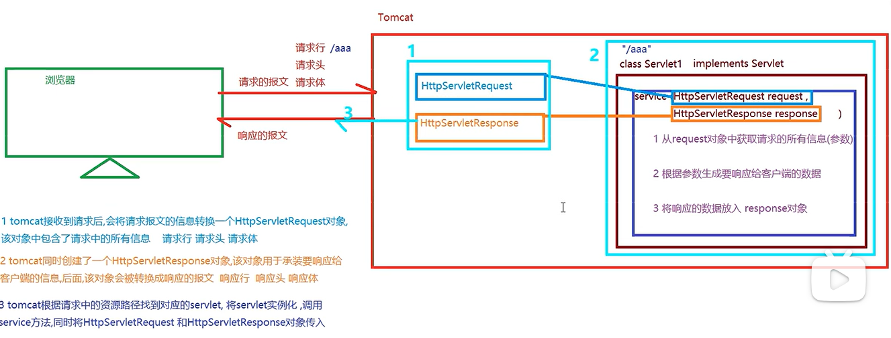
    <p>Servelet工作原理</p>
</div>


#### Servlet 的配置方式
***Servlet 的配置可以通过以下两种方式实现***：

（1）**web.xml 配置**
在 `web.xml` 文件中，可以通过 `<servlet>` 和 `<servlet-mapping>` 标签来配置 Servlet：
```xml
<servlet>
    <servlet-name>MyServlet</servlet-name>
    <servlet-class>com.example.MyServlet</servlet-class>
</servlet>
<servlet-mapping>
    <servlet-name>MyServlet</servlet-name>
    <url-pattern>/myServlet</url-pattern>
</servlet-mapping>
```

（2）**注解配置**
从 Servlet 3.0 开始，可以使用 `@WebServlet` 注解来简化配置：
```java
@WebServlet("/myServlet")
public class MyServlet extends HttpServlet {
    @Override
    protected void doGet(HttpServletRequest req, HttpServletResponse resp) throws ServletException, IOException {
        resp.getWriter().write("Hello, Servlet!");
    }
}
```

#### Servlet 的应用场景
Servlet 主要用于以下场景：
- **动态内容生成**：根据用户请求动态生成 HTML 页面。
- **表单处理**：处理用户提交的表单数据。
- **用户认证与授权**：实现用户登录、权限验证等功能。
- **与数据库交互**：通过 JDBC 连接数据库，实现数据的增删改查。

#### Servlet 的优缺点
***优点：***
- **跨平台**：基于 Java，具有良好的跨平台性。
- **高性能**：支持多线程，可以同时处理多个请求。
- **安全性**：可以利用 Java 的安全机制，如用户认证和授权。

***缺点：***
- **开发复杂**：需要编写大量的 Java 代码，开发效率较低。
- **依赖容器**：需要依赖 Web 容器（如 Tomcat）来运行。
- **功能有限**：主要用于处理 HTTP 请求，对于复杂的业务逻辑支持不足。

**Servlet 与现代框架的对比**
虽然 Servlet 是 Java Web 开发的基础，但随着技术的发展，***许多现代框架（如 Spring MVC、Spring Boot）在 Servlet 的基础上提供了更高级的抽象和更强大的功能***。这些框架通过注解、依赖注入等技术简化了开发过程，提高了开发效率。

---

### Servelet 开发流程

***目标：校验注册时，用户名是否被占用*** 
    
通过客户端像一个Servelet发送请求，携带username， 如果用户名是 `sijor`，则向客户端响应 No， 如果是其他，响应Yes

- 当客户端浏览器访问服务器静态资源的时候，Tomcat会找到静态资源，并生成响应报文，响应报文包含响应行、响应头、响应体
    - 响应头中包含 `Content-Type`， 代表返回内容（响应体）的类型（Tomcat在其conf中的web.xml查找）
    - 响应体就是所请求的静态资源
- 若访问的是动态资源（Tomcat需要调用Servlet来获取）
    - 响应头中需要在程序中显示设置 `Content-Type`


***完整过程***
<div style="text-align:center">
    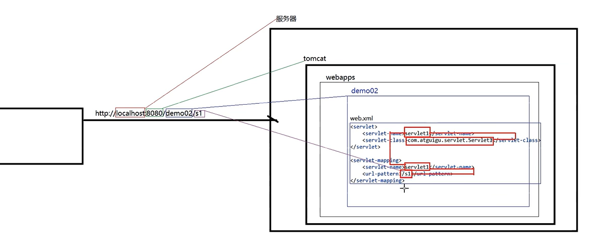
    <p>项目运行http访问全过程</p>
</div>

- 浏览器访问 url
    - `localhost` 定位到本地主机
    - `8080`端口找到 Tomcat
    - `demo02` 找到Tomcat中的 demo02项目
    - `s1` 在该Web项目的 `web.xml` 中查找对应于 `s1` 的映射，然后根据 `servlet-name` 定位到对应的 `servlet-class` 并运行该程序

**PS**
- 一个 `<servlet>` 可以对应多个 `<servlet-mapping>`
- `<servlet-mapping>` 中一个 `servlet-name` 可以有多个不同的 `servlet-pattern`
- 可以使用注解，取代上面的配置方式
    - `@WebServlet(urlPatterns/value={...})`


### Servlet 生命周期
<div style="text-align:center">
    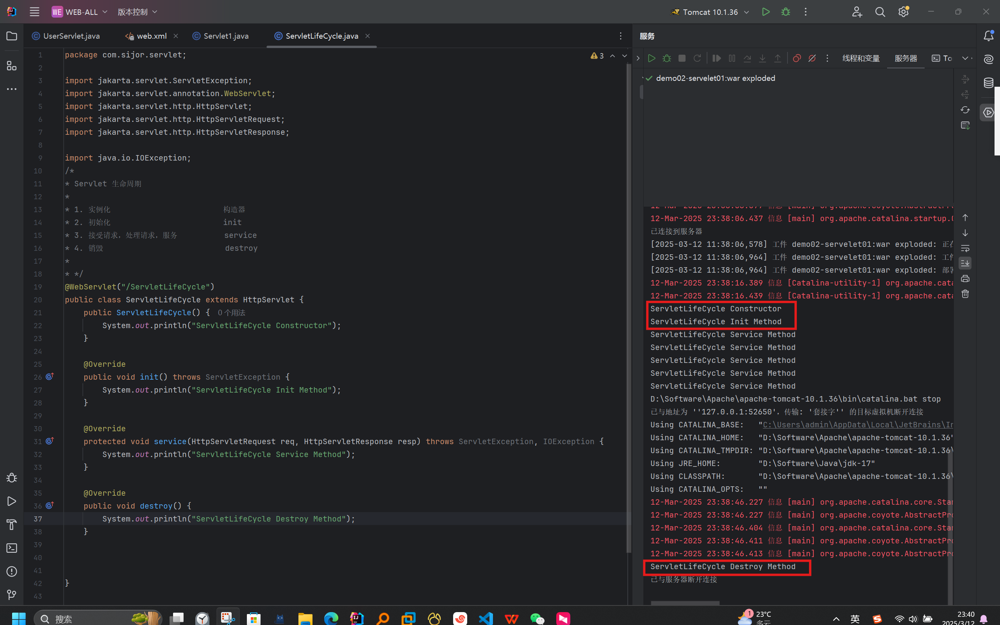
    <p>Servlet生命周期</p>
</div>

可以从运行结果中看到：
- Servlet 的 构造器 **只在第一次请求时候执行过一次**
    - 若要在 Tomcat 启动时就进行 对象构造和初始化，需要在 注解中设置属性、配置 web.xml 
    - 原来是 `@WebServlet("/xxx")`，需要增加属性设置 —> `@WebServlet(value="/xxx", loadOnStartup=n)` (n>0)
    ```xml
    <servlet>
        ...
        <load-on-startup>-1</load-on-startup>
        <!-- 
            default -1， Tomcat 启动时不会实例化 该 Servlet
            任意正数， 则会
         -->
    </servlet>
    ```
- Servlet 的 初始化 **只在第构造器执行完毕后执行过一次**
- Servlet 的 服务方法**在每次请求的时候都会执行**
- 真正执行 destroy 销毁的时候 **在关闭服务的时候**


由此可见 ***Servlet在Tomcat中是单例的***

对于并发访问的服务，若两个以上客户端同时请求一个 Servlet动态资源：
- 一般情况下，**Tomcat 会为每一个到来的请求 分配一个线程 来处理该请求**
    - **每个线程 有自己的线程栈** 
    - 线程会执行 service方法，每个线程都会 将 service方法（地址） 压栈到自己的线程栈
- Tomcat 中的 Servlet实例对象又存在于 堆中
- 当不同线程执行service方法，若要访问 同一个实例对象的 成员变量 会怎样？
    - 如图，不同线程栈中执行的 i++， 所操作的对象 都是同一对象的 i 成员变量 （即 ***Servlet的成员变量 在多个线程栈之中是共享的***），***会在并发请求时 引发线程安全问题***
    <div style="text-align:center">
        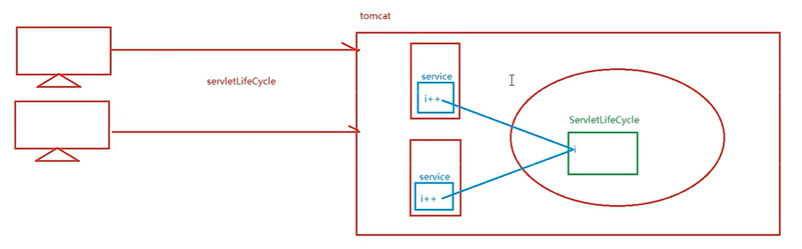
        <p>Servlet线程安全问题</p>
    </div>

    - 所以 ***避免 修改 Servlet对象的成员变量***

***defalut-servlet***

- 当客户端请求 静态 资源的 时候，Tomcat 会根据请求 查找现有 Servlet 对象
- 没有匹配者，最后会交给 ***default-servlet*** 处理该请求
    - Tomcat的 web.xml 中配置如下
    ```xml
    <servlet-mapping>
        <servlet-name>default</servlet-name>
        <url-pattern>/</url-pattern>
    </servlet-mapping>
    ```
    - default-servlet 会通过IO流读取 请求路径下的文件，并将其放入 response对象中（响应体），然后封装进响应报文

### Servlet继承结构


#### 1. 顶级Servlet接口
```java
    public interface Servlet {
        // 初始化方法，构造完毕后，由tomcat 自动调用完成初始化功能的方法
        void init(ServletConfig var1) throws ServletException;

        // 获得ServletConfig 对象的方法 （配置信息如何存放？）
        ServletConfig getServletConfig();

        // 接受用户请求，用于响应信息、处理请求的方法
        void service(ServletRequest var1, ServletResponse var2) throws ServletException, IOException;

        // 返回Servlet字符串描述信息的方法
        String getServletInfo();

        // Servlet在回收前由tomcat所调用的销毁方法，用于资源释放
        void destroy();
    }
```

***Servlet配置信息存放***

上述Servlet配置信息写在 web.xml 中，如下，tomcat会读取标签中的键值对数据，然后在执行 `void init(ServletConfig var1)` 的时候会生成一个 `ServletConfig` 对象，从而可以被获取

```xml
    <servlet>
        <servlet-name>userServlet</servlet-name>
        <servlet-class>com.sijor.servlet.UserServlet</servlet-class>
        <init-param>
            <param-name>key</param-name>
            <param-value>value</param-value>
        </init-param>
    </servlet>
    <servlet-mapping>
        <servlet-name>userServlet</servlet-name>
        <url-pattern>/usr-servlet</url-pattern>
    </servlet-mapping>
```

#### 2. 抽象类GenericServlet

```java
    public abstract class GenericServlet implements Servlet, ServletConfig, Serializable {
        private transient ServletConfig config;
    
        public void destroy() {
            // 将抽象方法，重写为普通方法，在方法内部没有任何的实现代码
            // 平庸实现
        }
    
        // tomcat在调用init方法时，会读取配置信息进入一个ServletConfig对象并将该对象传入init方法
        public void init(ServletConfig config) throws ServletException {
            // 将config对象存储为当前的属性
            this.config = config;
            // 调用了重载的无参的init
            this.init();
        }
    
        // 重载的初始化方法，我们重写初始化方法时对应的方法
        public void init() throws ServletException {
        }
    
        // 返回ServletConfig的方法
        public ServletConfig getServletConfig() {
            return this.config;
        }
    
        // 再次抽象声明service方法
        public abstract void service(ServletRequest var1, ServletResponse var2) throws ServletException, IOException;
    }
```

#### 3. 抽象类HttpServlet

`HttpServletRequest` 侧重于实现 `service` 

```java
    public abstract class HttpServlet extends GenericServlet {
    
        public void service(ServletRequest req, ServletResponse res) throws ServletException, IOException {
            HttpServletRequest request;
            HttpServletResponse response;
            try {

                // 参数的父转子，调用了重载的 service 方法 
                request = (HttpServletRequest)req;
                response = (HttpServletResponse)res;
            } catch (ClassCastException var6) {
                throw new ServletException(lStrings.getString("http.non_http"));
            }

            // 调用了重载的 service 方法  
            this.service(request, response);
        }

        protected void service(HttpServletRequest req, HttpServletResponse resp) throws ServletException, IOException {
            // 获取请求方式
            String method = req.getMethod();    // GET POST PUT DELETE OPTIONS ... ... 
            long lastModified;

            // 根据请求方式，调用对应的 doxxx 方法
            if (method.equals("GET")) {
                lastModified = this.getLastModified(req);
                if (lastModified == -1L) {
                    this.doGet(req, resp);
                } else {
                    ...
                }
            } else if (method.equals("HEAD")) {
                ...
                this.doHead(req, resp);
            } else if (method.equals("POST")) {
                this.doPost(req, resp);
            } else if (method.equals("PUT")) {
                this.doPut(req, resp);
            } else if (method.equals("DELETE")) {
                this.doDelete(req, resp);
            } else if (method.equals("OPTIONS")) {
                this.doOptions(req, resp);
            } else if (method.equals("TRACE")) {
                this.doTrace(req, resp);
            } else {
                ...
                resp.sendError(501, errMsg);
            }
        }

        protected void doGet(HttpServletRequest req, HttpServletResponse resp) throws ServletException, IOException {
            String msg = lStrings.getString("http.method_get_not_supported");
            ...
            
            // 故意响应405，发送请求不允许的信息
            resp.sendError(405, msg)
        }

        protected void doPost(HttpServletRequest req, HttpServletResponse resp) throws ServletException, IOException {
            String msg = lStrings.getString("http.method_post_not_supported");
            ...
            // 故意响应405，发送请求不允许的信息
            resp.sendError(405, msg)
        }
    }
```

#### 4. 自定义Servlet

<div style="text-align:center">
    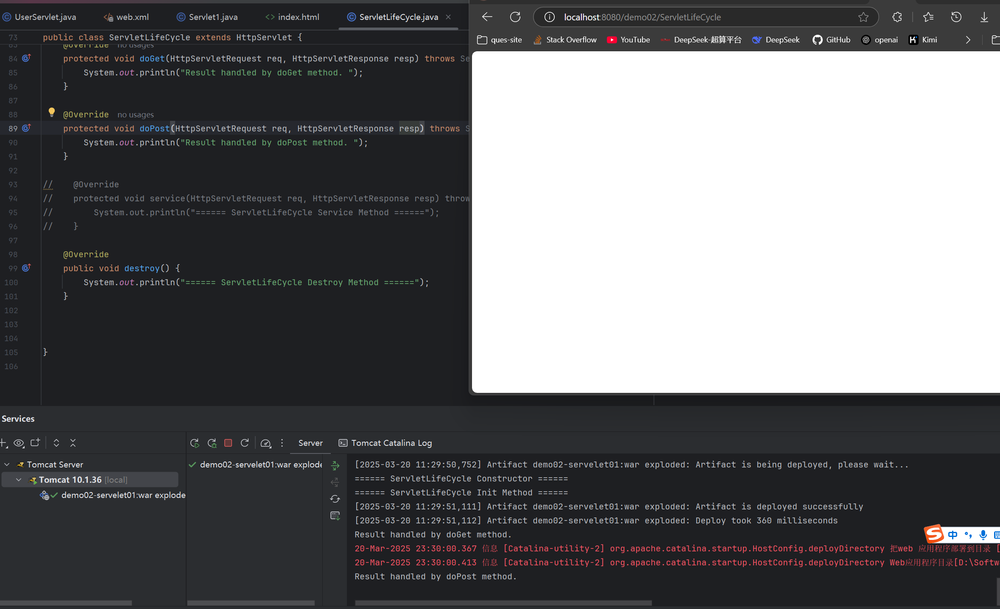
    <p>自定义Servlet方法</p>
</div>

如图前面所示，实际上所继承的 `HttpServlet` 中的 `service` 实际上实现了根据请求类型执行 `doXXX` 的处理逻辑

这里如果注释掉自定义Servlet中的 `service` 方法， 则默认调用父类中的 `service` 方法，而父类 `HttpServlet` 中的 `service` 在处理 `doGet` 和 `doPost` 会故意返回 405

在重写两个 `doXXX` 处理逻辑的条件下，可以看到控制台中会执行相应的输出动作

---

1. 部分程序员推荐在 `Servlet` 中重写 `doXXX` 方法处理请求，理由是 `service` 方法中可能做了一些处理，如果我们直接重写 `service` 的话，父类中 `service`方法处理功能会失效
2. 目前直接重写 `service` 也没有什么问题
3. 后续使用了 SpringMVC 框架后，我们则无需继承 `HttpServlet`，处理请求的方法也无需是 `doXXX` 或 `service`
4. 如 `doGet` 和 `doPost` 方法中，我们定义的代码都一样，可以让一个方法直接调用另一个方法


***需要掌握的技能***
    继承 `HttpServlet` 之后，要么重写 `service` 方法，要么重写 `doGet/doPost` 方法

### ServletConfig

<div style="text-align:center">
    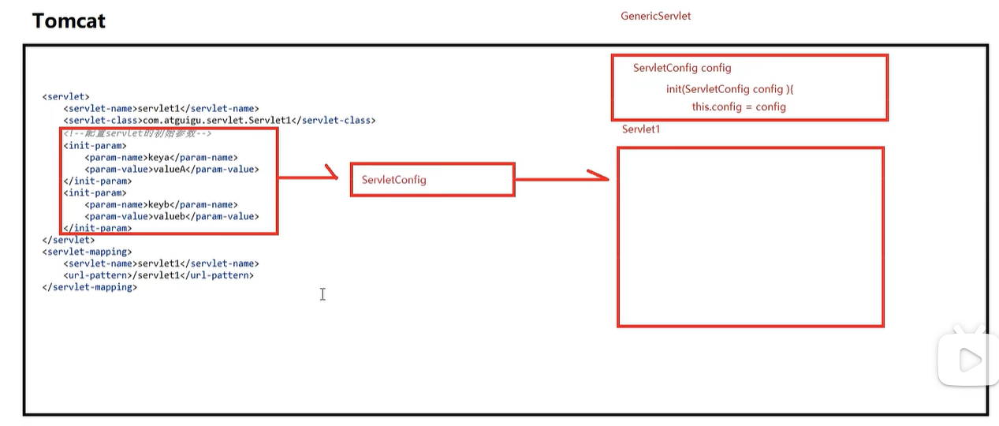
    <p>ServletConfig原理</p>
</div>

- `ServletConfig` 是为 `Servlet` 提供配置参数的一种对象，每个 `Servlet` 都有自己唯一的 `ServletConfig`
- 容器会为每个  `Servlet` 实例化一个 `ServletConfig` 对象，并通过  `Servlet` 生命周期的  `init` 方法传给  `Servlet` 作为属性 

#### web.xml 配置
```xml
    <servlet>
        <servlet-name>servlet1</servlet-name>
        <servlet-class>com.sijor.servlet.Servlet1</servlet-class>
        <init-param>
            <param-name>keyA</param-name>
            <param-value>valueA</param-value>
        </init-param>
        <init-param>
            <param-name>keyB</param-name>
            <param-value>valueB</param-value>
        </init-param>
    </servlet>
    
    <servlet-mapping>
        <servlet-name>servlet1</servlet-name>
        <url-pattern>/ConfigContextServlet</url-pattern>
    </servlet-mapping>
```
#### 注解配置

```java
@WebServlet(
        name = "Servlet1",
        urlPatterns = "/Servlet1",
        initParams = {@WebInitParam(name = "key-A", value = "value-A"), @WebInitParam(name = "key-B", value = "value-B")}
)
public class Servlet1 extends HttpServlet {
    @Override
    protected void service(HttpServletRequest req, HttpServletResponse resp) throws ServletException, IOException {
        ...
    }
```


### ServletContext

#### ervletContext是什么 
- ServletContext对象有称呼为**上下文对象**，或者叫**应用域对象**(后面统一讲解域对象)
- 容器会为每个app创建一个 ***独立的唯一的ServletContext对象***
- ServletContext对象为所有的Servlet所共享
- ***ServletContext可以为所有的Servlet提供初始配置参数***

<div style="text-align:center">
    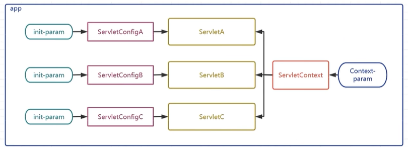
    <p>ServletContext原理</p>
</div>

#### ServletContext其他中要API
##### 获取资源的真实路径 
```java
String path = servletContext.getRealPath("资源在web目录中的路径");
```
例如目标是 ***获取某个静态资源的路径***，不是工程目录中的路径，而是部署项目中的路径；

不能直接拷贝静态资源在本地的完整路径

上述代码中的API可以动态获取 ***项目在实际运行时候的实际路径***

##### 获取项目的上下文路径 

```java
String contextPath = servletContext.getContextPath();
```
项目的部署名称，也叫做项目的上下文路径、在部署进入tomcat时所使用的路径，该路径是可能发生变化的，***通过上述API可以动态获取项目真实的上下文路径***

##### 域对象的相关API 

域对象的相关API

- 域对象：一些用于存储数据和传递数据的对象，传递数据不同的范围，我们称之为不同的域，不同的域对象代表不同的域，共享数据的范围也不同
- ***ServletContext代表应用，所以ServletContext域也叫作应用域，是webapp中最大的域，可以在本应用内实现数据的共享和传递***
- webapp中的三大域对象，分别是***应用域，会话域，请求域***
- 后续我们会将三大域对象统一进行讲解和演示，三大域对象都具有的API如下

API | 功能解释
--- | ---
void setAttribute(String key,Object value); | 向域中存储/修改数据
Object getAttribute(String key); | 获得域中的数据
void removeAttribute(String key); | 移除域中的数据


***域对象（Scope Object）是 Java Servlet API 中用于在不同的作用域（范围）内存储和共享数据的对象。Servlet 规范定义了四种域对象，每种域对象对应不同的数据共享范围：***

1. **Page 域**：仅在同一个 JSP 页面或 Servlet 的请求处理方法中有效。
2. **Request 域**：在一次请求中有效，可以跨多个页面共享数据。
3. **Session 域**：在同一个会话中有效，可以跨多个请求共享数据。
4. **Application 域**：在同一个应用程序中有效，可以跨多个会话和请求共享数据。

### 域对象的 API 使用

域对象提供了一组标准的 API 来存储、检索和移除数据。这些 API 在所有四种域对象中都是通用的，包括 `PageContext`、`HttpServletRequest`、`HttpSession` 和 `ServletContext`。以下是这些 API 的详细说明和使用方法：

#### 1. `setAttribute(String key, Object value)`

用于向域对象中存储数据。`key` 是数据的名称，`value` 是要存储的数据。

**示例代码：**
```java
// 在 Servlet 中设置属性
request.setAttribute("username", "Kimi");
session.setAttribute("userRole", "admin");
application.setAttribute("appVersion", "1.0");
```

#### 2. `getAttribute(String key)`

用于从域对象中检索数据。`key` 是之前存储数据时使用的名称。

**示例代码：**
```java
// 在 Servlet 中获取属性
String username = (String) request.getAttribute("username");
String userRole = (String) session.getAttribute("userRole");
String appVersion = (String) application.getAttribute("appVersion");
```

#### 3. `removeAttribute(String key)`

用于从域对象中移除数据。`key` 是之前存储数据时使用的名称。

**示例代码：**
```java
// 在 Servlet 中移除属性
request.removeAttribute("username");
session.removeAttribute("userRole");
application.removeAttribute("appVersion");
```

#### 使用场景

- **Page 域**：通常用于在 JSP 页面中传递数据，例如在表单处理中。
- **Request 域**：适用于在一次请求中传递数据，例如在请求转发时。
- **Session 域**：适用于在用户会话期间存储用户特定的信息，例如用户的登录状态。
- **Application 域**：适用于在整个应用程序中共享全局数据，例如应用程序的配置信息。

#### 示例：使用 ServletContext 存储和检索全局数据

```java
import javax.servlet.*;
import javax.servlet.http.*;

public class MyAppServlet extends HttpServlet {
    public void init() throws ServletException {
        // 在应用启动时设置全局属性
        getServletContext().setAttribute("appVersion", "1.0");
    }

    protected void doGet(HttpServletRequest request, HttpServletResponse response) throws ServletException, IOException {
        // 从应用域中获取全局属性
        String appVersion = (String) getServletContext().getAttribute("appVersion");
        response.setContentType("text/html");
        response.getWriter().println("<html><body>");
        response.getWriter().println("<h1>Application Version: " + appVersion + "</h1>");
        response.getWriter().println("</body></html>");
    }
}
```

在这个示例中，我们在 Servlet 的 `init()` 方法中设置了一个全局属性 `appVersion`，然后在 `doGet()` 方法中检索并显示这个属性。这个属性在整个应用程序中都是可用的。


<div style="text-align:center">
    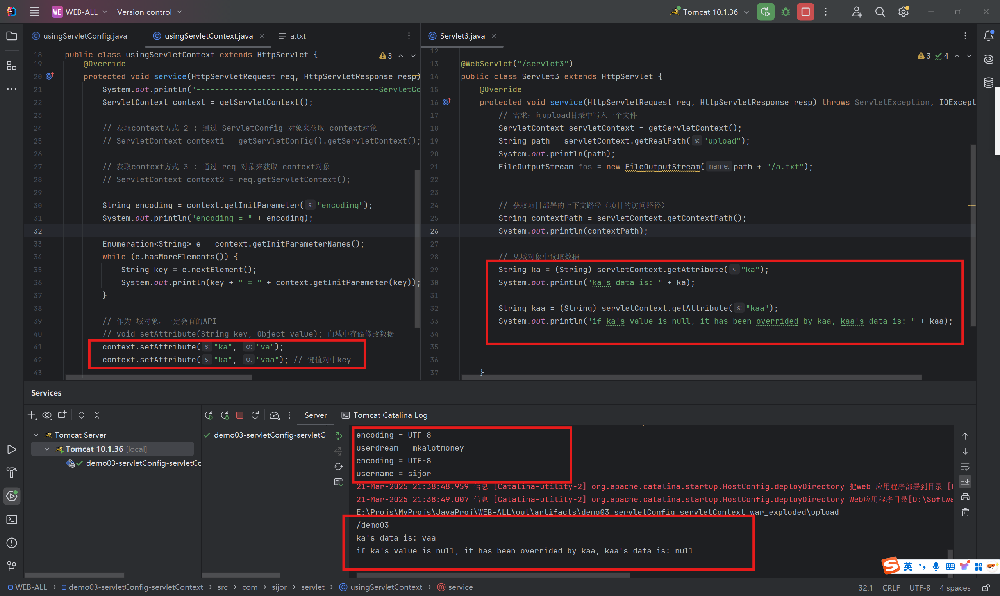
    <p>Servlet域对象</p>
</div>

如图所示，左右两边分别是两个 `servlet` 类，左边的最后设置了 `usingServletContext` 设置了如下属性值：

```java
ServletContext context = getServletContext();

...

// void setAttribute(String key, Object value); 向域中存储修改数据
context.setAttribute("ka", "va");
context.setAttribute("ka", "vaa"); // 键值对中key
```

右边 `Servlet3` 可以使用这个应用域中的属性值
```java
ServletContext servletContext = getServletContext();
        
...

// 从域对象中读取数据
String ka = (String) servletContext.getAttribute("ka");
System.out.println("ka's data is: " + ka);

String kaa = (String) servletContext.getAttribute("kaa");
System.out.println("if ka's value is null, it has been overrided by kaa, kaa's data is: " + kaa);
```

可以看到，`ka` 的值是 `vaa` ，因为键值对设置时，相同键的后来的值会覆盖之前的，而 `kaa` 并没有对应的键值对设置

***PS:访问方式是先访问左边的 urlpattern `/TestingContext` 然后再访问右边的 `servlet3`***，因为只有先设置了，才能访问到


### HttpServletRequest

- HttpServletRequest是一个接口,其父接口是ServletRequest
- HttpServletRequest是 ***Tomcat 将请求报文转换封装而来的对象,在Tomcat调用service方法时传入***
- HttpServletRequest代表客户端发来的请求,所有请求中的信息都可以通过该对象获得

<div style="text-align:center">
    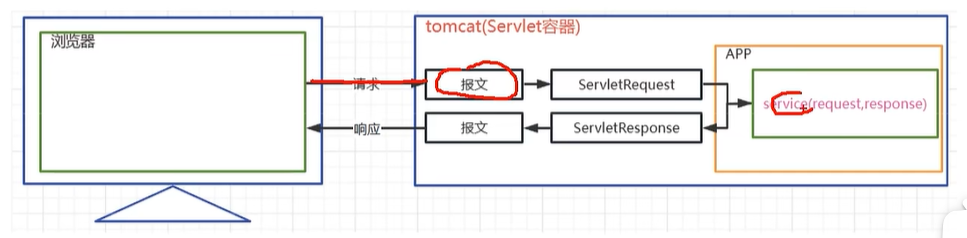
    <p>HttpServletRequest概念</p>
</div>


#### HttpServletRequest常见API

- ***获取请求行信息相关(方式,请求的Url,协议及版本)***

| API | 功能解释 |
| --- | --- |
| StringBuffer getRequestURL(); | 获取客户端请求的url |
| String getRequestURI(); | 获取客户端请求项目中的具体资源 |
| int getServerPort(); | 获取客户端发送请求时的端口 |
| int getLocalPort(); | 获取本应用在所在容器的端口 |
| int getRemotePort(); | 获取客户端程序的端口 |
| String getScheme(); | 获取请求协议 |
| String getProtocol(); | 获取请求协议及版本号 |
| String getMethod(); | 获取请求方式 |

---

- ***获取请求头信息相关***

| API | 功能解释 |
| --- | --- |
| String getHeader(String headerName); | 根据头名称获取请求头 |
| Enumeration<String> getHeaderNames(); | 获取所有的请求头名字 |
| String getContentType(); | 获取content-type请求头 |


---
- ***获取请求参数相关***

| API | 功能解释 |
| --- | --- |
| String getParameter(String parameterName); | 根据请求参数名获取请求单个参数值 |
| String[] getParameterValues(String parameterName); | 根据请求参数名获取请求多个参数值数组 |
| Enumeration<String> getParameterNames(); | 获取所有请求参数名 |
| Map<String, String[]> getParameterMap(); | 获取所有请求参数的键值对集合 |
| BufferedReader getReader() throws IOException; | 获取读取请求体的字符输入流 |
| ServletInputStream getInputStream() throws IOException; | 获取读取请求体的字节输入流 |
| int getContentLength(); | 获取请求体长度的字节数 |


---
#### HttpServletResponse
#### 请求转发和重定向
***请求转发特点（通过 HttpServletRequest对象获取请求转发器实现）***
- 请求转发时，请求和响应对象会继续传递给下一个资源
- 请求中的参数可以继续向下传递
- 请求转发是服务器内部行为
- 不能访问项目以外的资源，`请求的资源[/demo04/http://www.baidu.com]不可用`

***响应重定向特点（通过HttpServletResponse对象的sendRedirect方法实现）***
- 定向可以到本项目以外的外部资源
#### 乱码问题
#### 路径问题

## 案例开发-日程管理


