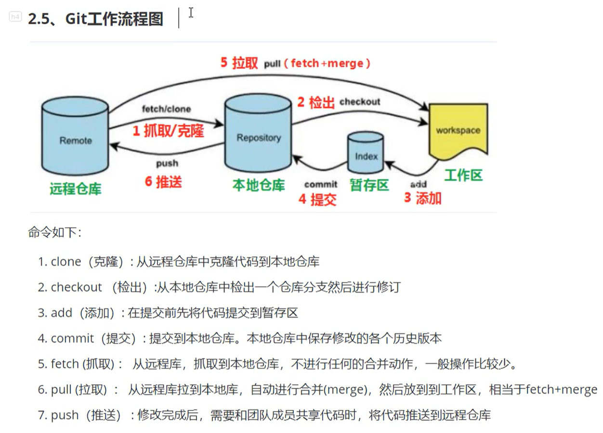

# Git

## Intro
分布式版本控制软件。版本控制意味着可以不用重写过去的版本就可以保存时间过程中的修改；分布式意味着开发者使用 Git仓库 的每一次提交、每一个分支、每一个文件都具有一个完整仓库的副本。

    
    
Git工作流程

1. **Workspace**：
   - 创建文件夹 —> 配置.gitignore文件 —> 文件夹中打开bash —> `git init`初始化一个新的git仓库。这样就创建了一个git工作区。
2. **Staging area**：
   - 实为 Index文件（.git/index）。用于追踪工作区文件的变化（增删改等）。是工作区和版本库的中间状态 —> `git add file_name` 将工作区文件加入暂存区。
3. **Repository**：
   - ***本地仓库和远程仓库***:
     - local repository就是本地的一个文件夹，远程仓库如Github等
     - 每次进入可以查看仓库状态 `git status`
     - 如果不是仓库需要进行git初始化 —> `git commit` 将暂存区修改记录提交。
   - ***上游分支、主分支***：
     - 上游分支（upstream branch）：通常指的是远程仓库的分支，它是你当前分支从远程仓库中克隆下来的原始分支。当你使用 `git clone` 命令从远程仓库克隆代码时，Git会默认将远程仓库的主分支（通常是master或main）作为你当前分支的上游分支。
     - 主分支：主分支通常是团队共同维护的分支，用于开发、测试和稳定版本的发布。在Git中，主分支通常被命名为main或master，它是远程仓库的默认分支。

## Related info
### 版本管理
版本管理是软件工程领域中的一种开发实践，是对软件代码或其他文件历史变化的追踪和管理。主要目的是为了记录软件变化的历史记录，以便回滚到之前状态，比较不同版本的差异，协同开发者的开发任务。
核心功能如下：
- 版本控制：记录文件的每一次修改，每个版本都会有唯一的标识
- 历史记录：追踪文件变化的历史，以便于回滚到某一历史状态
- 分支管理：主代码线可以引出多个分支线，供开发者协同开发使用，在各个分支独立开发（主线代码的基础之上）不会影响主线代码
- 合并：将分支内容推送与主代码合并，如一个分支功能的加入
- 冲突解决：不同用户对同一份代码进行修改时，整合代码内容
- 团队协作

## 命令
### 配置相关
- `git config --global user.name "username"` 设置全局仓库用户名字
- `git config --global user.email "useremail"` 设置全局仓库用户邮箱 （去掉 `global` 则为设置当前仓库的）
- `git config --global --get user.name` 获取局仓库用户名字
- `git config --global --get user.email` 获取全局仓库用户邮箱 （去掉 `global` 则为获取当前仓库的）
- `echo "some_file_or_directory" > .gitignore` 设置 .gitignore 文件来忽略特定文件或目录
- `git config --list` 查看所有配置项
- `git config --help` 查看某个配置项的帮助信息

### 基本操作
- `git init` 初始化目录为仓库
- `git status` 查看当前仓库状态
- `git add` 向仓库暂存区中添加文件，如 `gti add readme.md`
- `git commit` 保存仓库历史记录（即修改的各个历史版本） 如 `git commit -m 'commit info'`
  - 记录详细提交信息：不添加 `-m 'commit info'` ，
- `git log` 查看提交日志
  - `git log --graph` 以图表形式查看
  - `git log file_name` 查看指定文件相关的日志
  - `git log -p` 查看提交前后差异
  - `git log -p file_name`
- `git diff` 查看工作树和最新提交的差异

### 分支命令
- `git branch` 查看当前分支
  - 通常使用 `master` 作为主干分支
  - 特性分支，是指该分支中只实现某一特性/主题，不进行其他作业的操作
- `git checkout -b branch_name` 创建并切换到分支 `branch_name`
  - `git checkout branch_name` 切换到分支 `branch_name`
  - `git checkout -` 切换回上一个分支
- `git merge --no-ff branch_name` 合并分支，带有参数用于录入合并记录

### 更改提交操作
***暂时用不到，后续再学习***
- `git reset` 

### 推送至远程仓库
- `git remote add` 将远程仓库设置为本地仓库的远程仓库
  - `git remote add origin git@github.com:user_name/proj_name.git`
  - 上述命令会将远程仓库设置为 `origin`
- `git push -u origin master` 
  - 当前在本地 `master`仓库，将内容推送给对应的远程 `master` 仓库
  - `-u` 参数保证将远程 `origin`仓库的 `master`分支设定为，当前本地仓库的`upstream`
- `git checkout -b new_branch ` `git push -u origin new_branch`
  - 本地仓库新建分支，并推送给远程对应分支

### 同步原始项目
fork 别人的项目有了更新，将当前分支同步为最新版本
- `git remote add upstream git@github.com:proj_forked_url` 
  - 将原始仓库添加为本地仓库的远程仓库（参考上面 `git remote add`）
  - `upstream` 是通用名称，可以修改
- `git fetch upstream` 同步远程仓库信息
- `git merge upstream/main` 将原始仓库的更新合并到本地分支（`main`是当前在使用的分支）
- `git push origin main` 解决完所有冲突后推送自己分支的更新

### 从远程仓库获取

