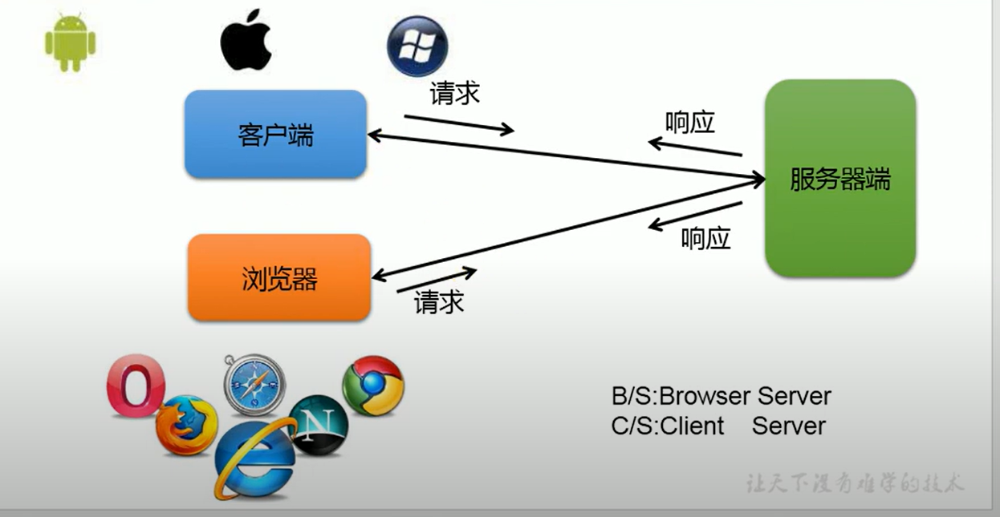
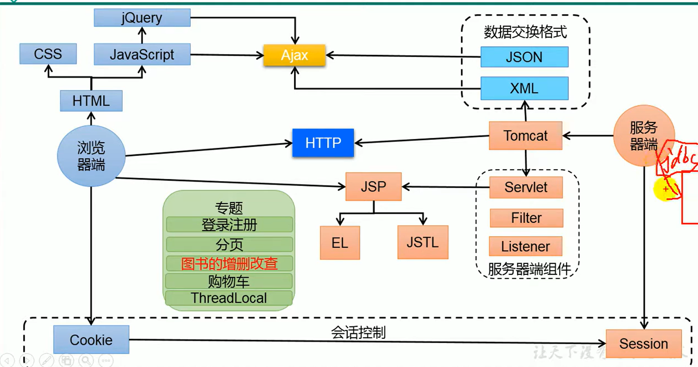
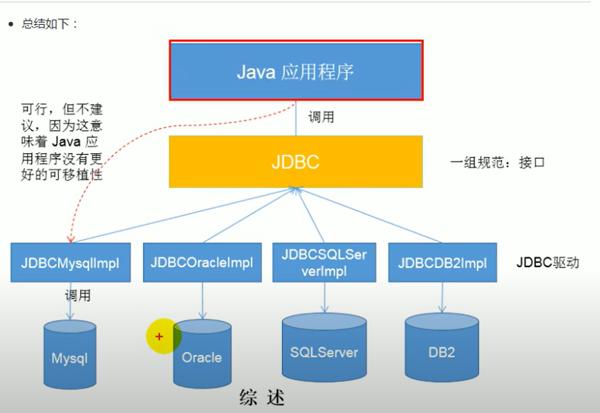
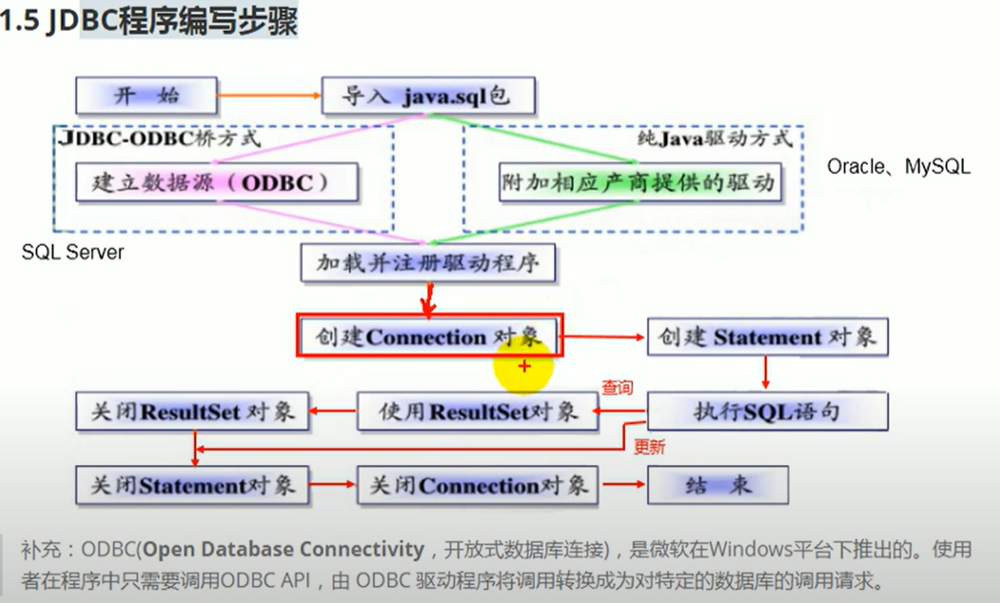
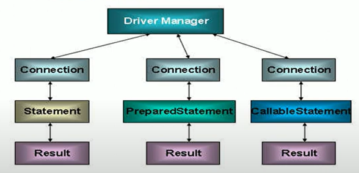

# 1. Preliminary
## 框架概述

***软件架构概述***

<div style="text-align:center">
    
    <p>软件架构</p>
</div>


***javaWeb框架概述***
<div style="text-align:center">
    
    <p>javaWeb技术框架</p>
</div>
 

## JDBC概述
***数据持久化***

如 Java的 I/O流中，内存缓冲buffer就不是持久化保存数据，而文件操作则是真正的数据保存

内存中的数据，不仅能保存到文件，存储介质其实有很多（file, sql, ...），保存到数据库是更加常用的数据持久化选择

***Java中的数据存储技术***

- JDBC 直接访问数据库
- JDO (Java Data Object) 技术
- 第三方 O/R 工具：Hiernate、Mybatis等

**都是 JDBC 的高级封装工具**

***JDBC连接概述***
<div style="text-align:center">
    
    <p>JDBC连接概述</p>
</div>
 

***JDBC 程序编写步骤***
<div style="text-align:center">
    
    <p>JDBC程序编写步骤</p>
</div>
 


# 2. JDBC 编程技术

***vscode 添加 Java的 mysql驱动（.jar文件）***
[VS code java连接MySQL详解](https://blog.csdn.net/m0_57089822/article/details/122078217)

- `Driver` 每个驱动程序类必须实现的接口 （一些jar包中已经实现，如com.mysql.jdbc.Driver.Driver() 需要关注方法的调用）
    - 如 `Connection connect(String url, Properties info)` 返回一个 Connection对象
- `Connection` 是一个与特定数据库连接的会话（session）对象
- `DriverManager` 用于管理一组 JDBC 驱动程序的服务 的类


## 数据库连接
迭代的5种连接方式

- 从第一种方式不断迭代，开始直接使用 数据库信息、mysql的jar包、mysql的 Driver驱动
- 后续不断抽象
    - 使用反射机制动态 创建驱动实例
    - 使用 DriverManager 这一统一接口来管理不同数据库的驱动程序
    - 资源信息（数据库信息）放入 jdbc.properties
    - ...


### 抽象和封装

JDBC 的设计目标是提供一种与数据库无关的接口，让开发者能够以统一的方式操作不同的数据库。

DriverManager 作为中间层，封装了驱动程序的细节，使得开发者无需直接与驱动程序交互。

如果直接使用 Driver 的实例，代码将与具体的数据库驱动程序紧密耦合，违反了 JDBC 的设计理念。
驱动程序注册机制

### 驱动程序注册机制

在 JDBC 规范中，驱动程序需要通过 DriverManager 进行注册。驱动程序类通常会实现 java.sql.Driver 接口，并在加载时自动注册到 DriverManager 中。

```java
public class MyDriver implements Driver {
    static {
        DriverManager.registerDriver(new MyDriver());
    }
}
```

## CRUD

***使用PreparedStatement实现CRUD***

- 数据库连接session 被用于**向数据库服务器发送命令和SQL语句**，并接受数据库服务器返回的结果，其实一个数据库连接就是一个 Socket连接
- java.sql包中有3个接口分别定义了对数据库的调用的不同方式
    - ***Statement***: 用于执行静态SQL语句并返回它所生成结果的对象
    - ***PreparedStatement***： `PreparedStatement` 是 `Statement`接口的子接口，SQL语句被预编译并存储在此对象中，可以使用此对象多次高效地执行该语句
    - ***CallableStatement***：用于执行SQL存储过程

<div style="text-align:center">
    
    <p>接口交互关系</p>
</div>

***直接使用Statement的弊端***
- 需要拼写sql 语句，并且存在SQL注入问题

