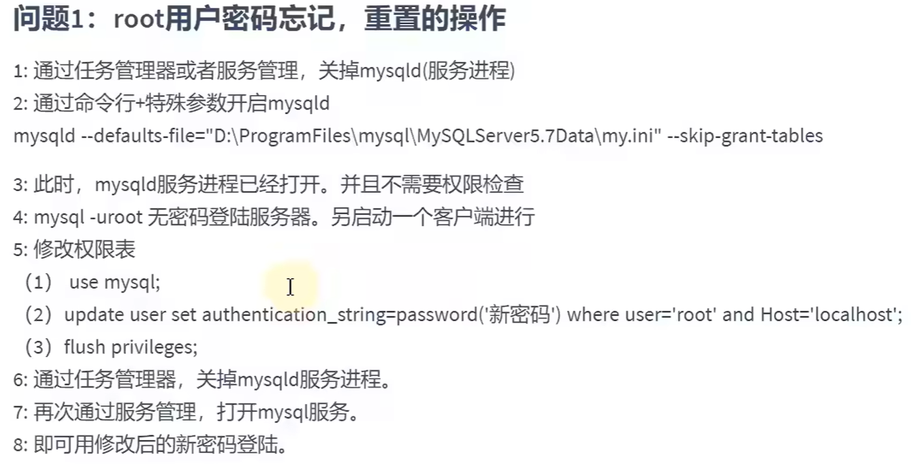
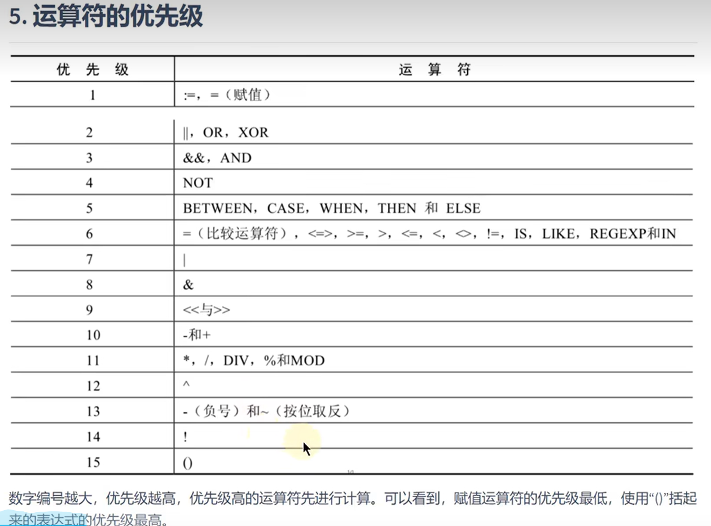
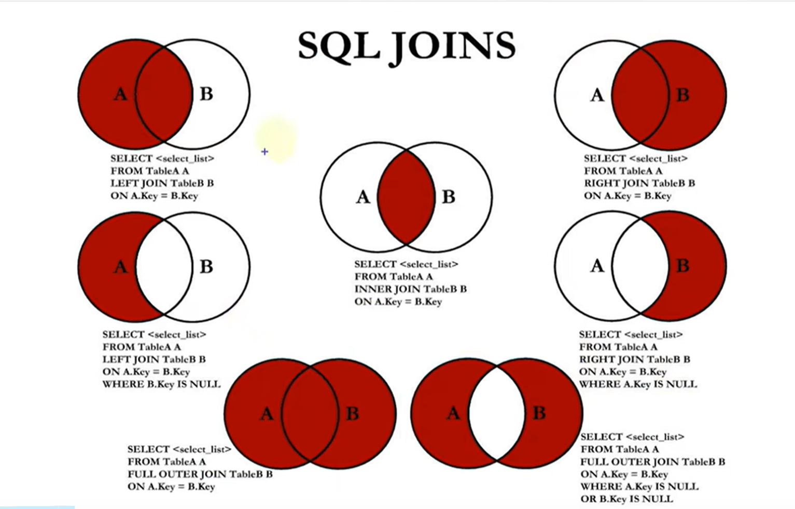

## MySQL
### Reference

- [菜鸟教程](https://www.runoob.com/mysql/mysql-connection.html)
- [MySQL安装教程](https://blog.csdn.net/weixin_47406082/article/details/131867849?ops_request_misc=%257B%2522request%255Fid%2522%253A%2522171647672116800225532250%2522%252C%2522scm%2522%253A%252220140713.130102334..%2522%257D&request_id=171647672116800225532250&biz_id=0&utm_medium=distribute.pc_search_result.none-task-blog-2~all~top_positive~default-2-131867849-null-null.142^v100^pc_search_result_base8&utm_term=MySQL%E5%AE%89%E8%A3%85&spm=1018.2226.3001.4187)
- [navicat安装教程](https://mp.weixin.qq.com/s/Of1282kGihYiXnmxvB9Csw)
- [navicat使用教程](https://blog.csdn.net/qq_45069279/article/details/105919312?ops_request_misc=%257B%2522request%255Fid%2522%253A%2522171657178116800182137881%2522%252C%2522scm%2522%253A%252220140713.130102334..%2522%257D&request_id=171657178116800182137881&biz_id=0&utm_medium=distribute.pc_search_result.none-task-blog-2~all~top_positive~default-2-105919312-null-null.142^v100^pc_search_result_base8&utm_term=navicat&spm=1018.2226.3001.4187)
- [卸载教程](https://blog.csdn.net/m0_52861000/article/details/131354710?ops_request_misc=%257B%2522request%255Fid%2522%253A%2522172110015316800180631045%2522%252C%2522scm%2522%253A%252220140713.130102334..%2522%257D&request_id=172110015316800180631045&biz_id=0&utm_medium=distribute.pc_search_result.none-task-blog-2~all~top_positive~default-2-131354710-null-null.142^v100^pc_search_result_base8&utm_term=%E5%8D%B8%E8%BD%BDmysql&spm=1018.2226.3001.4187)
### 数据库基础

- DBMS(Data Base Manage System) 数据库软件管理系统，是软件系统，如 MySQL等各类我们常称的“数据库”
- DBMS 存放的文件成为 “表（table）”， 结构化的文件，存储某种特定类型的数据
  - DBMS(MySQL) 中可以有多个 "库（library）"，每个库中会有多个 "表（table）"
- MySQL：开源DBMS，执行快，已安装，易使用
- client-server 软件：DBMS分为两类，一类是 共享文件系统的DBMS；一类则是客服-服务器软件，开发中的是后者
- ***模式（schema）***，在数据库中非常重要的概念，有不同含义：
  - 模式schema：指的是 数据库的结构设计，包括 tables、views、indexs、store procedures、triggers、constraints等。***schema 描述了数据的组织方式***
  - 数据库实例：有时候指的是一个 Database Instance
  - 命名空间： 某些数据库系统中，schema 也可以看做一个 namespace，用于区分不同的用户或组的对象名称
  - 数据字典： 一些数据库系统中，schema 用以存储数据库原数据的 data dictionary
- 列：记录的某个字段/属性
  - 数据类型
- 行：table中数据是按行存储的，一行就是一个 record
- 主键：每一行中可以唯一标识自己的一列/一组列
  - 就是每行的关键字
- SQL：Structured Query Language
- ***关系型数据库*** 就是使用关系模型（表格模型）的数据库，非关系型数据库则使用其他多种类型的数据模型（MongoDB:Document, redis:key-value, Elasticsearch:search-engine, Neo4J:graph...）

***Design rules of RDBMS***
- (relational data base manage system) ***RDBMS的典型数据结构： 数据表（structred）***，数据-->表-->库，一个数据库中可有多个表，每个表唯一（表名标识唯一）
- 表、记录、字段
  - ***E-R(Entity-relationship) 模型中 3 个主要概念： 实体集、属性、联系集***
    - 实体集：数据库中一个表
    - 实体：数据库表中的一行（row、record）
    - 属性：attribute，对应数据库表中的一列/字段（column、field）
  - 表的关联关系：1v1, 1vm, mvm, slef-reference（一对一、多， 多对多， 自我引用）

### MySQL 管理

#### NET commands
***[重装系统后无MySQL服务问题解决](https://blog.csdn.net/SH_King/article/details/48178711?ops_request_misc=&request_id=&biz_id=102&utm_term=net%20start%20%E6%89%BE%E4%B8%8D%E5%88%B0%20MySQL%20%E6%9C%8D%E5%8A%A1&utm_medium=distribute.pc_search_result.none-task-blog-2~all~sobaiduweb~default-4-48178711.142^v100^pc_search_result_base5&spm=1018.2226.3001.4187)***


- 命令行服务管理
  - ***管理员身份***打开命令行
  - `NET HELP` 查看 `NET` 命令帮助（小写也可以）
  - `NET START /HELP` 查看指定命令 `NET START` 的帮助信息
    - `NET START` 显示当前开启的服务
      - `NET START | find "MySQL/service_partial_name"`直接查找相关命令
    - `NET START service` 开启服务
    - `NET START "service1 service2"` 开启多个服务需用双引号指示多个名称
    - `NET STOP service` 关闭服务
- 启动 MySQL 服务
  - 查看开启服务，本地MySQL服务全称为 MySQL90
  - `NET START MySQL91` 开启MySQL服务
  - `NET STOP MySSQL91` 关闭MySQL服务

#### mysqladmin commands
- `mysqladmin -u root -p [check_content]` `-u` 是用户，`-p`是密码
- `mysqladmin -u root -p version` 查看完整的数据库主机信息
- `mysqladmin -u root -p status` 显示MySQL服务器的运行状态
- `mysqladmin -u root -p processlist` 显示MySQL服务器中正在运行的进程列表


***MySQL连接***
本地MySQL用户名：root
本地MySQL密码：123456

#### 命令行连接、退出
- `mysql -u [username(root)] -p` 然后键入密码进入 MySQL
  - `mysql -u root -p 123456 -P 3306 -h localhost` 完整连接命令，如果就是在本机的3306端口，后两个可以省略（参考上面 数据库主机信息查看命令）
- `mysql -V/--version`
- `quit/exit` 退出MySQL
- msql命令行实用程序
  - `;` 结束
  - `help` 或 `\h` 获取帮助，如 `help/HELP SELECT;` 、`\h SELECT`
  - `QUIT/quit/EXIT/exit` 退出数据库

#### 数据导入指令
- `source absolute_path_of_src_file.sql`
  - `source D:\xxx.sql`

### MySQL 操作实例
- `SHOW DATABASES;` 
- `CREATE DATABASE [IF NOT EXISTS] db_name;`
- `USE db_name;`
- `CREATE TABLE table_name(id int, name varchar(15));`
- `SHOW TABLES;`
- `SELECT * FROM table_name;`
- `INSERT INTO table_name VALUES(1001, 'sijorhou');`
  - `SHOW CREATE TABLE table_name` 快速显示常见table_name的完整命令和表结构
  - `SHOW VARIABLES LIKE 'character_set_%';`  用于显示所有以 character 为前缀的系统变量（显示MySQL服务器使用的字符集，如 `character_set_database：默认数据库的字符集`, `character_set_connection：服务器内部使用的客户与服务器之间的通信字符集`）
  - `SHOW VARIABLES LIKE 'collation_%';` 校对（collation）是指字符数据的比较和排序规则，该命令显示所有校对所依赖的字符集，如`collation_database：默认数据库的校对规则`, `collation_connection：客户与服务器之间通信的校对规则`
  - mysql数据库目录下的 `my.ini` 文件中可以修改默认字符集
- `DROP DATABASE db_name;`

创建数据库时，可以同时配置数据库信息
```sql
CREATE DATABASE [IF NOT EXISTS] mydatabase
CHARACTER SET utf8mb4
COLLATE utf8mb4_general_ci
DEFAULT CHARACTER SET utf8mb4
DEFAULT COLLATE utf8mb4_unicode_ci  -- 指定默认的排序规则，这里使用utf8mb4_unicode_ci作为示例
COMMENT = 'My custom database'        -- 为数据库添加注释
ENCRYPTION = 'Y';                    -- 启用加密，适用于MySQL 8.0及以上版本
```


<div style="text-align:center">
    
    <p>mysql密码重置步骤</p>
</div>

### SQL 语句
#### SELECT
- `SELECT seg(col),... FROM table_name` 以 "SELECT" 为关键字
  - 后跟 列名 （若不是 * 则为查询所有列），也可以写为列的别名 `SELECT seg seg_alias, ...`
  - 空值 NULL 参与运算， 含NULL运算结果仍为NULL
  - 着重号 ``
  - 查询常数
  - `DESC/DESCRIBE`
  - `WHERE`


```sql
-- 1. 基本查询语句
SELECT * FROM employees;
SELECT employee_id, first_name, emai, job_id FROM employees;

-- 2. 列别名（只能在 ORDER BY 中使用，WHERE中不醒）
SELECT employee_id emp_id, first_name fst_name, job_id FROM employees;
SELECT employee_id AS emp_id, first_name AS fst_name, job_id FROM employees;
SELECT employee_id "emp_id", first_name "fst_name", job_id FROM employees;
SELECT employee_id "emp_id", first_name "fst_name", salary * 12 "annual salary" FROM employees; 

-- 3. NULL 参与运算（year salary 中，commission_pact 中为NULL的结果均为NULL）
SELECT employee_id, salary "month salary", salary * (1 + commission_pct) * 12 "year salary", commission_pct FROM employees;

-- 若要筛选涉及 NULL 的数据， 使用 IS, IS NOT, <=> 
SELECT employee_id, salary "month salary", salary * (1 + commission_pct) * 12 "year salary", commission_pct FROM employees WHERE commission_pct IS NOT NULL;

-- 4. 着重号 ``，标注表名避免被识别为关键字
SELECT * FROM `order`;

-- 6. 查询常数，用于在查询结果中返回一个常量值，而无需存储在表中
SELECT 'SIJORHOU', '136315', employee_id, last_name FROM employees;

--7. 去重查询，使用 DISTINCT 关键字
SELECT DISTINCT department_id AS dp_id FROM employees;
SELECT DISTINCT department_id AS dp_id, salary FROM employees; -- 对所有记录，两个字段作为一个整体去重查询
SELECT department_id AS dp_id, DISTINCT salary FROM employees; -- 错误， 前后不一致

-- 8. 显示表结构，显示表中各个字段详细信息
DESC regions;
DESCRIBE employees;

-- 9. WHERE 过滤数据，WHERE 必须声明在 FROM 后面
SELECT * FROM employees WHERE department_id = 90;
SELECT * FROM employees WHERE last_name = 'King';
```

#### 运算符
```sql
-- 1. 算数运算符： + - * / DIV % MOD 
SELECT 100, 100 + 50, 100 -35, 3 * 18, 100 / 2, 100 DIV 2, 19 % 5, MOD(26, 7) FROM DUAL;
SELECT 100, 100 + '50', 100 -35, 3 * '18', 99 / '7', 19 % 5, MOD(26, 7) FROM DUAL;	-- 隐式转换 '' 会将数字字符 自动转换成数值类型  

SELECT employee_id, last_name AS lst_name, salary FROM employees WHERE employee_id % 2 = 0;		-- 筛选偶数工资的员工


-- 2. 比较运算符 = <=> != < <= > >=
SELECT 
	1 = 2, 1 != 2, 
	1 = '1', 1 = 'a', 0 = 'a',  -- 若字符转换为数值失败，则看做 0
	'a' = 'a', 'a' = 'ab',			-- 若均为字符/串，则按照字符/串进行比较
	1 = NULL, NULL = NULL				-- 只要NULL参与运算，结果均为NULL
FROM DUAL;		

SELECT last_name, salary, commission_pct FROM employees WHERE commission_pct IS NOT NULL AND salary >= 7000;    
SELECT 1 <=> NULL, NULL <=> NULL FROM DUAL; -- “安全等于 <=> ” 可以用于判断是不是 NULL


-- 3. 关键字 
-- 3.1 IS NULL \ IS NOT NULL \ ISNULL(expr)
SELECT employee_id, last_name, commission_pct FROM employees;
SELECT employee_id, last_name, commission_pct FROM employees WHERE ISNULL(commission_pct);
SELECT employee_id, last_name, commission_pct FROM employees WHERE commission_pct IS NULL;
SELECT employee_id, last_name, commission_pct FROM employees WHERE commission_pct <=> NULL;
SELECT employee_id, last_name, commission_pct FROM employees WHERE commission_pct IS NOT NULL;

-- 3.2 LEAST(value1,value2,...) \ GREATEST(value1,value2,...) 找最大最小
SELECT LEAST(1, 10, 9, -5, 89), GREATEST(1, 10, 9, -5, 89), LEAST('b', 'g', 'z', 't', 'l'), GREATEST('b', 'g', 'z', 't', 'l') FROM DUAL;

SELECT 
	last_name, first_name, 
	LEAST(last_name, first_name), 
	LEAST(LENGTH(first_name), LENGTH(last_name)) 
	FROM employees WHERE commission_pct IS NOT NULL;

-- 3.3 BETWEEN ... AND 范围查询
SELECT employee_id, last_name, first_name, salary 
FROM employees WHERE salary BETWEEN 6000 AND 10000;		-- 如果是 BETWEEN 10000 AND 6000 则查询无果

SELECT employee_id, last_name, first_name, salary 
FROM employees WHERE salary < 6000 OR salary > 10000;	

-- 3.4 IN \ NOT IN  在集合中与否
SELECT last_name, department_id AS dp_id FROM employees WHERE department_id = 20 OR department_id = 50 OR department_id = 100;  -- 直接使用 IN (set) \ NOT IN (set)

SELECT last_name, department_id FROM employees WHERE department_id IN (20, 50, 100);
SELECT last_name, department_id, salary FROM employees WHERE salary NOT IN (6000, 7000, 8000)

-- 3.5 LIKE 模糊查询， % 表示未知字符（若干个）， _ 表示一个未知字符， \ 表示转义字符
SELECT last_name FROM employees WHERE last_name LIKE '%a%';		-- 查询 last_name中包含 a 字符的数据
SELECT last_name FROM employees WHERE last_name LIKE 'a%';		-- 查询 last_name中以 a 字符开头的数据
SELECT last_name FROM employees WHERE last_name LIKE '%a%' AND last_name LIKE '%e%';  -- 既包含 a 又包含 e，等效写法如下
SELECT last_name FROM employees WHERE last_name LIKE '%a%e%' OR last_name LIKE '%e%a%';

SELECT last_name FROM employees WHERE last_name LIKE '_a%';		-- 查询 last_name中第二个字符为 a 的数据

-- 若要查询第三个字符为 e 的数据， 直接使用 __e （新版本）
SELECT last_name FROM employees WHERE last_name LIKE '__a%';


-- 4. 逻辑运算符 OR ||	AND &&	NOT !		XOR
SELECT employee_id, salary, department_id FROM employees WHERE department_id = 50 AND salary > 4000;
SELECT last_name, salary, department_id FROM employees WHERE salary BETWEEN 10000 AND 30000;


-- 5. 位运算符 & | ^ ~ >> 
SELECT 12 & 5, 12 | 5, 12 ^ 5, ~12, 12 << 1, 12 << 2, 12 >> 1, 12 >> 2 FROM DUAL;		-- 换算成二进制进行 按位与、或、取反、

```
***逻辑运算符优先级***
<div style="text-align:center">
    
    <p>mysql密码重置步骤</p>
</div>

#### 排序与分页

```sql
-- 1. 排序 ORDER BY 对查询到的数据进行排序,  DESC 降序排序， ASC 升序排序（默认）
SELECT employee_id, last_name, salary FROM employees ORDER BY salary DESC;		-- 按照 salary 降序排序
SELECT employee_id, last_name, salary FROM employees ORDER BY salary ASC;		-- 按照 salary 降序排序
SELECT employee_id, salary, salary * 12 "annual salary" FROM employees ORDER BY "annual salary";		-- 使用列别名，按照别名进行排序

SELECT employee_id, last_name, salary FROM employees WHERE department_id IN (50, 60, 70) ORDER BY department_id DESC;

-- 1.2 多列排名
-- 二级排序，先对某个字段排序，然后对另一个字段排序 （三级、...多级排序 均为 “多列排序”）
-- 例：现根据 department_id 降序排序， 然后在相同的 department_id 中根据 salary 升序排序
SELECT employee_id, salary, department_id FROM employees ORDER BY department_id DESC, salary ASC;


-- 2. 分页
-- 若符合查询条件的数据非常多， 返回数据的开销很大， 可以分页返回
-- 使用 LIMIT 实现数据分页显示
SELECT employee_id, last_name FROM employees LIMIT 0, 20; 	-- 代表从 0偏移20个位置，即显示第一页20条数据
SELECT employee_id, last_name FROM employees LIMIT 20, 20;	-- 显示第二页20条数据

-- 每页显示 pageSize 条记录， 当前显示 pageNo 页 ： 公式： LIMIT (pageNo-1) * pageSize, pageSize;
SELECT employee_id, last_name, salary FROM employees WHERE salary > 6000 ORDER BY salary DESC LIMIT 0, 10;

SELECT employee_id, last_name FROM employees LIMIT 31, 2;		-- 从31偏移两个位置， 即显示第32， 33 条数据
SELECT employee_id, last_name FROM employees LIMIT 2 OFFSET 31;		-- 从31偏移两个位置， 即显示第32， 33 条数据

-- 查询最高工资员工信息： 降序排序， 分页仅显示第一条
SELECT * FROM employees ORDER BY salary DESC LIMIT 1; 	-- 省略基准位置， 默认从 0 开始

```


#### 多表查询/关联查询

多表查询，即 ***关联查询***，指两个或更多表一起完成查询操作（前提是一起查询的表之间有一对一、一对多等关系，***多表之间有关联字段***）

为什么有些数据要分多个表存储不同字段： 如果都在一个表中，那么一条记录占据内存就比较大，一次所能查询的记录个数就比较少，那么当需要查询大量记录时候，就需要进行多次 IO，开销较大


```sql
-- 1. example: 查询某一个名为 'Abel' 的员工在哪个城市工作 （如何将三条查询语句写成 关联查询？）

-- employees 表中的记录包含一个 department_id 字段，该字段关联 departments 表（记录中也有 department_id字段）
-- departments 表中记录包含一个 location_id 字段，该字段关联 locations 表（记录中也有 location字段）
SELECT * FROM employees WHERE last_name = 'Abel';
SELECT * FROM departments WHERE department_id = 80;
SELECT * FROM locations WHERE location_id = 2500;


-- 2. 笛卡尔积
-- 错误方式，每个员工和每个部门都匹配了一遍（笛卡尔积/交叉链接 \ CROSS JOIN）
-- 错误原因：缺少多表的连接条件
SELECT employee_id, department_name FROM employees, departments;

-- -- 正确方式，加上 连接条件
SELECT employee_id, department_name FROM employees, departments WHERE employees.department_id = departments.department_id;

-- 3. 表名使用
-- 这里会报错，因为要显示的 employee_id he  department_name 分别在 employees 和 departments 表中，但是 department_id 在多个表中，需要指明显示哪个表中的 department_id

-- SELECT employee_id, department_name, department_id 
-- FROM employees, departments 
-- WHERE employees.department_id = departments.department_id;

-- 正确方式
SELECT employee_id, department_name, employees.department_id 
FROM employees, departments
WHERE employees.department_id = departments.department_id;

-- 实际上建议每个要显示的数据都指明所在表
SELECT employees.employee_id, departments.department_name, employees.department_id 
FROM employees, departments 
WHERE employees.department_id = departments.department_id;

-- 使用表名导致查询语句过长的时候，可以使用别名（如果使用过程中给表起了别名，那么使用表名时候就必须使用别名）
SELECT emp.employee_id, dept.department_name, emp.department_id 
FROM employees emp, departments dept 
WHERE emp.department_id = dept.department_id;


-- 4. example 中的正确写法，多表查询
SELECT emp.employee_id, dept.department_name, emp.department_id, locs.city
FROM employees emp, departments dept, locations locs
WHERE emp.last_name = 'Abel'
AND emp.department_id = dept.department_id
AND dept.location_id = locs.location_id;


```
##### 多表查询分类
```sql
-- 多表查询分类
-- 1. 等值连接 vs 非等值连接
-- 2. 自连接 vs 非自连接
-- 3. 内连接 vs 外连接

-- 1. 等值连接 vs 非等值连接
-- 非等值连接 实例
SELECT emp.last_name, emp.salary, jg.grade_level
FROM employees emp, job_grades jg
WHERE emp.salary BETWEEN jg.lowest_sal AND jg.highest_sal;

-- 2. 自连接 vs 非自连接
-- 自连接 实例：employees表中，每条员工记录都有一个 manager_id，该id 代表的管理者也在employees表中
SELECT emp.employee_id, emp.last_name, emp.manager_id, mgr.employee_id, mgr.last_name
FROM employees emp, employees mgr
WHERE emp.manager_id = mgr.employee_id;


-- 3. 内连接 vs 外连接
-- 内连接：前面的例子都是内连接，即 “合并具有同一列的两个以上的表的行，结果集中不包含一个表与另一个表不匹配的行”；即 结果集只包含两个表的交集部分

-- 外连接：“合并具有同一列的两个以上的表的行，结果集中除了包含一个表与另一个表匹配的行，还查询到了左表 或 右表中不匹配的行”
-- 外连接分类： 左外连接、右外连接、满外连接


-- 查询所有员工的last_name, department_name 信息
-- employees 中有一个记录中 department_id 记录为Null，最后查询记录数位 106 （employees中107）
SELECT emp.employee_id, dept.department_name
FROM employees emp, departments dept
WHERE emp.department_id = dept.department_id;

-- SQL99语法实现内连接
-- 使用 INNER JOIN ... ON ...  INNER JOIN 代表关联两个表（INNER 可以省略），ON 取代 WHERE 指明查询条件
SELECT emp.employee_id, emp.last_name, dept.department_name
FROM employees emp INNER JOIN departments dept ON emp.department_id = dept.department_id
INNER JOIN locations loc ON dept.location_id = loc.location_id;

-- SQL99语法实现外连接
-- 左外连接（就是 额外加入左表中不符合连接条件的记录）
-- （连接条件：emp.department_id = dept.department_id， 不匹配记录：department_id 为 Null 的 178 Grant， departments中没有 Null department_id）
-- (这里记录数位 107 和 employees中相同，即不仅包含匹配的行，还包含左表中不匹配的行，所以为“左外连接”)

SELECT emp.employee_id, emp.last_name, dept.department_id
FROM employees emp LEFT OUTER JOIN departments dept ON emp.department_id = dept.department_id;

-- 右外连接
SELECT emp.employee_id, emp.last_name, dept.department_id
FROM employees emp RIGHT OUTER JOIN departments dept ON emp.department_id = dept.department_id;


-- 满外连接
-- 不支持 FULL OUTER JOIN， 需要额外实现
SELECT emp.employee_id, emp.last_name, dept.department_id
FROM employees emp RIGHT OUTER JOIN departments dept ON emp.department_id = dept.department_id;
```


##### 7种joins连接
<div style="text-align:center">
    
    <p>mysql密码重置步骤</p>
</div>

```sql
-- 7种 SQL JOINS

-- 1. 合并查询结
-- 使用 UNION 关键字，将多条 SELECT 语句的结果组合成单个结果集
-- 合并时，两表对应的列数和数据类型必须相同
-- 各个 SELECT 语句之间使用 UNION（会执行去重） 或 UNION ALL（不会执行去重） 关键字分割
-- SELECT column ... FROM table1 UNION SELECT column FROM table2;

-- 查询部门编号 > 90 或 邮箱包含 a 的员工信息
-- 方式 1
SELECT * 
FROM employees emp 
WHERE emp.department_id > 90 OR emp.email LIKE '%a%';

-- 方式2
SELECT * FROM employees emp WHERE emp.department_id > 90
UNION
SELECT * FROM employees emp WHERE emp.email LIKE '%a%';

-- 2. 7 种实现

-- 2.1 中图：内连接
SELECT emp.employee_id, dept.department_name
FROM employees emp JOIN departments dept
ON emp.department_id = dept.department_id;

-- 2.2 左上图：左外连接
SELECT emp.employee_id, dept.department_name
FROM employees emp LEFT OUTER JOIN departments dept
ON emp.department_id = dept.department_id;

-- 2.3 右上图：左右外连接
SELECT emp.employee_id, dept.department_name
FROM employees emp RIGHT OUTER JOIN departments dept
ON emp.department_id = dept.department_id;


-- 2.4 左中图：（相当于左上图去掉AB共同包含的部分）
SELECT emp.employee_id, dept.department_name
FROM employees emp LEFT OUTER JOIN departments dept
ON emp.department_id = dept.department_id
WHERE dept.department_id IS NULL;


-- 2.5 右中图：（相当于右中图去掉AB共同包含的部分）
SELECT emp.employee_id, dept.department_name
FROM employees emp RIGHT OUTER JOIN departments dept
ON emp.department_id = dept.department_id
WHERE emp.department_id IS NULL;


-- 2.6 左下图：满外连接
-- 2.6.1 UNION ALL 左上+右中
SELECT emp.employee_id, dept.department_name FROM employees emp LEFT OUTER JOIN departments dept ON emp.department_id = dept.department_id
UNION ALL
SELECT emp.employee_id, dept.department_name FROM employees emp RIGHT OUTER JOIN departments dept ON emp.department_id = dept.department_id WHERE emp.department_id IS NULL;

-- 2.6.2 UNION ALL 右上+左中
SELECT emp.employee_id, dept.department_name FROM employees emp RIGHT OUTER JOIN departments dept ON emp.department_id = dept.department_id
UNION ALL
SELECT emp.employee_id, dept.department_name FROM employees emp LEFT OUTER JOIN departments dept ON emp.department_id = dept.department_id WHERE dept.department_id IS NULL;


-- 2.7 右下图：左中+右中
SELECT emp.employee_id, dept.department_name FROM employees emp LEFT JOIN departments dept ON emp.department_id = dept.department_id WHERE dept.department_id IS NULL
UNION ALL
SELECT emp.employee_id, dept.department_name FROM employees emp RIGHT JOIN departments dept ON emp.department_id = dept.department_id WHERE emp.department_id IS NULL;
```
##### 2个 SQL99新特性
```sql
-- SQL99新特性：自然连接 NATURAL JOIN、 USING 

-- 1. NATURAL JOIN
-- employees 和 departments 表中有两个相同的字段：department_id 和 manager_id

-- 原来查询语句需要使用 JOIN ON 关联查询
SELECT emp.employee_id, emp.last_name, dept.department_name
FROM employees emp JOIN departments dept
ON emp.department_id = dept.department_id AND emp.manager_id = dept.manager_id;

-- 使用 NATURAL JOIN 可以自动关联两表，查询两表中的相同字段后进行 等值连接
SELECT emp.employee_id, emp.last_name, dept.department_name
FROM employees emp NATURAL JOIN departments dept;

-- 2. USING
-- 关联查询内容，等值连接如果字段名字在两表中相同，直接使用 USING
SELECT emp.employee_id, emp.last_name, dept.department_name
FROM employees emp JOIN departments dept
USING (department_id);
```

#### 函数
不同 DBMS 之间的函数的差异性远大于 SQL语言在不同 DBMS 之间的差异
##### MySQL内置函数及其分类
从 ***实现的功能** 的角度分类：
- 数值函数
- 字符串函数
- 日期和时间函数
- 流程控制函数（如 加密与解密函数、获取MySQL信息函数、聚合函数）

再分为两类：***单行函数、聚合函数/分组函数***

##### 数值函数
###### 
```txt
ABS(x)    
SIGN(x)
Pi()
CEIL(x), CEILING(x)
FLOOR(x)
LEAST(v1, v2, v3, ...)
GREATEST(v1, v2, v3, ...)
MOD(x, y)
RAND()          返回0-1随机值
RAND(x)         返回0-1随机值，x为种子，相同x会产生相同随机数
ROUND(x)        四舍五入x
ROUND(x, y)     四舍五入x，保留小数点后y位
TRUNCAT(x, y)   返回数字 x 截断 y 位小数的结果
SQRT(x)         返回 x 平方根，若为负数，返回NULL
```

```sql
-- 1. 数值函数
SELECT ABS(-123), ABS(21),
SIGN(-123), SIGN(32),
PI(),
CEIL(-32.23), CEIL(89.65),
FLOOR(18.7), FLOOR(-5.4)
FROM DUAL;

SELECT MOD(12,5),
LEAST(32,-18,0), GREATEST(38,99,12),
TRUNCATE(1.89427613,5),
SQRT(9)
FROM DUAL;


-- 第一个产生 不同随机数，第二个每次产生的随机数相同
SELECT RAND(), RAND(6) FROM DUAL;
SELECT RAND(), RAND(6) FROM DUAL;

SELECT 
ROUND(123.456), ROUND(123.456, 0), 
ROUND(123.456, 1), ROUND(123.456, 2),
ROUND(123.456, -1), ROUND(123.456, -2)
FROM DUAL;


```