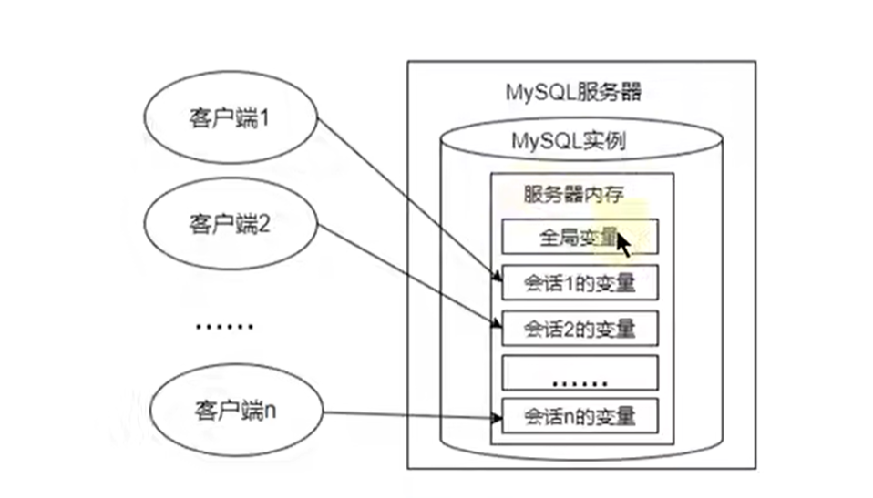

# 基础篇
# MySQL
## 学习记录

课程38，七章练习之前的所有内容已经学习完毕

**[✓] 已完成 or [☐] 未完成**

准备开始在每一章通过练习推动学习，从上至下是按照顺序来的，若有额外需要，可先完成


- [✓]***聚合函数及其练习-[39, 42]***
- [☐]***查询举例分析及其练习-[43, 48]***

由于其他内容需要，先进行 ：
- [✓]***数据库的创建、修改删除-[49, 54]***
- [✓]***DML增删改及其练习-[55, 58]***
- [✓]***数据类型及其相关-[59,, 65]***  未细看


## Reference

- [菜鸟教程](https://www.runoob.com/mysql/mysql-connection.html)
- [MySQL安装教程](https://blog.csdn.net/weixin_47406082/article/details/131867849?ops_request_misc=%257B%2522request%255Fid%2522%253A%2522171647672116800225532250%2522%252C%2522scm%2522%253A%252220140713.130102334..%2522%257D&request_id=171647672116800225532250&biz_id=0&utm_medium=distribute.pc_search_result.none-task-blog-2~all~top_positive~default-2-131867849-null-null.142^v100^pc_search_result_base8&utm_term=MySQL%E5%AE%89%E8%A3%85&spm=1018.2226.3001.4187)
- [navicat安装教程](https://mp.weixin.qq.com/s/Of1282kGihYiXnmxvB9Csw)
- [navicat使用教程](https://blog.csdn.net/qq_45069279/article/details/105919312?ops_request_misc=%257B%2522request%255Fid%2522%253A%2522171657178116800182137881%2522%252C%2522scm%2522%253A%252220140713.130102334..%2522%257D&request_id=171657178116800182137881&biz_id=0&utm_medium=distribute.pc_search_result.none-task-blog-2~all~top_positive~default-2-105919312-null-null.142^v100^pc_search_result_base8&utm_term=navicat&spm=1018.2226.3001.4187)
- [卸载教程](https://blog.csdn.net/m0_52861000/article/details/131354710?ops_request_misc=%257B%2522request%255Fid%2522%253A%2522172110015316800180631045%2522%252C%2522scm%2522%253A%252220140713.130102334..%2522%257D&request_id=172110015316800180631045&biz_id=0&utm_medium=distribute.pc_search_result.none-task-blog-2~all~top_positive~default-2-131354710-null-null.142^v100^pc_search_result_base8&utm_term=%E5%8D%B8%E8%BD%BDmysql&spm=1018.2226.3001.4187)
- [高级篇笔记](https://www.yuque.com/isljq/mysql/biar3e95d4s9z0m1)
## 数据库基础

- DBMS(Data Base Manage System) 数据库软件管理系统，是软件系统，如 MySQL等各类我们常称的“数据库”
- DBMS 存放的文件成为 “表（table）”， 结构化的文件，存储某种特定类型的数据
  - DBMS(MySQL) 中可以有多个 "库（library）"，每个库中会有多个 "表（table）"
- MySQL：开源DBMS，执行快，已安装，易使用
- client-server 软件：DBMS分为两类，一类是 共享文件系统的DBMS；一类则是客服-服务器软件，开发中的是后者
- ***模式（schema）***，在数据库中非常重要的概念，有不同含义：
  - 模式schema：指的是 数据库的结构设计，包括 tables、views、indexs、store procedures、triggers、constraints等。***schema 描述了数据的组织方式***
  - 数据库实例：有时候指的是一个 Database Instance
  - 命名空间： 某些数据库系统中，schema 也可以看做一个 namespace，用于区分不同的用户或组的对象名称
  - 数据字典： 一些数据库系统中，schema 用以存储数据库原数据的 data dictionary
- 列：记录的某个字段/属性
  - 数据类型
- 行：table中数据是按行存储的，一行就是一个 record
- 主键：每一行中可以唯一标识自己的一列/一组列
  - 就是每行的关键字
- SQL：Structured Query Language
- ***关系型数据库*** 就是使用关系模型（表格模型）的数据库，非关系型数据库则使用其他多种类型的数据模型（MongoDB:Document, redis:key-value, Elasticsearch:search-engine, Neo4J:graph...）

***Design rules of RDBMS***
- (relational data base manage system) ***RDBMS的典型数据结构： 数据表（structred）***，数据-->表-->库，一个数据库中可有多个表，每个表唯一（表名标识唯一）
- 表、记录、字段
  - ***E-R(Entity-relationship) 模型中 3 个主要概念： 实体集、属性、联系集***
    - 实体集：数据库中一个表
    - 实体：数据库表中的一行（row、record）
    - 属性：attribute，对应数据库表中的一列/字段（column、field）
  - 表的关联关系：1v1, 1vm, mvm, slef-reference（一对一、多， 多对多， 自我引用）

## MySQL 管理

### NET commands
***[重装系统后无MySQL服务问题解决](https://blog.csdn.net/SH_King/article/details/48178711?ops_request_misc=&request_id=&biz_id=102&utm_term=net%20start%20%E6%89%BE%E4%B8%8D%E5%88%B0%20MySQL%20%E6%9C%8D%E5%8A%A1&utm_medium=distribute.pc_search_result.none-task-blog-2~all~sobaiduweb~default-4-48178711.142^v100^pc_search_result_base5&spm=1018.2226.3001.4187)***


- 命令行服务管理
  - ***管理员身份***打开命令行
  - `NET HELP` 查看 `NET` 命令帮助（小写也可以）
  - `NET START /HELP` 查看指定命令 `NET START` 的帮助信息
    - `NET START` 显示当前开启的服务
      - `NET START | find "MySQL/service_partial_name"`直接查找相关命令
    - `NET START service` 开启服务
    - `NET START "service1 service2"` 开启多个服务需用双引号指示多个名称
    - `NET STOP service` 关闭服务
- 启动 MySQL 服务
  - 查看开启服务，本地MySQL服务全称为 MySQL90
  - `NET START MySQL91` 开启MySQL服务
  - `NET STOP MySSQL91` 关闭MySQL服务

### mysqladmin commands
- `mysqladmin -u root -p [check_content]` `-u` 是用户，`-p`是密码
- `mysqladmin -u root -p version` 查看完整的数据库主机信息
- `mysqladmin -u root -p status` 显示MySQL服务器的运行状态
- `mysqladmin -u root -p processlist` 显示MySQL服务器中正在运行的进程列表


***MySQL连接***
本地MySQL用户名：root
本地MySQL密码：123456

### 命令行连接、退出
- `mysql -u [username(root)] -p` 然后键入密码进入 MySQL
  - `mysql -u root -p 123456 -P 3306 -h localhost` 完整连接命令，如果就是在本机的3306端口，后两个可以省略（参考上面 数据库主机信息查看命令）
- `mysql -V/--version`
- `quit/exit` 退出MySQL
- msql命令行实用程序
  - `;` 结束
  - `help` 或 `\h` 获取帮助，如 `help/HELP SELECT;` 、`\h SELECT`
  - `QUIT/quit/EXIT/exit` 退出数据库

### 数据导入指令
- `source absolute_path_of_src_file.sql`
  - `source D:\xxx.sql`


### 五大类语句
在数据库管理系统（DBMS）中，DML、DCL、DDL、DQL 和 TCL 是 SQL（结构化查询语言）的五大类语句，每类语句都有其特定的功能和用途。下面我将逐一介绍这些语句类别：

#### DML
***（Data Manipulation Language，数据操纵语言）***
DML 是用来检索、插入、更新和删除数据库中的数据记录的语句。主要的 DML 语句包括：

- `SELECT`：用于查询数据库中的数据。
- `INSERT`：用于向数据库表中插入新的数据行。
- `UPDATE`：用于修改数据库表中的现有数据。
- `DELETE`：用于从数据库表中删除数据。

#### DCL
***（Data Control Language，数据控制语言）***
DCL 用于控制数据库中数据的访问权限和安全性。主要的 DCL 语句包括：

- `GRANT`：授予用户或角色对数据库对象（如表、视图、存储过程等）的特定权限。
- `REVOKE`：撤销之前授予的权限。

#### DDL
***（Data Definition Language，数据定义语言）***
DDL 用于定义和管理数据库结构，包括创建、修改和删除数据库对象。主要的 DDL 语句包括：

- `CREATE`：用于创建新的数据库对象，如创建新表或新索引。
- `ALTER`：用于修改现有数据库对象的结构，如添加、删除或修改表中的列。
- `DROP`：用于删除数据库对象，如删除表、索引或视图。
- `TRUNCATE`：用于快速删除表中的所有行，但不删除表本身。

#### DQL
***（Data Query Language，数据查询语言）***
DQL 实际上通常被认为是 DML 的一部分，因为它主要涉及数据的查询操作。`SELECT` 语句是 DQL 的核心，用于从数据库中检索数据。DQL 可以包括复杂的查询，如联接（JOIN）、子查询、分组（GROUP BY）和排序（ORDER BY）等。

#### TCL
***（Transaction Control Language，事务控制语言）***
TCL 用于管理数据库事务，确保数据的一致性和完整性。主要的 TCL 语句包括：

- `BEGIN` 或 `START TRANSACTION`：开始一个新的事务。
- `COMMIT`：提交事务，使事务中的所有更改永久生效。
- `ROLLBACK`：回滚事务，撤销事务中的所有更改，恢复到事务开始前的状态。
- `SAVEPOINT`：设置事务的保存点，允许在事务中进行部分回滚。


## MySQL 操作实例 (DDL)
- `SHOW`
  - `SHOW DATABASES;` 
  - `SHOW TABLES;`
  - `SHOW COLUMNS FROM table_name;` <=> `DESCRIBE table_name;`
  - `SHOW STATUS;`
  - `SHOW CREATE DATABASE database_name;` ***快速显示常见database_name的完整命令和表结构***
  - `SHOW CREATE TABLE table_name;` ***快速显示常见table_name的完整命令和表结构***


### 数据库相关管理操作

- `USE db_name;`

- `CREATE`
  - `CREATE DATABASE [IF NOT EXISTS] db_name;`
  - `CREATE DATABASE [IF NOT EXISTS] db_name CHARACTER SET 'gbk/utf-8/...';`
- `SELECT DATABASE()` 查看当前所使用的数据库名字，直接 `SHOW TABLES;` 也会在第一行告知所使用的数据库
- `DROP DATABASE [IF EXISTS] database_name` 删除数据库

创建数据库时，可以同时配置数据库信息
```sql
CREATE DATABASE [IF NOT EXISTS] mydatabase
CHARACTER SET utf8mb4
COLLATE utf8mb4_general_ci
DEFAULT CHARACTER SET utf8mb4
DEFAULT COLLATE utf8mb4_unicode_ci  -- 指定默认的排序规则，这里使用utf8mb4_unicode_ci作为示例
COMMENT = 'My custom database'        -- 为数据库添加注释
ENCRYPTION = 'Y';                    -- 启用加密，适用于MySQL 8.0及以上版本
```


- `SHOW VARIABLES LIKE 'character_set_%';`  用于显示所有以 character 为前缀的系统变量（显示MySQL服务器使用的字符集，如 `character_set_database：默认数据库的字符集`, `character_set_connection：服务器内部使用的客户与服务器之间的通信字符集`）
- `SHOW VARIABLES LIKE 'collation_%';` 校对（collation）是指字符数据的比较和排序规则，该命令显示所有校对所依赖的字符集，如`collation_database：默认数据库的校对规则`, `collation_connection：客户与服务器之间通信的校对规则`
- mysql数据库目录下的 `my.ini` 文件中可以修改默认字符集
### 数据库表相关管理操作 

- `CREATE TABLE table_name(id int, name varchar(15));` 创建数据库表
  - 若未指明字符集，则默认使用所在数据库的字符集
- 可以在**同一数据库下，基于现有的表创建新表**（可从其中选择所需字段），且查询语句中字段的别名就是新表中字段的名字
  - `CREATE TABLE test_table2 AS SELECT employee_id, last_name, salary FROM employees;`
  - 该语句创建新表 test_table2，其中只包含查询语句中的三个字段，若只需要字段不需要数据，使用 where进行肯定false的过滤条件即可 如 `... WHERE 1 = 2;`

```sql
CREATE TABLE [IF NOT EXISTS] table_name(
  field1, data_type [约束条件] [默认值],
  field2, data_type [约束条件] [默认值],
  field3, data_type [约束条件] [默认值],
  ...
)

```
- `SELECT [*/column] FROM table_name;` 查看数据库的全部/某一列
- `SHOW CREATE TABLE table_name`       查看数据库的创建信息
- `SHOW COLUMNS FROM table_name;`  查看数据库字段详情
  - `DESCRIBE/DESC table_name;` 等效
- `INSERT INTO table_name VALUES(1001, 'sijorhou');`
- ***修改表 (ALTER TABLE)***
  - 添加一个字段（ADD）
    - `ALTER TABLE test_table ADD salary DOUBLE(10, 2);` 默认添加字段到最后面
    - `ALTER TABLE test_table ADD new_id INT FIRST;` `FIRST` 关键字将字段添加到最前面
    - `ALTER TABLE test_table ADD phone VARCHAR(20) AFTER id;` `... AFTER field;` 关键字将字段添加到某个字段之后的特定位置
  - 修改一个字段（MODIFY）
    - `ALTER TABLE table_name MODIFY current_filed new_type_length DEFAULT 'aaa';`
    - ` ALTER TABLE test_table MODIFY emp_name VARCHAR(35) DEFAULT 'AAA';` 将原来 emp_name字段的长度 20 改为 35，并通过 `DEFAULT` 关键字增加默认值
    - 一般不会修改字段的数据类型，可改的有（数据类型、长度、默认值）
  - 重命名一个字段（CHANGE）
    - `ALTER TABLE table_name CHANGE current_filed new_field_name [new type length/...];`
    - 如 `ALTER TABLE test_table CHANGE salary monthly_salary DOUBLE(10, 3);`修改了 salary字段的名字，并将原来 double(10,2) 类型改为 double(10,3)
  - 删除一个字段
    - `ALTER TABLE table_name DROP COLUMN field_name;`
- `RENAME TABLE old_name TO new_name;` 重命名表
- `DROP TABLE [IF EXISTS] db_name;`  删除表（无法撤销/回滚）
- `TRUNCATE TABLE [IF EXISTS] table_name;` 清空表中所有数据，但是表结构还在

### COMMIT ROLLBACK
COMMIT 是提交数据，一旦提交，数据则永久保存在数据库中，不可以回滚，只能再次执行增删改的CRUD操作

ROLLBACK 是回滚数据，即撤销操作，执行 ROLLBACK 可以回滚数据，***回滚到最近的一次 COMMIT 之后***

- DDL 操作 （如TRUNCATE TABLE）一旦执行，不可回滚（默认自动COMMIT无法设置为false）
- DML 操作 （如DELETE FROM）默认情况一旦执行，不可回滚，但在执行DML之前限制性 `SET autocommit = FALSE;`，则后续DML操作可以回滚


***DELETE FROM 回滚演示***

<div style="text-align:center">
    
    <p>DELETE FROM 回滚成功</p>
</div>

如图所示，cpy_jobs 中字段数据显示后执行 `COMMIT;` 提交数据，然后在执行 DML语句 （`DELETE FROM table_name;`） 之前先执行 `SET autocommit = FALSE;`，然后执行删除，再次查询发现数据已经没有了，此时执行回滚操作 `ROLLBACK;` 后再次查询，数据恢复了


***TRUNCATE TABLE 回滚演示***
<div style="text-align:center">
    
    <p>TRUNCATE TABLE 回滚失败</p>
</div>

如图所示，cpy_jobs 中字段数据显示后执行 `COMMIT;` 提交数据，然后在执行 DDL语句 （`TRUNCATE TABLE table_name;`） 之前先执行 `SET autocommit = FALSE;`，然后执行删除，再次查询发现数据已经没有了，此时执行回滚操作 `ROLLBACK;` 后再次查询，数据没有恢复，回滚失败

### 密码重置 
<div style="text-align:center">
    
    <p>mysql密码重置步骤</p>
</div>

# SQL 语句
## SELECT (DQL)
- `SELECT seg(col),... FROM table_name` 以 "SELECT" 为关键字
  - 后跟 列名 （若不是 * 则为查询所有列），也可以写为列的别名 `SELECT seg seg_alias, ...`
  - 空值 NULL 参与运算， 含NULL运算结果仍为NULL
  - 着重号 ``
  - 查询常数
  - `DISTINCT`
  - `DESC/DESCRIBE table_name` <=> `SHOW COLUMNS FROM table_name`
  - `WHERE`
  - `table_name.column_name` 限定列名，即指定查询的列


```sql
-- 1. 基本查询语句
SELECT * FROM employees;
SELECT employee_id, first_name, email, job_id FROM employees;

-- 2. 列别名（只能在 ORDER BY 中使用，WHERE中不行）
SELECT employee_id emp_id, first_name fst_name, job_id FROM employees;
SELECT employee_id AS emp_id, first_name AS fst_name, job_id FROM employees;
SELECT employee_id "emp_id", first_name "fst_name", job_id FROM employees;
SELECT employee_id "emp_id", first_name "fst_name", salary * 12 "annual salary" FROM employees; 

-- 3. NULL 参与运算（year salary 中，commission_pact 中为NULL的结果均为NULL）
SELECT employee_id, salary "month salary", salary * (1 + commission_pct) * 12 "year salary", commission_pct FROM employees;

-- 若要筛选涉及 NULL 的数据， 使用 IS, IS NOT, <=> 
SELECT employee_id, salary "month salary", salary * (1 + commission_pct) * 12 "year salary", commission_pct FROM employees WHERE commission_pct IS NOT NULL;

-- 4. 着重号 ``，标注表名避免被识别为关键字
SELECT * FROM `order`;

-- 6. 查询常数，用于在查询结果中返回一个常量值，而无需存储在表中
SELECT 'SIJORHOU', '136315', employee_id, last_name FROM employees;

--7. 去重查询，使用 DISTINCT 关键字
SELECT DISTINCT department_id AS dp_id FROM employees;
SELECT DISTINCT department_id AS dp_id, salary FROM employees; -- 对所有记录，两个字段作为一个整体去重查询
SELECT department_id AS dp_id, DISTINCT salary FROM employees; -- 错误， 前后不一致

-- 8. 显示表结构，显示表中各个字段详细信息
DESC regions;
DESCRIBE employees;

-- 9. WHERE 过滤数据，WHERE 必须声明在 FROM 后面
SELECT * FROM employees WHERE department_id = 90;
SELECT * FROM employees WHERE last_name = 'King';
```

### 运算符
- `DUAL` 虚表
- 算数运算符
- 比较运算符
- 关键字：
  - `IS NULL \ IS NOT NULL \ ISNULL(expr)`
  - `LEAST(value1,value2,...) \ GREATEST(value1,value2,...)`, `LENGTH()`
  - `BETWEEN ... AND`
  - `IN \ NOT IN`
  - `LIKE`, `%, _, \` 通配符：用来匹配值的一部分的特殊符号
- 逻辑运算符
- 位运算符

```sql
-- 1. 算数运算符： + - * / DIV % MOD 
SELECT 100, 100 + 50, 100 -35, 3 * 18, 100 / 2, 100 DIV 2, 19 % 5, MOD(26, 7) FROM DUAL;
SELECT 100, 100 + '50', 100 -35, 3 * '18', 99 / '7', 19 % 5, MOD(26, 7) FROM DUAL;	-- 隐式转换 '' 会将数字字符 自动转换成数值类型  

SELECT employee_id, last_name AS lst_name, salary FROM employees WHERE employee_id % 2 = 0;		-- 筛选偶数工资的员工


-- 2. 比较运算符 = <=> != < <= > >=
SELECT 
	1 = 2, 1 != 2, 
	1 = '1', 1 = 'a', 0 = 'a',  -- 若字符转换为数值失败，则看做 0
	'a' = 'a', 'a' = 'ab',			-- 若均为字符/串，则按照字符/串进行比较
	1 = NULL, NULL = NULL				-- 只要NULL参与运算，结果均为NULL
FROM DUAL;		

SELECT last_name, salary, commission_pct FROM employees WHERE commission_pct IS NOT NULL AND salary >= 7000;    
SELECT 1 <=> NULL, NULL <=> NULL FROM DUAL; -- “安全等于 <=> ” 可以用于判断是不是 NULL


-- 3. 关键字 
-- 3.1 IS NULL \ IS NOT NULL \ ISNULL(expr)
SELECT employee_id, last_name, commission_pct FROM employees;
SELECT employee_id, last_name, commission_pct FROM employees WHERE ISNULL(commission_pct);
SELECT employee_id, last_name, commission_pct FROM employees WHERE commission_pct IS NULL;
SELECT employee_id, last_name, commission_pct FROM employees WHERE commission_pct <=> NULL;
SELECT employee_id, last_name, commission_pct FROM employees WHERE commission_pct IS NOT NULL;

-- 3.2 LEAST(value1,value2,...) \ GREATEST(value1,value2,...) 找最大最小
SELECT LEAST(1, 10, 9, -5, 89), GREATEST(1, 10, 9, -5, 89), LEAST('b', 'g', 'z', 't', 'l'), GREATEST('b', 'g', 'z', 't', 'l') FROM DUAL;

SELECT 
	last_name, first_name, 
	LEAST(last_name, first_name), 
	LEAST(LENGTH(first_name), LENGTH(last_name)) 
FROM employees WHERE commission_pct IS NOT NULL;

-- 3.3 BETWEEN ... AND 范围查询
SELECT employee_id, last_name, first_name, salary 
FROM employees WHERE salary BETWEEN 6000 AND 10000;		-- 如果是 BETWEEN 10000 AND 6000 则查询无果

SELECT employee_id, last_name, first_name, salary 
FROM employees WHERE salary < 6000 OR salary > 10000;	

-- 3.4 IN \ NOT IN  在集合中与否
SELECT last_name, department_id AS dp_id FROM employees WHERE department_id = 20 OR department_id = 50 OR department_id = 100;  -- 直接使用 IN (set) \ NOT IN (set)

SELECT last_name, department_id FROM employees WHERE department_id IN (20, 50, 100);
SELECT last_name, department_id, salary FROM employees WHERE salary NOT IN (6000, 7000, 8000)

-- 3.5 LIKE 模糊查询， % 表示未知字符（若干个）， _ 表示一个未知字符， \ 表示转义字符
SELECT last_name FROM employees WHERE last_name LIKE '%a%';		-- 查询 last_name中包含 a 字符的数据
SELECT last_name FROM employees WHERE last_name LIKE 'a%';		-- 查询 last_name中以 a 字符开头的数据
SELECT last_name FROM employees WHERE last_name LIKE '%a%' AND last_name LIKE '%e%';  -- 既包含 a 又包含 e，等效写法如下
SELECT last_name FROM employees WHERE last_name LIKE '%a%e%' OR last_name LIKE '%e%a%';

SELECT last_name FROM employees WHERE last_name LIKE '_a%';		-- 查询 last_name中第二个字符为 a 的数据

-- 若要查询第三个字符为 e 的数据， 直接使用 __e （新版本）
SELECT last_name FROM employees WHERE last_name LIKE '__a%';


-- 4. 逻辑运算符 OR ||,	AND &&,	NOT !,		XOR
SELECT employee_id, salary, department_id FROM employees WHERE department_id = 50 AND salary > 4000;
SELECT last_name, salary, department_id FROM employees WHERE salary BETWEEN 10000 AND 30000;


-- 5. 位运算符 & | ^ ~ >> 
SELECT 12 & 5, 12 | 5, 12 ^ 5, ~12, 12 << 1, 12 << 2, 12 >> 1, 12 >> 2 FROM DUAL;		-- 换算成二进制进行 按位与、或、取反、

```

***逻辑运算符优先级***
<div style="text-align:center">
    
    <p>运算符优先级</p>
</div>

### 排序与分页
- `ORDER BY`
  - `ORDER BY ... DESC/ASC;`
  - `ORDER BY ... DESC, ... ASC;`
- `LIMIT`
  - `LIMIT n;` 返回前 n 行
  - `LIMIT offset, n;` 返回 offser 行后的 n 行
  - `LIMIT n OFFSET offset;` 使用关键字指定 offset
- 分页
  - `ORDER BY` 和 `LIMIT` 组合在一起使用可以对数据进行动态分页查询
  - `ORDER BY ... DESC, ... ASC LIMIT ... ;`

***关于多级排序***：
**在多级排序中，每个新的排序列会在上一个排序列相同的行中起作用。第三列排序仅影响那些在前两列的值相同的行，不会改变前两列的排序顺序**

```sql
-- 1. 排序 ORDER BY 对查询到的数据进行排序,  DESC 降序排序， ASC 升序排序（默认）
SELECT employee_id, last_name, salary FROM employees ORDER BY salary DESC;		-- 按照 salary 降序排序
SELECT employee_id, last_name, salary FROM employees ORDER BY salary ASC;		-- 按照 salary 升序排序
SELECT employee_id, salary, salary * 12 "annual salary" FROM employees ORDER BY "annual salary";		-- 使用列别名，按照别名进行排序

SELECT employee_id, last_name, salary FROM employees WHERE department_id IN (50, 60, 70) ORDER BY department_id DESC;

-- 1.2 多列排名
-- 二级排序，先对某个字段排序，然后对另一个字段排序 （三级、...多级排序 均为 “多列排序”）
-- 例：现根据 department_id 降序排序， 然后在相同的 department_id 中根据 salary 升序排序
SELECT employee_id, salary, department_id FROM employees ORDER BY department_id DESC, salary ASC;


-- 2. 分页
-- 若符合查询条件的数据非常多， 返回数据的开销很大， 可以分页返回
-- 使用 LIMIT 实现数据分页显示
SELECT employee_id, last_name FROM employees LIMIT 0, 20; 	-- 代表从 0偏移20个位置，即显示第一页20条数据
SELECT employee_id, last_name FROM employees LIMIT 20, 20;	-- 显示第二页20条数据

-- 每页显示 pageSize 条记录， 当前显示 pageNo 页 ： 公式： LIMIT (pageNo-1) * pageSize, pageSize;
SELECT employee_id, last_name, salary FROM employees WHERE salary > 6000 ORDER BY salary DESC LIMIT 0, 10;

SELECT employee_id, last_name FROM employees LIMIT 31, 2;		-- 从31偏移两个位置， 即显示第32， 33 条数据
SELECT employee_id, last_name FROM employees LIMIT 2 OFFSET 31;		-- 从31偏移两个位置， 即显示第32， 33 条数据

-- 查询最高工资员工信息： 降序排序， 分页仅显示第一条
SELECT * FROM employees ORDER BY salary DESC LIMIT 1; 	-- 省略基准位置， 默认从 0 开始

```

### 多表查询/关联查询

多表查询，即 ***关联查询***，指两个或更多表一起完成查询操作（前提是一起查询的表之间有一对一、一对多等关系，***多表之间有关联字段***）

为什么有些数据要分多个表存储不同字段： 如果都在一个表中，那么一条记录占据内存就比较大，一次所能查询的记录个数就比较少，那么当需要查询大量记录时候，就需要进行多次 IO，开销较大

---

***UNION 和 UNION ALL***
- `UNION`
  - `SELECT ... UNION SELECT ...;` 合并结果集并去重
  - 示例：
    ```sql
    SELECT name FROM employees
    UNION
    SELECT name FROM managers;
    ```
- `UNION ALL`
  - `SELECT ... UNION ALL SELECT ...;` 合并结果集并保留重复行
  - 示例：
    ```sql
    SELECT name FROM employees
    UNION ALL
    SELECT name FROM managers;
    ```

---

***多表查询分类***
- **等值连接 vs 非等值连接**
  - 等值连接
    - `JOIN ... ON ... = ...;` 基于相等条件连接
    - 示例：
      ```sql
      SELECT employees.name, departments.department_name
      FROM employees
      JOIN departments ON employees.department_id = departments.department_id;
      ```
  - 非等值连接
    - `JOIN ... ON ... BETWEEN ... AND ...;` 基于非相等条件连接
    - 示例：
      ```sql
      SELECT employees.name, salary_grades.grade
      FROM employees
      JOIN salary_grades ON employees.salary BETWEEN salary_grades.min_salary AND salary_grades.max_salary;
      ```

- **自连接 vs 非自连接**
  - 自连接
    - `JOIN ... ON ... = ...;` 同一个表与自身连接
    - 示例：
      ```sql
      SELECT e1.name AS employee_name, e2.name AS manager_name
      FROM employees e1
      JOIN employees e2 ON e1.manager_id = e2.employee_id;
      ```
  - 非自连接
    - `JOIN ... ON ... = ...;` 不同表之间的连接
    - 示例：
      ```sql
      SELECT employees.name, departments.department_name
      FROM employees
      JOIN departments ON employees.department_id = departments.department_id;
      ```

- **内连接 vs 外连接**
  - 内连接
    - `INNER JOIN ... ON ... = ...;` 返回匹配的行
    - 示例：
      ```sql
      SELECT employees.name, departments.department_name
      FROM employees
      INNER JOIN departments ON employees.department_id = departments.department_id;
      ```
  - 外连接
    - `LEFT JOIN ... ON ... = ...;` 返回左表所有行
    - `RIGHT JOIN ... ON ... = ...;` 返回右表所有行
    - `FULL JOIN ... ON ... = ...;` 返回左右表所有行
    - 示例：
      ```sql
      SELECT employees.name, departments.department_name
      FROM employees
      LEFT JOIN departments ON employees.department_id = departments.department_id;
      ```

---

- **UNION** 用于合并结果集并去重，**UNION ALL** 用于合并结果集并保留重复行。
- **等值连接**基于相等条件，**非等值连接**基于非相等条件。
- **自连接**是表与自身连接，**非自连接**是不同表之间的连接。
- **内连接**返回匹配的行，**外连接**返回所有行（即使没有匹配）。

--- 


```sql
-- 1. example: 查询某一个名为 'Abel' 的员工在哪个城市工作 （如何将三条查询语句写成 关联查询？）

-- employees 表中的记录包含一个 department_id 字段，该字段关联 departments 表（记录中也有 department_id字段）
-- departments 表中记录包含一个 location_id 字段，该字段关联 locations 表（记录中也有 location字段）
SELECT * FROM employees WHERE last_name = 'Abel';
SELECT * FROM departments WHERE department_id = 80;
SELECT * FROM locations WHERE location_id = 2500;


-- 2. 笛卡尔积
-- 错误方式，每个员工和每个部门都匹配了一遍（笛卡尔积/交叉链接 \ CROSS JOIN）
-- 错误原因：缺少多表的连接条件
SELECT employee_id, department_name FROM employees, departments;

-- -- 正确方式，加上 连接条件
SELECT employee_id, department_name FROM employees, departments WHERE employees.department_id = departments.department_id;

-- 3. 表名使用
-- 这里会报错，因为要显示的 employee_id he  department_name 分别在 employees 和 departments 表中，但是 department_id 在多个表中，需要指明显示哪个表中的 department_id

-- SELECT employee_id, department_name, department_id 
-- FROM employees, departments 
-- WHERE employees.department_id = departments.department_id;

-- 正确方式
SELECT employee_id, department_name, employees.department_id 
FROM employees, departments
WHERE employees.department_id = departments.department_id;

-- 实际上建议每个要显示的数据都指明所在表
SELECT employees.employee_id, departments.department_name, employees.department_id 
FROM employees, departments 
WHERE employees.department_id = departments.department_id;

-- 使用表名导致查询语句过长的时候，可以使用别名（如果使用过程中给表起了别名，那么使用表名时候就必须使用别名）
SELECT emp.employee_id, dept.department_name, emp.department_id 
FROM employees emp, departments dept 
WHERE emp.department_id = dept.department_id;


-- 4. example 中的正确写法，多表查询
SELECT emp.employee_id, dept.department_name, emp.department_id, locs.city
FROM employees emp, departments dept, locations locs
WHERE emp.last_name = 'Abel'
AND emp.department_id = dept.department_id
AND dept.location_id = locs.location_id;

```

#### 多表查询分类
```sql
-- 多表查询分类
-- 1. 等值连接 vs 非等值连接
-- 2. 自连接 vs 非自连接
-- 3. 内连接 vs 外连接

-- 1. 等值连接 vs 非等值连接
-- 非等值连接 实例
SELECT emp.last_name, emp.salary, jg.grade_level
FROM employees emp, job_grades jg
WHERE emp.salary BETWEEN jg.lowest_sal AND jg.highest_sal;

-- 2. 自连接 vs 非自连接
-- 自连接 实例：employees表中，每条员工记录都有一个 manager_id，该id 代表的管理者也在employees表中
SELECT emp.employee_id, emp.last_name, emp.manager_id, mgr.employee_id, mgr.last_name
FROM employees emp, employees mgr
WHERE emp.manager_id = mgr.employee_id;


-- 3. 内连接 vs 外连接
-- 内连接：前面的例子都是内连接，即 “合并具有同一列的两个以上的表的行，结果集中不包含一个表与另一个表不匹配的行”；即 结果集只包含两个表的交集部分

-- 外连接：“合并具有同一列的两个以上的表的行，结果集中除了包含一个表与另一个表匹配的行，还查询到了左表 或 右表中不匹配的行”
-- 外连接分类： 左外连接、右外连接、满外连接


-- 查询所有员工的last_name, department_name 信息
-- employees 中有一个记录中 department_id 记录为Null，最后查询记录数位 106 （employees中107）
SELECT emp.employee_id, dept.department_name
FROM employees emp, departments dept
WHERE emp.department_id = dept.department_id;

-- SQL99语法实现内连接
-- 使用 INNER JOIN ... ON ...  INNER JOIN 代表关联两个表（INNER 可以省略），ON 取代 WHERE 指明查询条件
SELECT emp.employee_id, emp.last_name, dept.department_name
FROM employees emp INNER JOIN departments dept ON emp.department_id = dept.department_id
INNER JOIN locations loc ON dept.location_id = loc.location_id;

-- SQL99语法实现外连接
-- 左外连接（就是 额外加入左表中不符合连接条件的记录）
-- （连接条件：emp.department_id = dept.department_id， 不匹配记录：department_id 为 Null 的 178 Grant， departments中没有 Null department_id）
-- (这里记录数位 107 和 employees中相同，即不仅包含匹配的行，还包含左表中不匹配的行，所以为“左外连接”)

SELECT emp.employee_id, emp.last_name, dept.department_id
FROM employees emp LEFT OUTER JOIN departments dept ON emp.department_id = dept.department_id;

-- 右外连接
SELECT emp.employee_id, emp.last_name, dept.department_id
FROM employees emp RIGHT OUTER JOIN departments dept ON emp.department_id = dept.department_id;


-- 满外连接
-- 不支持 FULL OUTER JOIN， 需要额外实现
SELECT emp.employee_id, emp.last_name, dept.department_id
FROM employees emp RIGHT OUTER JOIN departments dept ON emp.department_id = dept.department_id;
```


#### 7种joins连接
<div style="text-align:center">
    
    <p>7-joins</p>
</div>

```sql
-- 7种 SQL JOINS

-- 1. 合并查询结
-- 使用 UNION 关键字，将多条 SELECT 语句的结果组合成单个结果集
-- 合并时，两表对应的列数和数据类型必须相同
-- 各个 SELECT 语句之间使用 UNION（会执行去重） 或 UNION ALL（不会执行去重） 关键字分割
-- SELECT column ... FROM table1 UNION SELECT column FROM table2;

-- 查询部门编号 > 90 或 邮箱包含 a 的员工信息
-- 方式 1
SELECT * 
FROM employees emp 
WHERE emp.department_id > 90 OR emp.email LIKE '%a%';

-- 方式2
SELECT * FROM employees emp WHERE emp.department_id > 90
UNION
SELECT * FROM employees emp WHERE emp.email LIKE '%a%';

-- 2. 7 种实现

-- 2.1 中图：内连接
SELECT emp.employee_id, dept.department_name
FROM employees emp JOIN departments dept
ON emp.department_id = dept.department_id;

-- 2.2 左上图：左外连接
SELECT emp.employee_id, dept.department_name
FROM employees emp LEFT OUTER JOIN departments dept
ON emp.department_id = dept.department_id;

-- 2.3 右上图：左右外连接
SELECT emp.employee_id, dept.department_name
FROM employees emp RIGHT OUTER JOIN departments dept
ON emp.department_id = dept.department_id;


-- 2.4 左中图：（相当于左上图去掉AB共同包含的部分）
SELECT emp.employee_id, dept.department_name
FROM employees emp LEFT OUTER JOIN departments dept
ON emp.department_id = dept.department_id
WHERE dept.department_id IS NULL;


-- 2.5 右中图：（相当于右中图去掉AB共同包含的部分）
SELECT emp.employee_id, dept.department_name
FROM employees emp RIGHT OUTER JOIN departments dept
ON emp.department_id = dept.department_id
WHERE emp.department_id IS NULL;


-- 2.6 左下图：满外连接
-- 2.6.1 UNION ALL 左上+右中
SELECT emp.employee_id, dept.department_name FROM employees emp LEFT OUTER JOIN departments dept ON emp.department_id = dept.department_id
UNION ALL
SELECT emp.employee_id, dept.department_name FROM employees emp RIGHT OUTER JOIN departments dept ON emp.department_id = dept.department_id WHERE emp.department_id IS NULL;

-- 2.6.2 UNION ALL 右上+左中
SELECT emp.employee_id, dept.department_name FROM employees emp RIGHT OUTER JOIN departments dept ON emp.department_id = dept.department_id
UNION ALL
SELECT emp.employee_id, dept.department_name FROM employees emp LEFT OUTER JOIN departments dept ON emp.department_id = dept.department_id WHERE dept.department_id IS NULL;


-- 2.7 右下图：左中+右中
SELECT emp.employee_id, dept.department_name FROM employees emp LEFT JOIN departments dept ON emp.department_id = dept.department_id WHERE dept.department_id IS NULL
UNION ALL
SELECT emp.employee_id, dept.department_name FROM employees emp RIGHT JOIN departments dept ON emp.department_id = dept.department_id WHERE emp.department_id IS NULL;
```
#### 2个 SQL99新特性
```sql
-- SQL99新特性：自然连接 NATURAL JOIN、 USING 

-- 1. NATURAL JOIN
-- employees 和 departments 表中有两个相同的字段：department_id 和 manager_id

-- 原来查询语句需要使用 JOIN ON 关联查询
SELECT emp.employee_id, emp.last_name, dept.department_name
FROM employees emp JOIN departments dept
ON emp.department_id = dept.department_id AND emp.manager_id = dept.manager_id;

-- 使用 NATURAL JOIN 可以自动关联两表，查询两表中的相同字段后进行 等值连接
SELECT emp.employee_id, emp.last_name, dept.department_name
FROM employees emp NATURAL JOIN departments dept;

-- 2. USING
-- 关联查询内容，等值连接如果字段名字在两表中相同，直接使用 USING
SELECT emp.employee_id, emp.last_name, dept.department_name
FROM employees emp JOIN departments dept
USING (department_id);
```

### 函数
不同 DBMS 之间的函数的差异性远大于 SQL语言在不同 DBMS 之间的差异
#### MySQL内置函数与分类
从 ***实现的功能** 的角度分类：
- 数值函数
- 字符串函数
- 日期和时间函数
- 流程控制函数（如 加密与解密函数、获取MySQL信息函数、聚合函数）

再分为两类：***单行函数、聚合函数/分组函数***

#### 数值函数 

##### 基本函数
```txt
ABS(x)    
SIGN(x)
Pi()
CEIL(x), CEILING(x)
FLOOR(x)
LEAST(v1, v2, v3, ...)
GREATEST(v1, v2, v3, ...)
MOD(x, y)
RAND()          返回0-1随机值
RAND(x)         返回0-1随机值，x为种子，相同x会产生相同随机数
ROUND(x)        四舍五入x
ROUND(x, y)     四舍五入x，保留小数点后y位
TRUNCAT(x, y)   返回数字 x 截断 y 位小数的结果
SQRT(x)         返回 x 平方根，若为负数，返回NULL
```

```sql
-- 基本函数
SELECT ABS(-123), ABS(21),
SIGN(-123), SIGN(32),
PI(),
CEIL(-32.23), CEIL(89.65),
FLOOR(18.7), FLOOR(-5.4)
FROM DUAL;

SELECT MOD(12,5),
LEAST(32,-18,0), GREATEST(38,99,12),
TRUNCATE(1.89427613,5),
SQRT(9)
FROM DUAL;


-- 第一个产生 不同随机数，第二个每次产生的随机数相同
SELECT RAND(), RAND(6) FROM DUAL;
SELECT RAND(), RAND(6) FROM DUAL;

SELECT 
ROUND(123.456), ROUND(123.456, 0), 
ROUND(123.456, 1), ROUND(123.456, 2),
ROUND(123.456, -1), ROUND(123.456, -2)
FROM DUAL;

-- 单行函数可以嵌套
SELECT ROUND(123.45678, 3);
SELECT TRUNCATE(ROUND(123.45678, 3), 1);
```

##### 三角函数

```txt
弧度-角度转换
RADIANS(X)
DEGREES(X)

三角函数(X均为弧度值)
SIN(X)
ASIN(X)
COS(X)
ACOS(X)
TAN(X)
ATAN(X)
ATAN2(m, n) 返回两个数的反正切值
COT(X)

指数函数 和 对数
POW(m, n) 返回 m 的 n 次方
POWER(m, n)
EXP(num) 返回 e 的 num次方

LN(X)
LOG(X), LOG10(X), LOG2(4)


进制间的转换
BIN(X)
HEX(X)
OCT(X)
CONV(X, f1, f2) 把 x 由 f1进制的数，转变成 f2进制的数
```


```sql
-- 1. 弧度-角度转换
-- RADIANS(X) 角度->弧度，X为角度值；DEGREES(X) 弧度->角度，X为弧度值
SELECT RADIANS(60) / PI() FROM DUAL;
SELECT DEGREES(PI() * 0.25) FROM DUAL;

-- 2. 三角函数
SELECT 
SIN(RADIANS(30)), DEGREES(ASIN(0.5)), 
COS(RADIANS(60)), DEGREES(ACOS(SQRT(0.5))) 
FROM DUAL;

SELECT TAN(RADIANS(45)), DEGREES(ATAN(1)) FROM DUAL;


-- 3. 指数函数 和 对数函数
SELECT POW(2,3), POWER(2,10), EXP(0) FROM DUAL;
SELECT LN(EXP(3)), LOG(EXP(2)), LOG10(10), LOG2(4) FROM DUAL;

-- 4. 进制间的转换
SELECT
BIN(12), HEX(12), OCT(10), CONV(1100, 2, 16)
FROM DUAL;
```

#### 字符串函数

| 函数         | 用法                                                                 |
|--------------|----------------------------------------------------------------------|
| ASCII(S)     | 返回字符串S中的第一个字符的ASCII码值                                 |
| CHAR_LENGTH(s) | 返回字符串s的字符数。作用与CHARACTER_LENGTH(s)相同                  |
| LENGTH(s)    | 返回字符串s的字节数，和字符集有关                                    |
| CONCAT(s1,s2,...Sn) | 连接s1,s2...sn为一个字符串                                       |
| CONCAT_WS(x, S1,S2,...sn) | 同CONCAT(s1,s2...)函数，但是每个字符串之间要加上x             |
| INSERT(str, idx, len, replacestr) | 将字符串str从第idx位置开始，len个字符长的子串替换为字符串replacestr |
| REPLACE(str,a,b) | 用字符串b替换字符串str中所有出现的字符串a                         |
| UPPER(s)或UCASE(s) | 将字符串s的所有字母转成大写字母                                   |
| LOWER(s)或LCASE(s) | 将字符串s的所有字母转成小写字母                                   |
| LEFT(str,n)  | 返回字符串str最左边的n个字符                                         |
| RIGHT(str,n) | 返回字符串str最右边的n个字符                                         |
| LPAD(str,len,pad) | 用字符串pad对str最左边进行填充，直到str的长度为len个字符          |
| RPAD(str ,len, pad) | 用字符串pad对str最右边进行填充，直到str的长度为len个字符         |
| LTRIM(s)            | 去掉字符串s左侧的空格                                               |
| RTRIM(s)            | 去掉字符串s右侧的空格                                               |
| TRIM(s)             | 去掉字符串s开始与结尾的空格                                         |
| TRIM(s1 FROM s)    | 去掉字符串s开始与结尾的s1                                           |
| TRIM(LEADING s1 FROM s) | 去掉字符串s开始处的s1                                           |
| TRIM(TRAILING s1 FROM s) | 去掉字符串s结尾处的s1                                           |
| REPEAT(str,n)       | 返回str重复n次的结果                                                 |
| SPACE(n)            | 返回n个空格                                                          |
| STRCMP(s1,s2)       | 比较字符串s1,s2的ASCII码值的大小                                     |
| SUBSTR(s,index,len) | 返回从字符串s的index位置其len个字符，作用与SUBSTRING(s,nlen）、MID(s,n,len)相同 |
| LOCATE(substr,str) | 返回字符串substr在字符串str中首次出现的位置，作用于POSITION(substr IN str)、INSTR（str,substr）相同。未找到，返回0 |
| ELT(m,s1,s2,...,sn) | 返回指定位置的字符串，如果m=1，则返回s1，如果m=2，则返回s2，如果m=n，则返回sn |
| FIELD(s,s1,s2,...,sn) | 返回字符串s在字符串列表中第一次出现的位置                         |
| FIND_IN_SET(s1,s2)  | 返回字符串s1在字符串s2中出现的位置。其中，字符串s2是一个以逗号分隔的字符串 |


***实例***
```sql
-- ASCII(str) 返回 A 的 ASCII码
-- CHAR_LENGTH(str) 获取字符长度，无论中英文，一个字符就是一个长度
-- LENGTH(str) 获取字节长度，英文一个字符就是一个长度，而一个中文字符占据 3 个字节，所以 LENGTH('你好世杰') 长度为 12
SELECT 
ASCII('Abcdfsf'), 
CHAR_LENGTH('hello, sijorhou'), CHAR_LENGTH('你好世杰'),
LENGTH('hello, sijorhou'), LENGTH('你好世杰')
FROM DUAL;


-- CONCAT(str1,str2,...) 将多个字符串拼接在一起
SELECT 
CONCAT(emp.last_name, ', employee_id is ', emp.employee_id, ', works for ', mgr.last_name)
FROM employees emp JOIN employees mgr ON emp.manager_id = mgr.employee_id;


-- CONCAT_WS(separator,str1,str2,...) 使用分隔符 separator 将多个字符串连接起来
SELECT CONCAT_WS('-', 'hello' , 'sijorhou', '!!!') FROM DUAL;
-- 嵌套
SELECT CONCAT('today is ', CONCAT_WS('-', '2024', '11', '18')) FROM DUAL;


-- INSERT(str,pos,len,newstr) 使用功能 newstr 取代 str 中从 pos开始往后的len长度的字符串
-- MySQL 中字符串索引是从 1 开始的
-- res:
-- 123456--hello, sijorhou!!!--654321
-- 123456--hello, sijorhou!!!--654321
-- --hello, sijorhou!!!--AAA654321
-- hello--AAA--hello
SELECT INSERT('123456AAA654321', 7, 3, '--hello, sijorhou!!!--') FROM DUAL;
SELECT REPLACE('123456AAA654321', 'AAA', '--hello, sijorhou!!!--') FROM DUAL;
SELECT REPLACE('123456AAA654321', '123456', '--hello, sijorhou!!!--') FROM DUAL;
-- 嵌套
SELECT 
REPLACE(REPLACE('123456AAA654321', '123456', 'hello--') , '654321', '--hello') FROM DUAL;


-- UPPER(str), LOWER(str) 分别将字符串 str 转换成大写和小写
SELECT UPPER('Hello, sijorhou'), LOWER('HELLO, SIJORHOU') FROM DUAL; 
-- res: HELLO, SIJORHOU, hello, sijorhou


-- LEFT(str,len), RIGHT(str,len) 分别返回 str 左边或右边的 len长度的 子串
SELECT 
CHAR_LENGTH('abcdefghigklmnopqrstuvwxyz'), 
UPPER('abcdefghigklmnopqrstuvwxyz'),
LEFT('abcdefghigklmnopqrstuvwxyz', 13), RIGHT('abcdefghigklmnopqrstuvwxyz', 13),
CHAR_LENGTH(LEFT('abcdefghigklmnopqrstuvwxyz', 13)),
LENGTH(RIGHT('abcdefghigklmnopqrstuvwxyz', 13))
FROM DUAL;
-- res: 26	ABCDEFGHIGKLMNOPQRSTUVWXYZ	abcdefghigklm	nopqrstuvwxyz	13	13


-- LPAD(str,len,padstr), RPAD(str,len,padstr) 会在字符串 str 的左边或 右边，填充 padstr 直到长度达到 len，拖过 len长度小于 str，则无论左右只保留 len长度的子串
SELECT 
emp.employee_id, emp.last_name, 
LPAD(emp.salary, 10, '*'), LPAD(emp.salary, 6, '*'), RPAD(emp.salary, 6, '*')
FROM employees emp;
-- res: 100	King	**24000.00	24000.	24000.

SELECT employee_id, last_name, LPAD(last_name, 20, '-'), RPAD(last_name, 20, '-') FROM employees;
-- res: 100	King	----------------King	King----------------


-- TRIM(str) 去掉字符串开始与结尾的空格
-- TRIM([remstr FROM] str) 去掉 str字符串首尾 的 remstr 子串
-- TRIM([{BOTH | LEADING | TRAILING} [remstr] FROM] str) 去掉str 首尾、首部、尾部的 remstr子串
SELECT 
LTRIM('     hello, sijorhou, how are you!!    '),
TRIM('     hello, sijorhou, how are you!!    '), RTRIM('     hello, sijorhou, how are you!!    '),
TRIM('oh' FROM 'ohelloh'), 
TRIM(LEADING 'oh' FROM 'ohelloh'), TRIM(TRAILING 'oh' FROM 'ohelloh'), TRIM(BOTH 'oh' FROM 'ohelloh')
FROM DUAL;
-- res:
-- hello, sijorhou, how are you!!    . '.'之前是全部返回结果
-- hello, sijorhou, how are you!!.
--      hello, sijorhou, how are you!!.
-- ell.
-- elloh.
-- ohell.
-- ell.


-- REPEAT(str,count) 重复 count 次 str 的结果
-- SPACE(N) 重复n次空格
-- STRCMP(expr1,expr2) 比较 expr1 和 expr2 的ASCII码值大小
-- SUBSTR(str,pos,len) 返回 字符串 str从 pos 位置开始的len长度的子串（包含第 pos 个）
SELECT 
CONCAT_WS(REPEAT('sijorhou-', 2), SPACE(2), REPEAT('-repeat_str', 2)),
STRCMP('abc', 'abcd'), STRCMP('abc', 'abb'),
SUBSTR('abcdefghijklmnopqrstuvwxyz', 14, 13)
FROM DUAL; 
-- res:
--   sijorhou-sijorhou--repeat_str-repeat_str.
-- -1
-- 1
-- nopqrstuvwxyz.


-- LOCATE(substr,str) 返回 substr子串在str中首次出现的位置
-- ELT(N,str1,str2,str3,...) 返回指定位置的字符串，若 N=1，则返回 str
-- FIELD(str,str1,str2,str3,...) 返回 str 在字符串列表 [str1, str2, str3, str4, ...] 中首次出现的位置，出现是指完全相同
-- FIND_IN_SET(str,strlist) 返回 str 在 strlist中首次出现的位置 (strlist是用 , 分割的一个字符串， 注意 空格也包含在字符串中)
SELECT LOCATE('0', '123456789'), LOCATE('6', '123456789'),		-- 0 6
ELT(1, '1', '2', '3', '4'), ELT(2, '1', '2', '3', '4'), 			-- 1 2
ELT(3, '1', '2', '3', '4'), ELT(4, '1', '2', '3', '4'),				-- 3 4
FIELD('a', 'abc', 'def', 'ghi', 'jkl'), FIELD('def', 'abc', 'def', 'ghi', 'jkl'),		-- 0 2
FIND_IN_SET('are', 'hellosijorhouhowareyou'),									-- 0
FIND_IN_SET('are', 'hello,sijorhou,how,are,you'),							-- 4
FIND_IN_SET('are', 'hello, sijorhou, how, are, you') 					-- 0
FROM DUAL;
```

#### 日期和时间函数

##### 获取日期、时间
| 函数                             | 用法                             |
|----------------------------------|----------------------------------|
| CURDATE(), CURRENT_DATE()        | 返回当前日期，只包含年、月、日   |
| CURTIME(), CURRENT_TIME()        | 返回当前时间，只包含时、分、秒   |
| NOW() / SYSDATE() / CURRENT_TIMESTAMP() / LOCALTIME() / LOCALTIMESTAMP() | 返回当前系统日期和时间 |
| UTC_DATE()                       | 返回UTC（世界标准时间）日期       |
| UTC_TIME()                       | 返回UTC（世界标准时间）时间       |

***example***
```sql
-- 1. 获取日期、时间 
SELECT 
CURDATE(), CURRENT_DATE(),		-- 2024-11-19
CURTIME(), CURRENT_TIME(),		-- 23:08:53
NOW(), SYSDATE(), 		-- 2024-11-19 23:08:53
UTC_DATE(), UTC_TIME()	-- 2024-11-19,  15:08:53
FROM DUAL;
```

##### 日期-时间戳转换
| 函数                   | 用法                                                         |
|------------------------|--------------------------------------------------------------|
| UNIX_TIMESTAMP()       | 以UNIX时间戳的形式返回当前时间。SELECT UNIX_TIMESTAMP()->1634348884 |
| UNIX_TIMESTAMP(date)   | 将时间date以UNIX时间戳的形式返回。                           |
| FROM_UNIXTIME(timestamp) | 将UNIX时间戳的时间转换为普通格式的时间                       |

***example***
```sql
-- 2. 日期与时间戳的转换
-- 首次运行返回时间、时间戳：2024-11-19 23:02:33, 1732028553
SELECT 
NOW(),
UNIX_TIMESTAMP(), 
UNIX_TIMESTAMP('2026-12-25 14:12:33'),		-- 可以生成指定时间的时间戳
FROM_UNIXTIME(1732028553)     -- 返回首次运行时间 2024-11-19 23:02:33
FROM DUAL;
```

##### 获取月份、星期、星期数、天数等函数
| 函数                   | 用法                                                         |
|------------------------|--------------------------------------------------------------|
| YEAR(date) / MONTH(date) / DAY(date) | 返回具体的日期值                                     |
| HOUR(time) / MINUTE(time) / SECOND(time) | 返回具体的时间值                               |
| MONTHNAME(date)        | 返回月份：January, ...                                      |
| DAYNAME(date)          | 返回星期几：MONDAY, TUESDAY...SUNDAY                        |
| WEEKDAY(date)          | 返回周几，注意，周1是0，周2是1，... 周日是6                  |
| QUARTER(date)          | 返回日期对应的季度，范围为1~4                               |
| WEEK(date), WEEKOFYEAR(date) | 返回一年中的第几周                                   |
| DAYOFYEAR(date)        | 返回日期是一年中的第几天                                   |
| DAYOFMONTH(date)       | 返回日期位于所在月份的第几天                               |
| DAYOFWEEK(date)        | 返回周几，注意：周日是1，周一是2，... 周六是7               |

```sql
-- 3. 获取月份、星期、星期数、天数等函数
-- YEAR(date), MONTH(date), DAY(date), HOUR(time), MINUTE(time), SECOND(time) 返回年月日时分秒
SELECT 
YEAR(CURRENT_DATE()), MONTH(CURRENT_DATE()), DAY(CURRENT_DATE()),
HOUR(CURTIME()), MINUTE(CURTIME()), SECOND(CURRENT_TIME())
FROM DUAL;

-- 设定时间： '2025-11-11'
SELECT 
MONTHNAME('2025-11-11'), DAYNAME('2025-11-11'), WEEKDAY('2025-11-11'), -- 将字符串 '2025-11-11' 隐式转换成日期
QUARTER(CURDATE()), WEEK(CURDATE()), 
DAYOFYEAR(NOW()), DAYOFMONTH(NOW()), DAYOFWEEK(NOW())
FROM DUAL;
```
##### 日期的操作函数

| 函数                   | 用法                                                         |
|------------------------|--------------------------------------------------------------|
| EXTRACT(type FROM date)| 返回指定日期中特定的部分，type指定返回的值                    |


```sql
-- 4. 日期操作函数
-- EXTRACT(unit FROM date)  代表从提起中提取所需类型的单元
-- unit 有:
-- MICROSECOND, SECOND, MINUTE, HOUR, 
-- DAY, MONTH, QUARTER, YEAR, 
-- SECOND_MICROSECOND, MINUTE_MICROSECOND, MINUTE_SECOND
SELECT
EXTRACT(HOUR FROM NOW()), EXTRACT(MINUTE FROM NOW()), 
EXTRACT(SECOND FROM NOW()), EXTRACT(MICROSECOND FROM NOW()),
EXTRACT(YEAR FROM NOW()), EXTRACT(MONTH FROM NOW()), EXTRACT(DAY FROM NOW()),
EXTRACT(QUARTER FROM NOW()), EXTRACT(SECOND_MICROSECOND FROM NOW()), 
EXTRACT(MINUTE_SECOND FROM NOW()), EXTRACT(MINUTE_MICROSECOND FROM NOW())
FROM DUAL;
```
##### 时间转换函数
| 函数                   | 用法                                                         |
|------------------------|--------------------------------------------------------------|
| TIME_TO_SEC(time)      | 将time转化为秒并返回结果值。转化的公式为：小时*3600+分钟*60+秒 |
| SEC_TO_TIME(seconds)   | 将seconds描述转化为包含小时、分钟和秒的时间                  |


##### 计算时间和日期的函数
***第一组***
| 函数                                      | 用法                                                         |
|-------------------------------------------|--------------------------------------------------------------|
| DATE_ADD(datetime, INTERVAL expr type), ADDDATE(date, INTERVAL expr type) | 返回与给定日期时间相差INTERVAL时间段的日期时间                  |
| DATE_SUB(date, INTERVAL expr type), SUBDATE(date, INTERVAL expr type) | 返回与date相差INTERVAL时间间隔的日期                           |

***第二组***
| 函数                   | 用法                                                         |
|------------------------|--------------------------------------------------------------|
| ADDTIME(time1, time2)  | 返回time1加上time2的时间。当time2为一个数字时，代表的是秒，可以为负数 |
| SUBTIME(time1, time2)  | 返回time1减去time2后的时间。当time2为一个数字时，代表的是秒，可以为负数 |
| DATEDIFF(date1, date2) | 返回date1 - date2的日期间隔天数                               |
| TIMEDIFF(time1, time2) | 返回time1 - time2的时间间隔                                   |
| FROM_DAYS(N)           | 返回从0000年1月1日起，N天以后的日期                           |
| TO_DAYS(date)          | 返回日期date距离0000年1月1日的天数                           |
| LAST_DAY(date)         | 返回date所在月份的最后一天的日期                             |
| MAKEDATE(year, n)      | 针对给定年份与所在年份中的天数返回一个日期                    |
| MAKETIME(hour, minute, second) | 将给定的小时、分钟和秒组合成时间并返回                  |
| PERIOD_ADD(time, n)    | 返回time加上n后的时间                                         |

##### 日期的格式化与解析
格式化：日期 -> 字符串
解析： 字符串 -> 日期

| 函数                   | 用法                                                         |
|------------------------|--------------------------------------------------------------|
| DATE_FORMAT(date, fmt) | 按照字符串fmt格式化日期date值                                 |
| TIME_FORMAT(time, fmt) | 按照字符串fmt格式化时间time值                                 |
| GET_FORMAT(date_type, format_type) | 返回日期字符串的显示格式                     |
| STR_TO_DATE(str, fmt)  | 按照字符串fmt对str进行解析，解析为一个日期                    |

***fmt常用格式符***
| 格式符 | 说明                             | 格式符 | 说明                             |
|--------|----------------------------------|--------|----------------------------------|
| %Y     | 4位数字表示年份                  | %y     | 表示两位数字表示年份            |
| %M     | 月名表示月份 (January,....)     | %m     | 两位数字表示月份 (01,02,03,...) |
| %b     | 缩写的月名 (Jan.,Feb.,....)     | %c     | 数字表示月份 (1,2,3,...)        |
| %D     | 英文后缀表示月中的天数 (1st,2nd,3rd,...) | %d     | 两位数字表示月中的天数 (01,02,...) |
| %e     | 数字形式表示月中的天数 (1,2,3,4,5,...) |        |                                  |
| %H     | 两位数字表示小时,24小时制 (01,02,..) | %h 和 %I | 两位数字表示小时,12小时制 (01,02,..) |
| %k     | 数字形式的小时,24小时制 (1,2,3) | %I     | 数字形式表示小时,12小时制 (1,2,3,4,...) |
| %i     | 两位数字表示分钟 (00,01,02)     | %S 和 %s | 两位数字表示秒 (00,01,02,...)   |
| %W     | 一周中的星期名称 (Sunday,...)   | %a     | 一周中的星期缩写 (Sun., Mon., Tues.,..) |
| %w     | 以数字表示周中的天数 (0=Sunday,1=Monday,...) | %U     | 以数字表示年中的第几周，（1,2,3。。）其中Sunday为周中第一天 |
| %j     | 以3位数字表示年中的天数(001,002...)       |        |                                          |
| %u     | 以数字表示年中的第几周，（1,2,3。。）其中Monday为周中第一天 |        |                                          |
| %T     | 24小时制                                 | %r     | 12小时制                                 |
| %p     | AM或PM                                   | %%     | 表示%                                     |

```sql
SELECT * FROM employees WHERE hire_date = '1994-08-17';  -- 隐式转换，字符串转换成了日期
-- 关于不按照'1994-08-17' 格式的字符串，就需要进行显示转换，自行设置逻辑去匹配

-- 格式化
-- res：
-- 2024-11-20	
-- 24,November,20th	
-- Nov,11,20	
-- 00:00:56	
-- 00 hour, 00 min, 56 second
SELECT 
CURRENT_DATE(), DATE_FORMAT(CURDATE(), '%y,%M,%D'), DATE_FORMAT(CURDATE(), '%b,%m,%d'), 
CURRENT_TIME(), TIME_FORMAT(CURTIME(), '%H hour, %i min, %s second')
FROM DUAL;


-- res:
-- 2024-November-20th	
-- 2024-11-20	
-- 12:08:24	
-- 2024-November-20th 12:08:24 Wednesday 3 00:08:24 12:08:24 AM
SELECT DATE_FORMAT(CURDATE(), '%Y-%M-%D'),
DATE_FORMAT(NOW(), '%Y-%m-%d'), TIME_FORMAT(CURTIME(), '%h:%i:%s'),
DATE_FORMAT(NOW(), '%Y-%M-%D %h:%i:%S %W %w %T %r')
FROM DUAL;


-- 解析：格式化的逆过程
SELECT 
STR_TO_DATE('2024-November-20th', '%Y-%M-%D'),
STR_TO_DATE('12:08:24', '%h:%i:%S'),
STR_TO_DATE('Wednesday 3', '%W %w'),	-- 这一条结果为 Null
STR_TO_DATE('12:08:24', '%T'),
STR_TO_DATE('AM', '%r')   -- 这一条结果为 Null
FROM DUAL;

```

***GET_FORMAT(date_type, format_type)中 date_type 和 format_type 参数取值举例***
| 日期类型    | 格式化类型 | 返回的格式化字符串       |
|-------------|------------|--------------------------|
| DATE        | USA        | %m.%d.%Y                 |
| DATE        | JIS        | %Y-%m-%d                 |
| DATE        | ISO        | %Y-%m-%d                 |
| DATE        | EUR        | %d.%m.%Y                 |
| DATE        | INTERNAL   | %Y%m%d                   |
| TIME        | USA        | %h:%i:%s%p               |
| TIME        | JIS        | %H:%i:%s                 |
| TIME        | ISO        | %H:%i:%s                 |
| TIME        | EUR        | %H.%i.%s                 |
| TIME        | INTERNAL   | %H%i%s                   |
| DATETIME    | USA        | %Y-%m-%d%H.%i.%s         |

#### 流程控制函数
- `IF(condition, value1, value2)` 如果 expression 位 True， 返回 value1， 否则返回 value2
- `IFNULL(value1, value2)` 如果 value1 不为 NULL，返回 value1， 否则返回 value2
- `CASE WHEN condition1 result1 WHEN cond2 res2 ... [ELSE resn] END` 相当于 java 的 `if ... else if ... else...`
- `CASE expr WHEN constant1 THEN value1 WHEN constant2 THEN value2... [ELSE valuen] END` 相当于 java的 `switch... case...`

```sql
-- 流程控制函数

SELECT last_name, salary, IF(salary >= 6000,'高工资','低工资') "details" FROM employees;

SELECT 
last_name, commission_pct, IF(commission_pct IS NOT NULL, commission_pct, 0) "details",
salary *12 * (1 + IF(commission_pct IS NOT NULL, commission_pct, 0)) "annual_sal" FROM employees;


# IFNULL(expr1,expr2) 可以看做是 IF(expr1,expr2,expr3)的特殊情况
SELECT last_name, commission_pct, IFNULL(commission_pct,0) "details" FROM employees; 


# CASE WHEN expr1 THEN res1 WHEN expr2 THEN res2 ... ... ELSE resn END 
SELECT last_name, salary, 
	CASE 
		WHEN salary >= 15000 THEN '白骨精'
		WHEN salary >= 10000 THEN '潜力股'
		WHEN salary >= 8000 THEN '小屌丝'
		ELSE '草根'
	END "details", department_id
FROM employees; 

# practice: 查询部门号为 10， 20， 30 的员工信息，若为 10， 打印其工资1.1倍 ，以此类推，1.2,1.3倍，其他部门 1.4倍
SELECT employee_id, last_name, department_id, salary,
	CASE department_id
		WHEN 10 THEN salary * 1.1
		WHEN 20 THEN salary * 1.2
		WHEN 30 THEN salary * 1.3
		ELSE salary * 1.4
	END "details"
FROM employees;


SELECT employee_id, last_name, department_id, salary,
	CASE 
		WHEN department_id = 10 THEN salary * 1.1
		WHEN department_id = 20 THEN salary * 1.2
		WHEN department_id = 30 THEN salary * 1.3
		ELSE salary * 1.4
	END "details"
FROM employees;
```

#### 加密与解密函数
针对数据库中的数据进行 加密 和 解密处理

| 函数     | 用法                                                                                      |
|----------|-------------------------------------------------------------------------------------------|
| PASSWORD(str) | 返回字符串str的加密版本，41位长的字符串。加密结果 **不可逆**，常用于用户的密码加密。                     |
| MD5(str)      | 返回字符串str的md5加密后的值，也是一种加密方式。若参数为NULL，则返回NULL。                            |
| SHA(str)      | 从原始文本字符串str计算返回加密后的密文字符串。当参数为NULL时，返回NULL。 **SHA加密法比MD5更安全**。    |
| ENCODE(value, password_seed) | 返回使用password_seed作为加密密钥加密value。                                                    |
| DECODE(value, password_seed) | 返回使用password_seed作为加密密钥解密value。                                                    |


#### 单行函数练习

```sql
-- 1. 显示系统时间： 日期 + 时间
SELECT NOW(), SYSDATE(), CURRENT_TIMESTAMP(), LOCALTIME(), LOCALTIMESTAMP() FROM DUAL;

-- 2. 查询员工的工号、姓名、工资、涨薪百分比20% 以后的结果
SELECT employee_id, last_name, salary, salary * (1 + 0.2) "new salary" FROM employees;

-- 3. 将员工姓名按首字母排序，并写出姓名长度
SELECT last_name, LENGTH(last_name) "Length of name" FROM employees ORDER BY UPPER(LEFT(last_name,1)) ASC;

-- 4. 查询员工 id, last_name, salary 并作为一个列输出，别名 out_put
SELECT CONCAT_WS(" ",employee_id,last_name,salary) "out_put" FROM employees;

-- 5. 查询公司各个员工工作的年数、工作的天数，并按照工作年数降序排序
SELECT employee_id AS eply_id, last_name AS lname, department_id AS dp_id, hire_date,
DATEDIFF(CURDATE(),hire_date) "worked_days", 
DATEDIFF(CURDATE(),hire_date) / 365 "worked_years_by_days",
(YEAR(CURDATE()) - YEAR(hire_date)) "worked_years_by_years"
FROM employees ORDER BY worked_days DESC;		# 取完的别名，直接拿来当做变量使用了，无需再加双引号


-- 6. 查询员工姓名，hire_date, department_id, 满足以下条件：1997之后雇佣，department_id 为 80， 90， 或110， commission_pct 不为空
SELECT 
last_name, hire_date, department_id, commission_pct
FROM employees
WHERE YEAR(hire_date) >= 1997 
AND (department_id IN (80, 90, 110)) 
AND commission_pct IS NOT NULL;


-- 7. 查询公司中入职超过10000天的员工姓名，入职时间
SELECT last_name, hire_date, (TO_DAYS(CURDATE()) - TO_DAYS(hire_date)) "worked_days" 
FROM employees WHERE TO_DAYS(CURDATE()) - TO_DAYS(hire_date) > 10000;

SELECT last_name, hire_date
FROM employees 
WHERE DATEDIFF(CURDATE(),hire_date) > 10000;

-- 8. 做一个查询，产生下面结果 <last_name> earns <salary> monthly but wants <salary * 3>
SELECT 
CONCAT_WS(" ",last_name,"earns",TRUNCATE(salary / 12,0),"monthly but wants",TRUNCATE(salary / 12 * 3,0)) "Dream salary"
FROM employees;

-- 9. 使用 case-when， 按照下面条件：
/*
job				grade
AD_PRES		A
ST_MAN		B
IT_PROG		C
SA_REP		D
ST_CLERK	E

产生下面的结果：

*/
SELECT last_name, job_id,
	CASE job_id
		WHEN "AD_PRES" THEN "A"
		WHEN "ST_MAN"	THEN	"B"
		WHEN "IT_PROG" THEN "C"
		WHEN "SA_REP" THEN "D"
		WHEN "ST_CLERK" THEN "E"
	END "grade"
FROM employees;
```

#### 5 大常用聚合函数

***聚合函数：*** 对一组数据返回一个值

***常用聚合函数：***

- `AVG()`
- `SUM()`
- `MAX()`
- `MIN()`
- `COUNT()` 计算行数或非空值的数量。

#### GROUP BY & HAVING
在 SQL 中，**`GROUP BY`** 和 **`HAVING`** 是用于对数据进行分组和过滤的重要子句。它们通常与聚合函数（如 `COUNT()`、`SUM()`、`AVG()` 等）一起使用，以实现对数据的汇总和分析。以下是它们的详细讲解及用法示例：

---

##### `GROUP BY` 的用法
1.1 **作用**
- **`GROUP BY`** 用于将数据按指定的列进行分组。
- 分组后，可以对每个组应用聚合函数（如 `COUNT()`、`SUM()`、`AVG()` 等）。
1.2 **语法**
```sql
SELECT column1, column2, aggregate_function(column3)
FROM table
GROUP BY column1, column2;
```
1.3 ***示例***
- 按部门分组，计算每个部门的员工数量：
  ```sql
  SELECT department, COUNT(*) AS employee_count
  FROM employees
  GROUP BY department;
  ```
  结果：
  | department | employee_count |
  |------------|----------------|
  | HR         | 5              |
  | IT         | 10             |
  | Sales      | 8              |

- 按部门和职位分组，计算每个组的平均工资：
  ```sql
  SELECT department, job_title, AVG(salary) AS average_salary
  FROM employees
  GROUP BY department, job_title;
  ```

---

##### `HAVING` 的用法

2.1 **作用**
- **`HAVING`** 用于过滤分组后的结果。
- 它通常与 `GROUP BY` 一起使用，用于筛选满足条件的分组。

2.2 **语法**
```sql
SELECT column1, column2, aggregate_function(column3)
FROM table
GROUP BY column1, column2
HAVING condition;
```

2.3 **示例**
- 查找员工数量大于 5 的部门：
  ```sql
  SELECT department, COUNT(*) AS employee_count
  FROM employees
  GROUP BY department
  HAVING employee_count > 5;
  ```
  结果：
  | department | employee_count |
  |------------|----------------|
  | IT         | 10             |
  | Sales      | 8              |

- 查找平均工资大于 5000 的部门：
  ```sql
  SELECT department, AVG(salary) AS average_salary
  FROM employees
  GROUP BY department
  HAVING average_salary > 5000;
  ```

---

##### 执行顺序
SQL 查询的执行顺序如下：
1. **`FROM`**：确定数据来源。
2. **`WHERE`**：过滤行。
3. **`GROUP BY`**：对数据进行分组。
4. **`HAVING`**：过滤分组后的结果。
5. **`SELECT`**：选择要返回的列。
6. **`ORDER BY`**：对结果进行排序。

```sql
SELECT department, AVG(salary) AS average_salary
FROM employees
WHERE salary > 3000
GROUP BY department
HAVING average_salary > 5000
ORDER BY average_salary DESC;
```
- **执行顺序**：
  1. 从 `employees` 表中选择数据。
  2. 过滤出 `salary > 3000` 的行。
  3. 按 `department` 分组。
  4. 过滤出 `average_salary > 5000` 的组。
  5. 选择 `department` 和 `average_salary` 列。
  6. 按 `average_salary` 降序排序。

---

##### PS
1. **`GROUP BY` 的列必须在 `SELECT` 中**：
   - 如果 `SELECT` 中包含非聚合列，则这些列必须出现在 `GROUP BY` 中。
   - 示例：
     ```sql
     SELECT department, job_title, AVG(salary)
     FROM employees
     GROUP BY department, job_title;
     ```

2. **`HAVING` 只能用于过滤分组后的结果**：
   - `HAVING` 不能用于过滤单行数据，单行数据过滤应使用 `WHERE`。
   - 示例：
     ```sql
     SELECT department, AVG(salary) AS average_salary
     FROM employees
     GROUP BY department
     HAVING average_salary > 5000;
     ```

3. **`HAVING` 可以使用聚合函数**：
   - `HAVING` 可以基于聚合函数的结果进行过滤。
   - 示例：
     ```sql
     SELECT department, COUNT(*) AS employee_count
     FROM employees
     GROUP BY department
     HAVING COUNT(*) > 5;
     ```

---

##### 总结
- **`GROUP BY`** 用于对数据进行分组，通常与聚合函数一起使用。
- **`HAVING`** 用于过滤分组后的结果，通常基于聚合函数的结果进行过滤。
- **`WHERE`** 用于过滤单行数据，而 **`HAVING`** 用于过滤分组后的结果。
- 理解 `GROUP BY` 和 `HAVING` 的执行顺序和用法，可以帮助编写更复杂的 SQL 查询。


#### 聚合函数练习

```sql
#1.where子句可否使用组函数进行过滤？
-- 不可以， 参考下面各个关键字作用：
-- 1. WHERE 针对每行数据进行条件过滤，必需在GROUP BY 之前进行
-- 2. GROUP BY 列数据进行了分组，后面不可以再使用WHERE了
-- 3. HAVING 是对GROUP BY 分组的每个组内的数据进行处理判断，和那些聚合函数一样 

FROM：确定数据来源。
WHERE：过滤行。
GROUP BY：对数据进行分组。
HAVING：过滤分组后的结果。
SELECT：选择要返回的列。
ORDER BY：对结果进行排序


#2.查询公司员工工资的最大值，最小值，平均值，总和
#(5大聚合函数的用法)
SELECT 
MAX(salary) AS max_salary,
MIN(salary) AS min_salary,
SUM(salary) AS sum_salary,
SUM(salary) / COUNT(salary) AS average_salary,
AVG(salary) AS AVG_salary
FROM employees;


#3.查询各job_id的员工工资的最大值，最小值，平均值，总和
SELECT  
job_id, 
AVG(salary) average_s, 
SUM(salary) total_s,
MAX(salary) max_s,
MIN(salary) min_s
FROM employees GROUP BY job_id;


#4.选择各个job_id的员工人数
SELECT job_id, COUNT(*) FROM employees GROUP BY job_id;


# 5.查询员工最高工资和最低工资的差距（DIFFERENCE）
SELECT MAX(salary) - MIN(salary) AS salary_difference FROM employees;


# 6.查询各个管理者手下员工的最低工资，其中最低工资不能低于6000，没有管理者的员工不计算在内
-- 注意，GROUP BY 不能放在 WHERE 之前，即WHERE 不能先用 GROUP BY 过滤，看第一个问题
SELECT 
manager_id, MIN(salary)
FROM employees WHERE manager_id IS NOT NULL
GROUP BY manager_id 
HAVING MIN(salary) >= 6000;


# 7.查询所有部门的名字，location_id，员工数量和平均工资，并按平均工资降序
SELECT 
d.department_name, d.location_id, COUNT(*), AVG(e.salary)
FROM departments d JOIN employees e 
ON d.department_id = e.department_id 
GROUP BY d.department_name, d.location_id
ORDER BY `AVG(e.salary)`;


# 8.查询每个工种、每个部门的部门名、工种名和最低工资
```


## DB管理-DML-数据类型
***基础知识***
- 一个完整的数据存储过程：
  - 创建数据库
  - 确认字段
  - 创建数据表
  - 插入数据


### DML
#### 插入数据（INSERT INTO）
***基本插入操作 (插入单行数据)***
```sql
INSERT TO table_name (column1, column2, column3, ...) VALUES (value1, value2, value3, ...);

-- 可以省略列名，但要保证提供的 值的顺序和对应的列的顺序一致

-- example:
INSERT INTO employees (age, name, QQ) VALUES (26, 'sijorhou', '1764308102');
INSERT INTO employees VALUES (26, 'sijorhou', '1764308102');
```

***插入多行数据***
```sql
INSERT INTO table_name (column1, column2, column3, ...)
VALUES
  (value1a, value2a, value3a, ...),
  (value1b, value2b, value3b, ...),
  (value1c, value2c, value3c, ...);

-- examples:
INSERT INTO employees (age, name, QQ)
VALUES
  (26, 'HSJ', '1764308102'),
  (25, 'SJHou', '1234567891'),
  (24, 'Sijorhou', '1472583693');
```

***将查询结果插入表中***
```sql
INSERT TO table_name
SELECT .../* FROM src_table WHERE conditions;

-- example:
INSERT TO children SELECT * FROM my_employees WHERE id IN (1, 2, 3);
```
#### 更新数据（UPDATE）

1. **基本语法**
```sql
UPDATE table_name
SET column1 = value1, column2 = value2, ...
WHERE condition;
```

- **`table_name`**：需要更新数据的表名。
- **`SET`**：指定要更新的列及其新值。
- **`WHERE`**：指定更新条件，决定哪些行会被更新。如果省略 `WHERE`，则会更新表中的所有行。

---

2. **更新单列**
    更新表中某一列的值。
    示例：将 `employees` 表中 `id` 为 1 的员工的工资更新为 5000：

```sql
UPDATE employees
SET salary = 5000
WHERE id = 1;
```

---

3. **更新多列**
  同时更新多个列的值。
  示例：将 `employees` 表中 `id` 为 1 的员工的工资更新为 5000，部门更新为 "Sales"：
```sql
UPDATE employees
SET salary = 5000, department = 'Sales'
WHERE id = 1;
```

---
4. **更新所有行**
  如果省略 `WHERE` 子句，则会更新表中的所有行。
  示例：将 `employees` 表中所有员工的工资增加 1000：

```sql
UPDATE employees
SET salary = salary + 1000;
```

---

5. **使用条件更新**
  通过 `WHERE` 子句指定更新条件，只更新符合条件的行。
  示例：将 `employees` 表中部门为 "HR" 的所有员工的工资增加 500：
```sql
UPDATE employees
SET salary = salary + 500
WHERE department = 'HR';
```

---
6. **使用子查询更新**
  在 `UPDATE` 语句中，可以使用子查询来动态确定更新的值。
  示例：将 `employees` 表中工资低于平均工资的员工的工资增加 10%：
```sql
UPDATE employees
SET salary = salary * 1.10
WHERE salary < (SELECT AVG(salary) FROM employees);
```

---

7. **更新多表数据**
  MySQL 支持同时更新多个表中的数据。
  示例：将 `employees` 表和 `departments` 表中部门为 "Sales" 的员工的工资增加 1000：
```sql
UPDATE employees, departments
SET employees.salary = employees.salary + 1000
WHERE employees.department_id = departments.department_id
  AND departments.department_name = 'Sales';
```

---

8. **使用 `LIMIT` 限制更新行数**
  通过 `LIMIT` 限制更新的行数。
  示例：将 `employees` 表中工资最低的 5 名员工的工资增加 500：
```sql
UPDATE employees
SET salary = salary + 500
ORDER BY salary ASC
LIMIT 5;
```

---
**PS**
- **`WHERE` 子句**：如果不加 `WHERE` 子句，会更新表中的所有行，可能导致数据丢失。
- **事务**：在更新重要数据时，建议使用事务（`BEGIN`、`COMMIT`、`ROLLBACK`）来确保数据一致性。
- **性能**：更新大量数据时，可能会影响性能，建议分批更新或使用索引优化查询条件。
- **备份**：在执行大规模更新操作前，建议先备份数据。

---
- `UPDATE` 用于修改表中已有的数据。
- 通过 `SET` 指定要更新的列及其新值。
- 通过 `WHERE` 指定更新条件，决定哪些行会被更新。
- 可以更新单列、多列、所有行，也可以使用子查询和多表更新。
- 使用 `LIMIT` 可以限制更新的行数。

```sql
-- 更新单列
UPDATE employees SET salary = 5000 WHERE id = 1;

-- 更新多列
UPDATE employees SET salary = 5000, department = 'Sales' WHERE id = 1;

-- 更新所有行
UPDATE employees SET salary = salary + 1000;

-- 使用条件更新
UPDATE employees SET salary = salary + 500 WHERE department = 'HR';

-- 使用子查询更新
UPDATE employees SET salary = salary * 1.10 WHERE salary < (SELECT AVG(salary) FROM employees);

-- 更新多表数据
UPDATE employees, departments
SET employees.salary = employees.salary + 1000
WHERE employees.department_id = departments.department_id
  AND departments.department_name = 'Sales';

-- 使用 LIMIT 限制更新行数
UPDATE employees SET salary = salary + 500 ORDER BY salary ASC LIMIT 5;
```

#### 删除（DELETE）

1. **基本语法**
```sql
DELETE FROM table_name
WHERE condition;
```

- **`table_name`**：需要删除数据的表名。
- **`WHERE`**：指定删除条件，决定哪些行会被删除。如果省略 `WHERE`，则会删除表中的所有行。

---

2. **删除特定行**
  通过 `WHERE` 子句指定删除条件，只删除符合条件的行。
  示例：删除 `employees` 表中 `id` 为 1 的员工：
```sql
DELETE FROM employees
WHERE id = 1;
```

---
3. **删除所有行**
  如果省略 `WHERE` 子句，则会删除表中的所有行。
  示例：删除 `employees` 表中的所有数据：
```sql
DELETE FROM employees;
```

---
4. **使用条件删除**
  通过 `WHERE` 子句指定复杂的删除条件。
  示例：删除 `employees` 表中部门为 "HR" 且工资低于 3000 的员工：
```sql
DELETE FROM employees
WHERE department = 'HR' AND salary < 3000;
```

---
5. **使用子查询删除**
  在 `DELETE` 语句中，可以使用子查询来动态确定删除的条件。
  示例：删除 `employees` 表中工资低于平均工资的员工：
```sql
DELETE FROM employees
WHERE salary < (SELECT AVG(salary) FROM employees);
```

---
6. **删除多表数据**
  MySQL 支持同时从多个表中删除数据。
  示例：删除 `employees` 表和 `departments` 表中部门为 "Sales" 的员工：
```sql
DELETE employees, departments
FROM employees
JOIN departments ON employees.department_id = departments.department_id
WHERE departments.department_name = 'Sales';
```

---
7. **使用 `LIMIT` 限制删除行数**
  通过 `LIMIT` 限制删除的行数。
  示例：删除 `employees` 表中工资最低的 5 名员工：
```sql
DELETE FROM employees
ORDER BY salary ASC
LIMIT 5;
```

---

8. **PS**
- **`WHERE` 子句**：如果不加 `WHERE` 子句，会删除表中的所有行，可能导致数据丢失。
- **事务**：在删除重要数据时，建议使用事务（`BEGIN`、`COMMIT`、`ROLLBACK`）来确保数据一致性。
- **性能**：删除大量数据时，可能会影响性能，建议分批删除或使用索引优化查询条件。
- **备份**：在执行大规模删除操作前，建议先备份数据。

---

- `DELETE` 用于从表中删除数据。
- 通过 `WHERE` 指定删除条件，决定哪些行会被删除。
- 可以删除特定行、所有行，也可以使用子查询和多表删除。
- 使用 `LIMIT` 可以限制删除的行数。

```sql
-- 删除特定行
DELETE FROM employees WHERE id = 1;

-- 删除所有行
DELETE FROM employees;

-- 使用条件删除
DELETE FROM employees WHERE department = 'HR' AND salary < 3000;

-- 使用子查询删除
DELETE FROM employees WHERE salary < (SELECT AVG(salary) FROM employees);

-- 删除多表数据
DELETE employees, departments
FROM employees
JOIN departments ON employees.department_id = departments.department_id
WHERE departments.department_name = 'Sales';

-- 使用 LIMIT 限制删除行数
DELETE FROM employees ORDER BY salary ASC LIMIT 5;
```

通过掌握 `DELETE` 的使用方法，可以灵活地删除数据库中的数据。

### 数据类型相关


<div style="text-align:center">
    
    <p>数据类型及常用数据类型</p>
</div>

***总结和建议***

- 在定义数据类型时：
  - 如果确定是整数，就用 INT
  - 如果是小数，一定用定点数类型 DECIMAL(M,D)
  - 如果是日期与时间，就用 DATETIME。

这样做的好处是，首先确保你的系统不会因为数据类型定义出错。不过，凡事都是有两面的，可靠性好，并不意味着高效。比如，TEXT 虽然使用方便，但是效率不如 CHAR(M) 和 VARCHAR(M)。

关于字符串的选择，建议参考如下阿里巴巴的《Java开发手册》规范：

阿里巴巴《Java开发手册》之MySQL数据库：
- **任何字段如果为非负数，必须是 UNSIGNED**
- **【强制】小数类型为 DECIMAL，禁止使用 FLOAT 和 DOUBLE**。
  - 说明：在存储的时候，FLOAT 和 DOUBLE 都存在精度损失的问题，很可能在比较值的时候，得到不正确的结果。如果存储的数据范围超过 DECIMAL 的范围，建议将数据拆成整数和小数并分开存储。
- **【强制】如果存储的字符串长度几乎相等，使用 CHAR 定长字符串类型**。
- 【强制】VARCHAR 是可变长字符串，不预先分配存储空间，长度不要超过 5000。如果存储长度大于此值，定义字段类型为 TEXT，独立出来一张表，用主键来对应，避免影响其它字段索引效率。


# Power Designer
[软件破解下载安装教程](https://blog.csdn.net/WwLK123/article/details/132729462)

[软件使用教程](https://blog.csdn.net/lfdfhl/article/details/131328054?ops_request_misc=%257B%2522request%255Fid%2522%253A%252203f7686afa3d5e82598835f9435200a3%2522%252C%2522scm%2522%253A%252220140713.130102334..%2522%257D&request_id=03f7686afa3d5e82598835f9435200a3&biz_id=0&utm_medium=distribute.pc_search_result.none-task-blog-2~all~top_positive~default-1-131328054-null-null.142^v102^pc_search_result_base5&utm_term=Power%20Designer&spm=1018.2226.3001.4187)


# 约束

***约束就是对数据库表中字段的限制***

## MySQL中的约束（Constraints）

### 1. 数据完整性（Data Integrity）
在数据库中，约束（Constraints）用于保证数据的完整性和一致性。**MySQL提供了多种约束类型，以确保数据符合业务规则，并防止错误数据的插入**。

数据完整性主要包括：
- **实体完整性**（Entity Integrity）：确保每一行数据有唯一标识（如主键约束）。
- **域完整性**（Domain Integrity）：限制列中数据的类型和范围（如非空约束、检查约束）。
- **引用完整性**（Referential Integrity）：维护表与表之间的关系（如外键约束）。
- **用户定义完整性**（User-defined Integrity）：应用特定的业务规则（如默认值、检查约束等）。

---

### 2. 约束分类

1. ***按照作用范围分类***

列级约束：约束声明在字段后面
表级约束：表中字段都声明完毕后，在所有字段后面声明的约束

2. ***按照功能分类***

MySQL的约束主要包括以下几种：

| 约束类型   | 作用 |
|-----------|-------------------------------|
| `NOT NULL` | 确保列不能为空 |
| `UNIQUE` | 确保列值唯一 |
| `PRIMARY KEY` | 既是`UNIQUE`又是`NOT NULL`，标识唯一行 |
| `FOREIGN KEY` | 确保引用完整性，维护表间关系 |
| `CHECK` | 约束列值范围（MySQL 8.0.16+ 支持） |
| `DEFAULT` | 设定列的默认值 |

---

### 3. 详细介绍各类约束

#### 3.1 `NOT NULL`（非空约束）
- 作用：防止某列插入`NULL`值，确保数据完整性。
- 示例：
```sql
CREATE TABLE users (
    id INT PRIMARY KEY,
    name VARCHAR(50) NOT NULL
);
```
- 说明：`name`列必须有值，不能为`NULL`。

---

#### 3.2 `UNIQUE`（唯一性约束）
- 作用：确保某列的所有值是唯一的，但可以包含`NULL`值（多个`NULL`被视为不同值）。
- 示例：
```sql
CREATE TABLE employees (
    id INT PRIMARY KEY,
    email VARCHAR(100) UNIQUE
);
```
- 说明：`email`列中的值必须唯一，但可以为空。

*添加唯一索引方式：*
```sql
CREATE TABLE employees (
    id INT PRIMARY KEY,
    email VARCHAR(100),
    CONSTRAINT unique_email UNIQUE (email)
);
```

***`CONSTRAINT`*** 为复合约束显示命名，便于直接管理约束（by name）

---

#### 3.3 `PRIMARY KEY`（主键约束）
- 作用：确保列的值唯一且不能为空，一个表只能有一个主键。
- 示例：
```sql
CREATE TABLE products (
    product_id INT PRIMARY KEY,
    name VARCHAR(100) NOT NULL
);
```
- 说明：`product_id`列不能重复，也不能为`NULL`。

*多列主键（复合主键）：*
```sql
CREATE TABLE orders (
    order_id INT,
    product_id INT,
    quantity INT,
    PRIMARY KEY (order_id, product_id) -- 组合主键
);
```

---

#### 3.4 `FOREIGN KEY`（外键约束）
- 作用：用于建立两个表之间的关系，确保子表中的值必须在父表中存在（保证引用完整性）。
- 示例：
```sql
CREATE TABLE customers (
    customer_id INT PRIMARY KEY,
    name VARCHAR(100) NOT NULL
);

CREATE TABLE orders (
    order_id INT PRIMARY KEY,
    customer_id INT,
    order_date DATE,
    FOREIGN KEY (customer_id) REFERENCES customers(customer_id) ON DELETE CASCADE
);
```
- 说明：
  - `orders` 表中的 `customer_id` 必须在 `customers` 表中存在。
  - `ON DELETE CASCADE` 表示当 `customers` 表中的某个 `customer_id` 被删除时，`orders` 表中的相关记录也会被删除。

---

#### 3.5 `CHECK`（检查约束）
- 作用：限制列中的值符合一定的条件（MySQL 8.0.16+ 支持）。
- 示例：
```sql
CREATE TABLE employees (
    id INT PRIMARY KEY,
    age INT CHECK (age >= 18 AND age <= 65)
);
```
- 说明：`age` 必须在 `18-65` 之间。

---

#### 3.6 `DEFAULT`（默认约束）
- 作用：当插入数据时，如果某列未提供值，则使用默认值。
- 示例：
```sql
CREATE TABLE users (
    id INT PRIMARY KEY,
    name VARCHAR(50) NOT NULL,
    created_at TIMESTAMP DEFAULT CURRENT_TIMESTAMP
);
```
- 说明：如果`created_at`未提供值，则自动填充当前时间。

---

### 4. 综合示例

```sql
CREATE DATABASE Company;
USE Company;

-- 创建部门表
CREATE TABLE departments (
    dept_id INT PRIMARY KEY,
    dept_name VARCHAR(50) NOT NULL UNIQUE
);

-- 创建员工表
CREATE TABLE employees (
    emp_id INT PRIMARY KEY,           -- 主键约束
    name VARCHAR(100) NOT NULL,        -- 非空约束
    email VARCHAR(100) UNIQUE,         -- 唯一性约束
    age INT CHECK (age >= 18 AND age <= 65), -- 检查约束（MySQL 8.0.16+）
    dept_id INT,                       -- 部门ID
    salary DECIMAL(10,2) DEFAULT 3000, -- 默认约束
    FOREIGN KEY (dept_id) REFERENCES departments(dept_id) ON DELETE SET NULL
);
```

**解释：**
- `departments` 表的 `dept_id` 是主键。
- `employees` 表：
  - `emp_id` 是主键。
  - `name` 不能为空。
  - `email` 必须唯一。
  - `age` 必须在 18-65 之间。
  - `salary` 默认值为 3000。
  - `dept_id` 是外键，引用 `departments.dept_id`，如果部门被删除，则该列设为 `NULL`。

---

### 5. 总结
- **非空约束（NOT NULL）**：防止列为空。
- **唯一约束（UNIQUE）**：保证列值唯一。
- **主键约束（PRIMARY KEY）**：唯一且非空，标识唯一行。
- **外键约束（FOREIGN KEY）**：确保子表数据与父表数据一致。
- **检查约束（CHECK）**：限制值的范围（MySQL 8.0.16+）。
- **默认约束（DEFAULT）**：指定列的默认值。

这些约束有助于确保数据完整性，减少错误输入，提高数据管理的可靠性。

---


## 单列-多列约束

在 MySQL 中，部分约束可以作用于**单列**，而部分约束可以**作用于多列**（即**复合约束**）。  

### 1. 只能作用于单列的约束
以下约束**只能**定义在单个列上：
- `NOT NULL`（非空约束）
- `DEFAULT`（默认约束）
- `CHECK`（检查约束，虽然可以涉及多个列的计算，但通常定义在单列上）

示例：
```sql
CREATE TABLE users (
    id INT PRIMARY KEY,
    name VARCHAR(50) NOT NULL,  -- 单列非空约束
    age INT CHECK (age >= 18),  -- 单列检查约束
    created_at TIMESTAMP DEFAULT CURRENT_TIMESTAMP -- 单列默认值
);
```

---

### 2. 可以作用于多列的约束
以下约束**可以**作用于多列：
| 约束类型   | 说明 |
|-----------|-------------------------------|
| `UNIQUE` | 可以确保多列的组合值唯一 |
| `PRIMARY KEY` | 复合主键（多个列共同作为主键） |
| `FOREIGN KEY` | 外键可以引用多列 |
| `CHECK` | 可以涉及多个列（但不是标准写法）|

---

### 3. 适用于多列的约束示例

#### 3.1 `UNIQUE` 约束（作用于多列）
确保多个列的**组合值**唯一，而不是单独某列唯一。

```sql
CREATE TABLE employees (
    first_name VARCHAR(50),
    last_name VARCHAR(50),
    department_id INT,
    UNIQUE (first_name, last_name) -- 确保同一个部门内，员工姓名不能重复
);
```
**说明：**  
- `first_name` 和 `last_name` 组合必须唯一（但单独的 `first_name` 或 `last_name` 可以重复）。
- 可用于防止姓名相同但不同部门的员工重复插入。

---

#### 3.2 `PRIMARY KEY` 约束（复合主键）
多个列**共同**构成主键，确保行的唯一性。

```sql
CREATE TABLE orders (
    order_id INT,
    product_id INT,
    quantity INT,
    PRIMARY KEY (order_id, product_id) -- 复合主键
);
```
**说明：**
- 订单表的主键由 `order_id` 和 `product_id` 组成。
- 这样可以保证**同一订单中**不能重复添加相同 `product_id`，但允许不同订单有相同 `product_id`。

---

#### 3.3 `FOREIGN KEY` 约束（作用于多列）
外键可以引用多个列，确保父表和子表的一致性。

```sql
CREATE TABLE parent_table (
    col1 INT,
    col2 INT,
    PRIMARY KEY (col1, col2) -- 复合主键
);

CREATE TABLE child_table (
    col1 INT,
    col2 INT,
    value VARCHAR(50),
    FOREIGN KEY (col1, col2) REFERENCES parent_table(col1, col2) -- 复合外键
);
```
**说明：**
- `child_table` 的 `col1, col2` 组合必须在 `parent_table` 中存在。

---

#### 3.4 `CHECK` 约束（作用于多列）
虽然 `CHECK` 通常用于单列，但可以包含**涉及多个列的条件**（MySQL 8.0.16+ 支持）。

```sql
CREATE TABLE employees (
    salary DECIMAL(10,2),
    bonus DECIMAL(10,2),
    CHECK (bonus <= salary * 0.5) -- 确保奖金不超过工资的50%
);
```
**说明：**
- `CHECK` 约束可以涉及**多个列**的计算（如 `bonus` 相对 `salary` 不能超过50%）。

---

### 4. 总结

| 约束类型  | 是否可作用于多列？ | 备注 |
|-----------|------------------|------|
| `NOT NULL` | ❌ | 只能作用于单列 |
| `DEFAULT` | ❌ | 只能作用于单列 |
| `CHECK` | ✅ | 可用于多列，但受限 |
| `UNIQUE` | ✅ | 可用于多列，确保组合唯一 |
| `PRIMARY KEY` | ✅ | 可用于多列，形成复合主键 |
| `FOREIGN KEY` | ✅ | 可用于多列，形成复合外键 |

在数据库设计时，可以利用**复合约束**来满足更复杂的业务逻辑，如**唯一组合键、复合主键、外键完整性等**。

## 约束后添加
在 MySQL 中，如果**表已经创建**，可以**使用 `ALTER TABLE` 语句**来添加约束，但**某些约束不能后添加**或**有特殊限制**。

---

### 1. 能否后添加？
| 约束类型     | 是否能后添加？ | `ALTER TABLE` 方式 |
|-------------|--------------|--------------------|
| `NOT NULL`  | ✅ 可以 | `ALTER TABLE table_name MODIFY column_name datatype NOT NULL;` |
| `DEFAULT`   | ✅ 可以 | `ALTER TABLE table_name ALTER column_name SET DEFAULT value;` |
| `CHECK` (MySQL 8.0.16+) | ✅ 可以 | `ALTER TABLE table_name ADD CONSTRAINT chk_name CHECK (condition);` |
| `UNIQUE`    | ✅ 可以 | `ALTER TABLE table_name ADD CONSTRAINT uniq_name UNIQUE (column1, column2);` |
| `PRIMARY KEY` | ✅ 可以 | `ALTER TABLE table_name ADD PRIMARY KEY (column1, column2);` |
| `FOREIGN KEY` | ✅ 可以 | `ALTER TABLE table_name ADD CONSTRAINT fk_name FOREIGN KEY (col1, col2) REFERENCES parent_table(col1, col2);` |

---
### 2. 具体添加方式

#### 2.1 添加 `NOT NULL` 约束
如果某列允许 `NULL`，但想改为**非空**：
```sql
ALTER TABLE employees 
MODIFY name VARCHAR(50) NOT NULL;
```
⚠ **注意：**
- 不能直接把**已有 `NULL` 值的列**改为 `NOT NULL`，需要先更新数据：
```sql
UPDATE employees SET name = 'Unknown' WHERE name IS NULL;
```

---

#### 2.2 添加 `DEFAULT` 约束
```sql
ALTER TABLE employees 
ALTER COLUMN salary SET DEFAULT 3000;
```
⚠ **注意：**
- 这个只影响**新插入的数据**，不修改已有数据。

---

#### 2.3 添加 `CHECK` 约束（MySQL 8.0.16+ 才支持）
```sql
ALTER TABLE employees 
ADD CONSTRAINT chk_salary CHECK (bonus <= salary * 0.5);
```
⚠ **注意：**
- `CHECK` 约束在 MySQL 5.x 版本之前不会生效。

---

#### 2.4 添加 `UNIQUE` 约束
```sql
ALTER TABLE employees 
ADD CONSTRAINT uniq_name UNIQUE (first_name, last_name);
```
⚠ **注意：**
- 如果已有重复数据，**添加唯一约束会失败**，需先删除重复数据：
```sql
DELETE FROM employees WHERE id NOT IN (
    SELECT MIN(id) FROM employees GROUP BY first_name, last_name
);
```

---

#### 2.5 添加 `PRIMARY KEY` 约束
如果表中没有主键，可以这样添加：
```sql
ALTER TABLE orders 
ADD PRIMARY KEY (order_id, product_id);
```
⚠ **注意：**
- **列必须是 `NOT NULL`**，否则报错：
```sql
ERROR 1171 (42000): All parts of a PRIMARY KEY must be NOT NULL
```
解决方案：
```sql
ALTER TABLE orders 
MODIFY order_id INT NOT NULL,
MODIFY product_id INT NOT NULL;
```

---

#### 2.6 添加 `FOREIGN KEY` 约束
```sql
ALTER TABLE child_table 
ADD CONSTRAINT fk_parent 
FOREIGN KEY (col1, col2) REFERENCES parent_table(col1, col2);
```
⚠ **注意：**
- **子表中的数据必须先满足外键约束**，否则添加失败！
- 可以先删除不符合条件的数据：
```sql
DELETE FROM child_table WHERE (col1, col2) NOT IN (
    SELECT col1, col2 FROM parent_table
);
```

---

### 3. 删除约束
| 约束类型     | 删除方式 |
|-------------|------------------------------|
| `NOT NULL`  | `ALTER TABLE table_name MODIFY column_name datatype;` |
| `DEFAULT`   | `ALTER TABLE table_name ALTER column_name DROP DEFAULT;` |
| `CHECK`     | `ALTER TABLE table_name DROP CHECK chk_name;` |
| `UNIQUE`    | `ALTER TABLE table_name DROP INDEX uniq_name;` |
| `PRIMARY KEY` | `ALTER TABLE table_name DROP PRIMARY KEY;` |
| `FOREIGN KEY` | `ALTER TABLE table_name DROP FOREIGN KEY fk_name;` |

示例：
```sql
ALTER TABLE employees DROP CONSTRAINT chk_salary;
```

---

### 4. 汇总完整代码示例
```sql
CREATE TABLE employees (
    id INT AUTO_INCREMENT,
    first_name VARCHAR(50),
    last_name VARCHAR(50),
    salary DECIMAL(10,2),
    bonus DECIMAL(10,2),
    department_id INT,
    PRIMARY KEY (id)
);

-- 添加 NOT NULL 约束
ALTER TABLE employees MODIFY first_name VARCHAR(50) NOT NULL;

-- 添加 DEFAULT 约束
ALTER TABLE employees ALTER salary SET DEFAULT 3000;

-- 添加 CHECK 约束
ALTER TABLE employees ADD CONSTRAINT chk_bonus CHECK (bonus <= salary * 0.5);

-- 添加 UNIQUE 约束（多列）
ALTER TABLE employees ADD CONSTRAINT uniq_name UNIQUE (first_name, last_name);

-- 添加外键约束
ALTER TABLE employees ADD CONSTRAINT fk_department FOREIGN KEY (department_id) REFERENCES departments(id);
```

---

### 5. 结论
✅ **大多数约束** (`NOT NULL`, `DEFAULT`, `CHECK`, `UNIQUE`, `PRIMARY KEY`, `FOREIGN KEY`) **都可以后添加**。  
⚠ **注意可能失败的情况**：
1. **`NOT NULL` 约束**：已有 `NULL` 值时不能直接加，需先修改数据。
2. **`UNIQUE` 约束**：若已有重复值，需先删除重复项。
3. **`PRIMARY KEY` 约束**：涉及的列必须是 `NOT NULL`。
4. **`FOREIGN KEY` 约束**：子表已有数据但不满足外键关系时，会失败。

如果你对某个约束的操作有具体问题，可以告诉我，我可以帮你修改 SQL 语句 😃


# 视图

## MySQL 视图（View）详解

### 1. 什么是视图？ 
视图（`View`）是**基于 SQL 查询结果创建的虚拟表**，它并不存储数据，而是对数据表的**逻辑抽象**。视图的主要作用包括：
- **简化查询**：封装复杂 SQL 逻辑，提供更直观的数据访问。
- **提高安全性**：限制用户只能访问视图定义的数据，而不能直接操作底层表。
- **提高可维护性**：如果底层表结构变化，只需修改视图，而不影响应用层 SQL。

---

### 2. 视图的创建 
#### 基本语法 
```sql
CREATE VIEW 视图名 AS
SELECT 列1, 列2, ... FROM 表名
WHERE 条件;
```


**📌 示例 1：创建一个简单视图**

假设有一个 `employees` 表：
```sql
CREATE TABLE employees (
    id INT PRIMARY KEY AUTO_INCREMENT,
    name VARCHAR(100),
    email VARCHAR(255),
    salary DECIMAL(10,2),
    department VARCHAR(50)
);
```

创建一个 `high_salary_employees` 视图，筛选工资大于 8000 的员工：
```sql
CREATE VIEW high_salary_employees AS
SELECT id, name, salary
FROM employees
WHERE salary > 8000;
```
**🔹 作用**
- 现在 `high_salary_employees` 作为虚拟表，可以像普通表一样查询：
```sql
SELECT * FROM high_salary_employees;
```
- 但它不存储数据，而是实时从 `employees` 获取符合条件的数据。

---

### 3. 视图的管理 
#### 查看已有视图 
```sql
SHOW FULL TABLES WHERE Table_type = 'VIEW';
```

#### 查看视图结构 
```sql
SHOW CREATE VIEW high_salary_employees;
```

#### 删除视图 
```sql
DROP VIEW high_salary_employees;
```

---

#### 视图的修改 

**🔹 修改视图（`ALTER VIEW` 或 `CREATE OR REPLACE VIEW`）**

如果要更新视图的 SQL 逻辑：
```sql
CREATE OR REPLACE VIEW high_salary_employees AS
SELECT id, name, salary, department
FROM employees
WHERE salary > 9000;
```
这样可以**直接覆盖**已有视图，而不需要先 `DROP VIEW` 再 `CREATE VIEW`。

---

### 5. 复杂视图 

**📌 示例 2：多表连接视图**

```sql
CREATE TABLE departments (
    id INT PRIMARY KEY AUTO_INCREMENT,
    dept_name VARCHAR(50)
);

CREATE VIEW employee_department AS
SELECT e.id, e.name, e.salary, d.dept_name
FROM employees e
JOIN departments d ON e.department = d.id;
```
- 这个视图将 `employees` 和 `departments` 关联，方便查询员工所属部门。


**📌 示例 3：聚合视图**

```sql
CREATE VIEW department_avg_salary AS
SELECT department, AVG(salary) AS avg_salary
FROM employees
GROUP BY department;
```
- 该视图计算每个部门的平均工资。

---

### 6. 视图的更新 
视图通常可以执行 `SELECT` 查询，但能否 `INSERT`、`UPDATE`、`DELETE` 取决于是否**符合更新视图的条件**。

**🔹 可更新视图**

如果视图：
✔ 只涉及 **单个表**  
✔ 不包含 **聚合（`GROUP BY`、`SUM`、`AVG`）**  
✔ 不包含 **DISTINCT、JOIN、子查询等**  
那么它可以更新：
```sql
UPDATE high_salary_employees
SET salary = 9500
WHERE id = 1;
```
这个操作会**同步更新 `employees` 表**。


**🔹 不能更新的视图**
以下情况的视图 **不可更新**：
- **包含 `JOIN`**
- **包含 `GROUP BY`、`HAVING`**
- **包含 `DISTINCT`**
- **使用 `UNION`**
- **使用 `非确定性函数`（如 `RAND()`）**

示例：
```sql
UPDATE department_avg_salary
SET avg_salary = 12000;  -- ❌ 报错，不可更新
```

---

### 7. 视图 vs 表 
| 比较项 | 视图（View） | 表（Table） |
|--------|------------|------------|
| **是否存储数据** | ❌ 不存储，只保存 SQL 逻辑 | ✅ 存储真实数据 |
| **是否可查询** | ✅ 支持 `SELECT` | ✅ 支持 `SELECT` |
| **是否可更新** | ⚠ 视情况而定 | ✅ 可更新 |
| **是否可索引** | ❌ 无索引 | ✅ 可创建索引 |
| **主要用途** | 简化查询，保护数据安全 | 存储数据 |

---

### 8. 视图的应用场景 
✔ **封装复杂查询**（避免重复写长 SQL）  
✔ **权限控制**（用户只能访问特定数据）  
✔ **数据抽象**（隐藏表的结构变化）  
✔ **跨表数据整合**（简化 `JOIN` 操作）  

---

### 9. 视图的综合示例 
```sql
CREATE TABLE employees (
    id INT PRIMARY KEY AUTO_INCREMENT,
    name VARCHAR(100),
    email VARCHAR(255),
    salary DECIMAL(10,2),
    department_id INT
);

CREATE TABLE departments (
    id INT PRIMARY KEY AUTO_INCREMENT,
    dept_name VARCHAR(50)
);

-- 创建基于两张表的视图
CREATE VIEW employee_info AS
SELECT e.id, e.name, e.salary, d.dept_name
FROM employees e
JOIN departments d ON e.department_id = d.id;

-- 查询视图
SELECT * FROM employee_info;
```

---

### 10. 结论 
- 视图是**基于 SQL 结果的虚拟表**，**不存储数据**。
- 可以用来简化查询、提高安全性和可维护性。
- 视图**可以更新**，但必须符合可更新条件（单表、无 `GROUP BY` 等）。
- **不可索引**，但底层表的索引仍然生效。
- 适用于**封装复杂查询、权限管理、数据整合**等场景。


# 存储过程
## MySQL存储过程

（Stored Procedure） 

### 什么是存储过程？ 
存储过程（Stored Procedure）是 **一组预编译的SQL语句**，存储在数据库中，可以重复调用。它类似于**函数**，但主要用于执行数据库操作，如增删改查。  

> 📌 **特点**：
> - **封装性**：将多条SQL语句封装在一起，减少重复代码  
> - **提高性能**：预编译后存储在数据库中，执行速度快  
> - **增强安全性**：可以限制用户访问权限，只允许调用存储过程  
> - **减少网络传输**：在服务器端执行，减少 SQL 发送次数  

***一个完整的存储过程实例***
```sql

-- 删除存储过程
DROP PROCEDURE IF EXISTS get_highest_salary;

-- 创建存储过程 （注意 DELIMITER 的含义）
DELIMITER //
CREATE PROCEDURE get_highest_salary(OUT id INT, OUT fname VARCHAR(10), OUT max_salary DOUBLE(10,2))
BEGIN

	SELECT id, first_name, salary FROM my_employees 
	WHERE salary = (SELECT MIN(salary) FROM my_employees) 
	LIMIT 1;

END //
DELIMITER ;

-- 展示创建语句
SHOW CREATE PROCEDURE get_highest_salary;

-- 定义变量
SET @id = 0, @fname = '', @max_salary = 0.0;

-- 调用存储过程
CALL get_highest_salary(@id, @fname, @max_salary);

-- 显示结果
SELECT @id, @fname, @max_salary;
```


---

### 存储过程的语法 
```sql
DELIMITER //
CREATE PROCEDURE 存储过程名 (参数列表)
BEGIN
    -- 过程体（SQL 语句）
END //
DELIMITER ;
```

🔹 **`DELIMITER //`**：用于改变 MySQL 语句的结束符，防止 `;` 提前终止 `BEGIN ... END` 块  
🔹 **参数列表**：可选，支持 **`IN`（输入参数）、`OUT`（输出参数）、`INOUT`（输入输出参数）**  
🔹 **过程体**：包含一组 SQL 语句  

---

### 存储过程的参数 
#### PS： SELECT INTO
***`SELECT ... INTO ...` 用于将查询结果写入文件或变量***

| 参数类型 | 作用 |
|---------|-----|
| `IN` | 传入参数，调用时提供值 |
| `OUT` | 传出参数，存储过程执行后返回 |
| `INOUT` | 既可传入也可传出 |

#### 示例 
```sql
CREATE PROCEDURE add_numbers(IN a INT, IN b INT, OUT sum_result INT)
BEGIN
    SET sum_result = a + b;
END //
```
调用存储过程并获取返回值：
```sql
CALL add_numbers(10, 20, @result);
SELECT @result;  -- 输出 30
```

---

### 存储过程的示例

#### 示例 1：无参数的存储过程
```sql
DELIMITER //
CREATE PROCEDURE show_employees()
BEGIN
    SELECT * FROM employees;
END //
DELIMITER ;
```
调用：
```sql
CALL show_employees();
```

---

#### 示例 2：带 `IN` 参数的存储过程
```sql
DELIMITER //
CREATE PROCEDURE get_employee_by_id(IN emp_id INT)
BEGIN
    SELECT * FROM employees WHERE id = emp_id;
END //
DELIMITER ;
```
调用：
```sql
CALL get_employee_by_id(3);
```

---

#### 示例 3：带 `OUT` 参数的存储过程 


```sql
DELIMITER //
CREATE PROCEDURE get_employee_count(OUT emp_count INT)
BEGIN
    SELECT COUNT(*) INTO emp_count FROM employees;
END //
DELIMITER ;
```
调用：
```sql
CALL get_employee_count(@count);
SELECT @count;  -- 显示员工总数
```

---

#### 示例 4：带 `INOUT` 参数的存储过程 
```sql
DELIMITER //
CREATE PROCEDURE double_number(INOUT num INT)
BEGIN
    SET num = num * 2;
END //
DELIMITER ;
```
调用：
```sql
SET @x = 5;
CALL double_number(@x);
SELECT @x;  -- 输出 10
```

---

### 存储过程的流程控制 
存储过程支持常见的控制流语句，如 `IF`、`CASE`、`LOOP`、`WHILE`、`REPEAT`。

#### `IF...ELSE` 语句 
```sql
DELIMITER //
CREATE PROCEDURE check_salary(IN emp_id INT, OUT salary_status VARCHAR(20))
BEGIN
    DECLARE emp_salary INT;
    SELECT salary INTO emp_salary FROM employees WHERE id = emp_id;
    
    IF emp_salary > 8000 THEN
        SET salary_status = 'High Salary';
    ELSE
        SET salary_status = 'Low Salary';
    END IF;
END //
DELIMITER ;
```
调用：
```sql
CALL check_salary(3, @status);
SELECT @status;
```

---

#### `WHILE` 循环 
```sql
DELIMITER //
CREATE PROCEDURE count_to_n(IN n INT)
BEGIN
    DECLARE i INT DEFAULT 1;
    WHILE i <= n DO
        SELECT i;
        SET i = i + 1;
    END WHILE;
END //
DELIMITER ;
```
调用：
```sql
CALL count_to_n(5);
```

---

### 修改和删除存储过程 
#### 修改存储过程 
MySQL **不支持 `ALTER PROCEDURE`**，需要先删除再重新创建：
```sql
DROP PROCEDURE IF EXISTS 存储过程名;
```
然后重新创建新的存储过程。

---

#### 删除存储过程 
```sql
DROP PROCEDURE IF EXISTS show_employees;
```

---

### 存储过程 vs 普通 SQL 语句 
| 对比项 | 存储过程 | 普通 SQL |
|--------|---------|---------|
| **执行效率** | 预编译后执行更快 | 需要每次解析 |
| **封装性** | 可以封装多条SQL，提高复用性 | 只能执行单条或少量SQL |
| **减少网络流量** | 只发送 `CALL` 语句，减少网络传输 | 需要多次往返数据库 |
| **可读性** | 逻辑清晰，代码复用 | 可能需要重复编写 SQL |

---

### 什么时候使用存储过程？ 
✅ 适用场景：
- **需要重复执行的 SQL 逻辑**（例如统计、批量操作）  
- **复杂业务逻辑**（如 `IF`、`LOOP`）  
- **提高查询性能**（避免频繁解析 SQL）  
- **安全性要求高**（只暴露存储过程，不让用户访问原始表）  

❌ **不适用场景**：
- 逻辑非常简单，只需单条 SQL 即可  
- 需要频繁修改逻辑（存储过程修改较繁琐）  

---

### 总结 
✔ **存储过程是一组预编译的 SQL 语句**，提高性能，减少网络传输  
✔ **支持 `IN`、`OUT`、`INOUT` 参数**，可以传递数据  
✔ **支持 `IF`、`LOOP`、`WHILE` 等控制流**，可以实现复杂逻辑  
✔ **可以封装查询、插入、更新、删除操作**，提高代码复用性  
✔ **缺点：维护成本较高，修改麻烦，不能直接索引**  

💡 **一句话总结**：**存储过程适用于高性能、复杂查询或批量处理的业务逻辑！** 🚀


## 存储函数
### MySQL 存储函数（Stored Function） 
存储函数（Stored Function）是 MySQL 服务器端的一种预定义 SQL 代码块，它接受输入参数，执行一系列 SQL 语句，并返回一个单一值。类似于编程语言中的函数，它可以用于计算、转换数据、封装复杂查询等。

---

#### 存储函数的特点 
- **必须有 `RETURN` 语句**，返回单个值。
- **只能返回一个值**，如果需要返回多个值，应该使用存储过程（Stored Procedure）。
- **可以在 `SELECT` 语句、`WHERE` 子句、`ORDER BY` 等位置使用**。
- **不能修改数据库表的数据**（默认情况下，存储函数不能执行 `INSERT`、`UPDATE`、`DELETE` 语句）。

---

### 存储函数的创建 
**基本语法**
```sql
CREATE FUNCTION 函数名 (参数名 数据类型, ...)
RETURNS 返回值数据类型
DETERMINISTIC | NOT DETERMINISTIC
BEGIN
    -- 变量声明
    -- SQL 语句
    RETURN 返回值;
END;
```
**关键点**
- `RETURNS`：指定返回值的数据类型。
- `DETERMINISTIC | NOT DETERMINISTIC`：
  - `DETERMINISTIC`（确定性函数）：相同输入总是返回相同输出（例如 `ABS()`）。
  - `NOT DETERMINISTIC`（非确定性函数）：相同输入可能返回不同输出（如 `RAND()`）。
- `RETURN`：存储函数必须有 `RETURN` 语句。

---

### 存储函数示例 
**示例 1：计算员工的最高薪资**
```sql
DELIMITER //
CREATE FUNCTION get_max_salary() RETURNS DOUBLE
DETERMINISTIC
BEGIN
    DECLARE max_sal DOUBLE;
    SELECT MAX(salary) INTO max_sal FROM employees;
    RETURN max_sal;
END //
DELIMITER ;
```
**调用**
```sql
SELECT get_max_salary();
```
返回 `employees` 表中的最高薪资。

---

**示例 2：计算两个数的和**
```sql
DELIMITER //
CREATE FUNCTION add_numbers(a INT, b INT) RETURNS INT
DETERMINISTIC
BEGIN
    RETURN a + b;
END //
DELIMITER ;
```
**调用**
```sql
SELECT add_numbers(10, 20);
```
返回 `30`。

---

**示例 3：根据员工 ID 获取姓名**
```sql
DELIMITER //
CREATE FUNCTION get_employee_name(emp_id INT) RETURNS VARCHAR(50)
DETERMINISTIC
BEGIN
    DECLARE emp_name VARCHAR(50);
    SELECT first_name INTO emp_name FROM employees WHERE id = emp_id;
    RETURN emp_name;
END //
DELIMITER ;
```
**调用**
```sql
SELECT get_employee_name(101);
```
返回员工 ID 为 101 的 `first_name`。

---

### 存储函数的管理
#### 修改存储函数 
MySQL **不支持** `ALTER FUNCTION`，只能删除后重新创建：
```sql
DROP FUNCTION IF EXISTS get_max_salary;
```

#### 查看存储函数
列出数据库中的所有存储函数：
```sql
SHOW FUNCTION STATUS WHERE Db = 'your_database_name';
```

查看函数的定义：
```sql
SHOW CREATE FUNCTION get_max_salary;
```

---

### 存储函数与存储过程的区别
| 对比项 | 存储函数（Stored Function） | 存储过程（Stored Procedure） |
|--------|------------------|------------------|
| **是否返回值** | 必须返回一个值 | 可以返回多个值（通过 `OUT` 参数），也可以不返回值 |
| **调用方式** | 可在 `SELECT` 语句中调用 | 只能用 `CALL` 语句调用 |
| **修改数据库数据** | 不能执行 `INSERT`、`UPDATE`、`DELETE`（默认情况下） | 可以修改数据库数据 |
| **是否支持事务** | 不能显式提交或回滚事务 | 可以使用 `COMMIT`、`ROLLBACK` |
| **是否能被索引** | 不能被索引 | 不能被索引 |
| **使用场景** | 计算、转换、封装查询逻辑 | 批量处理数据、事务操作 |

---

**存储函数 vs. 存储过程：示例对比**
**存储函数**
```sql
DELIMITER //
CREATE FUNCTION get_total_salary() RETURNS DOUBLE
DETERMINISTIC
BEGIN
    DECLARE total_sal DOUBLE;
    SELECT SUM(salary) INTO total_sal FROM employees;
    RETURN total_sal;
END //
DELIMITER ;
```
**调用**
```sql
SELECT get_total_salary();
```
**存储函数可以直接在 `SELECT` 语句中调用**。

---

**存储过程**
```sql
DELIMITER //
CREATE PROCEDURE get_total_salary_proc(OUT total_sal DOUBLE)
BEGIN
    SELECT SUM(salary) INTO total_sal FROM employees;
END //
DELIMITER ;
```
**调用**
```sql
CALL get_total_salary_proc(@result);
SELECT @result;
```
**存储过程需要 `CALL` 语句，并通过 `OUT` 参数返回数据**。

---

#### 何时使用存储函数 vs. 存储过程？ 
| 需求 | 选择 |
|------|------|
| 需要返回单个值 | 存储函数 |
| 需要在 `SELECT` 语句中调用 | 存储函数 |
| 需要执行 `INSERT`、`UPDATE`、`DELETE` | 存储过程 |
| 需要返回多个值 | 存储过程（通过 `OUT` 参数） |
| 需要执行复杂业务逻辑 | 存储过程 |

---

### 总结 
- **存储函数** 适用于计算值、封装查询逻辑，可以在 `SELECT` 语句中使用，但不能修改数据库数据。
- **存储过程** 适用于执行复杂逻辑和事务处理，可以修改数据库数据，但不能在 `SELECT` 语句中调用。
- 存储函数 **必须有 `RETURN`** 语句，而存储过程 **使用 `OUT` 参数返回值**。

你现在对存储函数的概念和用途清楚了吗？如果有具体的需求，可以一起分析如何选择合适的方案！ 😊
## 变量、流程控制、与游标

<div style="text-align:center">
    
    <p>系统变量分类</p>
</div>

根据目录内容，我将详细讲解 MySQL 中的相关知识点，包括 **变量、条件与处理程序、流程控制** 这三个方面。  

---

### 变量（Variables） 
MySQL 变量主要分为 **系统变量** 和 **用户变量**。

#### 系统变量（System Variables）
系统变量是 MySQL 服务器提供的全局变量，用于控制数据库的行为和配置。  

**系统变量分类**

系统变量可以分为：
- **全局变量（GLOBAL）**：对整个 MySQL 服务器生效，例如 `max_connections`（最大连接数）。
- **会话变量（SESSION）**：仅对当前会话生效，例如 `autocommit`（是否自动提交）。

**查看系统变量**
可以使用 `SHOW VARIABLES` 或 `SELECT @@变量名` 来查看：
```sql
-- 查看所有系统变量
SHOW VARIABLES;

-- 查看特定变量
SHOW VARIABLES LIKE 'max_connections';

-- 通过 SELECT 方式查看
SELECT @@max_connections;
```

---

#### 用户变量（User Variables）
用户变量是 MySQL 会话级别的变量，在一个连接内有效，适用于存储临时数据。

**用户变量分类**

用户变量主要包括：
- **会话用户变量**（Session Variables）：作用范围仅限当前会话（Connection）。
- **局部变量**（Local Variables）：在存储过程或函数内部定义的变量，仅在其作用域内有效。

**会话用户变量**

用户变量以 `@` 符号开头，并且无需声明即可使用：
```sql
SET @my_var = 100;
SELECT @my_var;
```

**局部变量**

局部变量只能在 `BEGIN ... END` 代码块中使用，必须通过 `DECLARE` 语句声明：
```sql
DECLARE v_salary INT;
SET v_salary = 5000;
```

**对比会话用户变量与局部变量**

| 变量类型  | 定义方式 | 作用范围 | 适用场景 |
|-----------|---------|---------|---------|
| 会话用户变量 | `SET @var = 值` | 当前会话 | 适用于存储查询结果，多个查询之间共享 |
| 局部变量 | `DECLARE var 类型` | 代码块内部 | 适用于存储过程和函数，不能跨查询 |

---

### 定义条件与处理程序（Condition Handling）
MySQL 提供 **条件处理机制**，用于处理错误、异常或其他情况。

#### 案例分析
比如，我们要创建一个存储过程，在插入数据时如果主键重复，就处理错误，而不是直接报错。

##### 定义条件
MySQL 使用 `DECLARE` 定义 **条件（Condition）**，可用于异常处理：
```sql
DECLARE duplicate_key CONDITION FOR SQLSTATE '23000';
```
其中 `23000` 代表 **主键冲突**。

##### 定义处理程序
使用 `DECLARE HANDLER` 定义 **处理程序（Handler）**：
```sql
DECLARE CONTINUE HANDLER FOR SQLSTATE '23000' SET @error_msg = 'Duplicate entry';
```
`CONTINUE` 表示当异常发生时，继续执行后续代码。

##### 案例解决
创建存储过程，处理主键重复错误：
```sql
DELIMITER //
CREATE PROCEDURE insert_employee(IN emp_id INT, IN emp_name VARCHAR(50))
BEGIN
    DECLARE CONTINUE HANDLER FOR SQLSTATE '23000'
    BEGIN
        -- 记录错误信息
        SET @error_msg = 'Duplicate entry found';
    END;

    INSERT INTO employees(id, name) VALUES(emp_id, emp_name);
END //
DELIMITER ;
```
调用时：
```sql
CALL insert_employee(1, 'Alice');
SELECT @error_msg; -- 如果有错误，会返回错误信息
```

---

### 流程控制（Flow Control）
流程控制包括 **分支结构**（IF、CASE） 和 **循环结构**（LOOP、WHILE、REPEAT）。

#### 分支结构之 IF
在存储过程中使用：
```sql
IF condition THEN
   -- 语句
ELSEIF condition THEN
   -- 语句
ELSE
   -- 语句
END IF;
```
示例：
```sql
DELIMITER //
CREATE PROCEDURE check_salary(IN emp_salary INT)
BEGIN
    IF emp_salary > 5000 THEN
        SELECT 'High Salary';
    ELSE
        SELECT 'Low Salary';
    END IF;
END //
DELIMITER ;
```

---

#### 分支结构之 CASE
`CASE` 语句类似于 `switch`：
```sql
CASE var
    WHEN value1 THEN
        -- 语句
    WHEN value2 THEN
        -- 语句
    ELSE
        -- 语句
END CASE;
```
示例：
```sql
DELIMITER //
CREATE PROCEDURE grade_student(IN score INT)
BEGIN
    CASE
        WHEN score >= 90 THEN SELECT 'A';
        WHEN score >= 80 THEN SELECT 'B';
        ELSE SELECT 'F';
    END CASE;
END //
DELIMITER ;
```

---

#### 循环结构
##### LOOP 循环
使用 `LOOP` 结构：
```sql
LOOP
    -- 语句
    IF condition THEN LEAVE label_name; END IF;
END LOOP label_name;
```
示例：
```sql
DELIMITER //
CREATE PROCEDURE count_numbers()
BEGIN
    DECLARE i INT DEFAULT 1;
    loop_label: LOOP
        SELECT i;
        SET i = i + 1;
        IF i > 5 THEN LEAVE loop_label; END IF;
    END LOOP loop_label;
END //
DELIMITER ;
```

---

##### WHILE 循环
```sql
WHILE condition DO
   -- 语句
END WHILE;
```
示例：
```sql
DELIMITER //
CREATE PROCEDURE while_loop_example()
BEGIN
    DECLARE i INT DEFAULT 1;
    WHILE i <= 5 DO
        SELECT i;
        SET i = i + 1;
    END WHILE;
END //
DELIMITER ;
```

---

##### REPEAT 循环
`REPEAT` 语句会 **至少执行一次**：
```sql
REPEAT
    -- 语句
UNTIL condition
END REPEAT;
```
示例：
```sql
DELIMITER //
CREATE PROCEDURE repeat_example()
BEGIN
    DECLARE i INT DEFAULT 1;
    REPEAT
        SELECT i;
        SET i = i + 1;
    UNTIL i > 5 END REPEAT;
END //
DELIMITER ;
```

---

#### 跳转语句
##### LEAVE 语句
用于跳出循环：
```sql
LOOP
    IF condition THEN LEAVE loop_label; END IF;
END LOOP loop_label;
```

##### ITERATE 语句
用于 **跳过本次循环，直接进入下一次循环**：
```sql
LOOP
    IF condition THEN ITERATE loop_label; END IF;
    -- 其他语句
END LOOP loop_label;
```

示例：
```sql
DELIMITER //
CREATE PROCEDURE iterate_example()
BEGIN
    DECLARE i INT DEFAULT 0;
    loop_label: LOOP
        SET i = i + 1;
        IF i = 3 THEN ITERATE loop_label; END IF;
        SELECT i;
        IF i >= 5 THEN LEAVE loop_label; END IF;
    END LOOP loop_label;
END //
DELIMITER ;
```

---

### 总结
- **变量**：系统变量（全局、会话）、用户变量（会话变量、局部变量）。
- **条件处理**：定义异常，使用 `DECLARE HANDLER` 处理错误。
- **流程控制**：
  - **分支**：`IF`、`CASE`
  - **循环**：`LOOP`、`WHILE`、`REPEAT`
  - **跳转**：`LEAVE`、`ITERATE`

这三个部分构成了 MySQL 存储过程和编程的重要基础，适用于各种数据库操作和逻辑控制。

### 课后练习题


# 高级篇
## 数据目录结构
## 用户权限管理

- `mysql` 系统表
  - MySQL 系统自带的核心数据库，它存储了**MySQL的用户账户和权限信息**，一些**存储过程、事件的定义**信息，一些运行过程中产生的**日志信息**，一些帮助信息以及时区信息等


