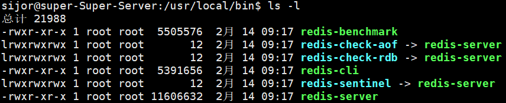

## reference
- [Redis菜鸟教程](https://www.runoob.com/redis/redis-tutorial.html)
- [网友笔记github](https://github.com/Romantic-Lei/Learning-in-practice/tree/master/Redis)
- [bilibili课程](https://www.bilibili.com/video/BV13R4y1v7sP/?vd_source=d13548dcb8cb26f0b71f3b365ede666f)
- [Redis 官网](https://redis.io/)
- [Redis 中文文档](https://www.redis.com.cn/documentation.html)
- [Redis 命令参考](http://doc.redisfans.com/)

- [github 历史版本压缩包下载网站](https://github.com/redis-windows/redis-windows/releases)
- [csdn教程](https://blog.csdn.net/qq_41941900/article/details/138712993?ops_request_misc=%257B%2522request%255Fid%2522%253A%252239f1162daf56b9d7886f28a7f3c95fbe%2522%252C%2522scm%2522%253A%252220140713.130102334..%2522%257D&request_id=39f1162daf56b9d7886f28a7f3c95fbe&biz_id=0&utm_medium=distribute.pc_search_result.none-task-blog-2~all~top_positive~default-2-138712993-null-null.142^v101^pc_search_result_base5&utm_term=Redis%E5%AE%89%E8%A3%85&spm=1018.2226.3001.4187)

## Preliminary

***概念***

- ***Redis (Remote Dictionary Server)***，远程字典服务器
    - 是完全开源，使用ANSIC语言编写遵守BSD协议
    - 是一个高性能的 ***Key-Value数据库***
    - 提供了丰富的数据结构，例如String、Hash、List、Set、SortedSet等等。
    - ***数据是存在内存中的***
    - 同时Redis支持事务、持久化、LUA脚本、发布/订阅、缓存淘汰、流技术等多种功能
    - 提供了主从模式、Redis Sentinel和Redis Cluster集群架构方案

***功能***
如高并发等场景下，MySQL无法很好地支持不平衡的读写需求，如大量查询和少量写入，希望读写分离（催生出了 “主库 增删改” 和 “从库 查”）

MySQL 是关系型数据库，可以保证数据的一致性和持久化存储，采用读写分离的框架来提高性能，但是在高并发读操作的场景下，可能会出现瓶颈。 

Redis 是一个高性能的缓存系统，适用于在高并发读操作的场景下缓存数据，减少数据库的负担。

- ***Redis常见应用场景***：
    - 缓存：常见的数据（如用户信息、商品信息、网页内容等）可以缓存到 Redis 中，减少对 MySQL 数据库的访问，降低数据库的负担。
    - 会话存储：Redis 的高并发支持非常适合存储用户会话（Session）数据。
    - 排行榜/计数器：Redis 提供的数据结构（如 sorted set）特别适合用来实现排行榜、计数器等场景。
    - 发布/订阅机制：Redis 支持发布/订阅功能，可以用于消息队列、事件通知等场景。
    - 队列：由于 Redis 提供了支持原子操作的队列（List 类型），它非常适合用于任务队列的管理。

- ***对比***
    - 硬件：磁盘（MySQL）—— 内存（Redis 更快）
    - 查询：语句（MySQL）—— 主键查询（Redis）
    - 关系：RDBMS（MySQL）—— NoSQL（Redis）


| 问题         | 定义                                                                 | 解决方法                                                       |
| ------------ | -------------------------------------------------------------------- | -------------------------------------------------------------- |
| 缓存穿透     | 请求的数据不存在于缓存中，直接访问数据库，增加数据库压力。         | 缓存空对象、使用布隆过滤器                                     |
| 缓存击穿     | 某个热点数据的缓存失效，多个请求并发访问数据库，增加数据库压力。   | 加锁、互斥访问、延迟双删策略                                   |
| 缓存雪崩     | 缓存中的大量数据同时失效，导致大量请求访问数据库，增加数据库压力。 | 设置不同的缓存过期时间、缓存预热、永不过期策略                |

## 下载与使用

- [Redis 官网](https://redis.io/)
- [Redis 中文文档](https://www.redis.com.cn/documentation.html)
- [Redis 命令参考](http://doc.redisfans.com/)

- [github 历史版本压缩包下载网站](https://github.com/redis-windows/redis-windows/releases)
- [csdn教程](https://blog.csdn.net/qq_41941900/article/details/138712993?ops_request_misc=%257B%2522request%255Fid%2522%253A%252239f1162daf56b9d7886f28a7f3c95fbe%2522%252C%2522scm%2522%253A%252220140713.130102334..%2522%257D&request_id=39f1162daf56b9d7886f28a7f3c95fbe&biz_id=0&utm_medium=distribute.pc_search_result.none-task-blog-2~all~top_positive~default-2-138712993-null-null.142^v101^pc_search_result_base5&utm_term=Redis%E5%AE%89%E8%A3%85&spm=1018.2226.3001.4187)

### Windows安装

1. 因为 redis 是Linux上的软件，所以为了适配Windows，基于Cygwin 和 MSYS2构建，直接下载带有 server 的版本压缩包后直接解压到Redis目录下可以使用

<div style="text-align:center">
    
    <p>redis-version</p>
</div>

2. 在 Redis目录中打开cmd，执行 `redis-server.exe redis.conf` 命令打开redis服务作为服务端，保持运行不关闭（或者注册到Windows服务）
3. 在 Redis目录中打开第二个cmd，执行 `redis-cli.exe -h 127.0.0.1 -p 6379` 命令打开客户端
<div style="text-align:center">
    
    <p>redis-cli</p>
</div>


### Linux安装和卸载
在Linux上安装，需要配置gcc环境、下载Redis的tar包、解压到opt目录、修改和使用conf文件副本

使用需要先启动 redis-server，然后连接 redis-cli


***安装和配置***

1. Linux环境安装Redis必须先具备gcc编译环境， 查看Linux的gcc环境，没有则安装。查看主机CPU尾数确定所需版本
    - `gcc -v`
    - `sudo apt install g++`
    - `getconf LONG_BIT`

2. 网络下载 Redis 归档文件，并拷贝到 /opt 目录中然后解压，后面都需要 sudo权限
    - `wget http://download.redis.io/releases/redis-7.0.0.tar.gz`
    - `sudo cp redis.7.0.0.tar.gz /opt`
    - `sudo tar -xzvf redis.7.0.0.tar.gz`

3. 进入解压的目录中，编译并安装 Redis，Redis会被默认安装在 `/usr/local/bin` 目录中
    - `sudo make && sudo make install`
<div style="text-align:center">
    
    <p>redis解压后目录内容</p>
</div>

<div style="text-align:center">
    
    <p>redis安装内容</p>
</div>

    redis-benchmark:性能测试工具，服务启动后运行该命令，看看自己电脑性能如何
    redis-check-aof:修复有问题的AOF文件，RDB和AOF后续学习
    redis-check-dump:修复有问题的dump.rdb文件
    redis-cli:客户端操作入口
    redis-sentinel:redis集群使用
    reids-server:redis服务器启动命令

4. 准备 conf 配置文件的副本，修改并使用
    - `sudo cp redis.conf /myredis/redis7.conf`
    - `sudo vim /myredis/redis7.conf`
    - `/ + keywords + enter` 在文本中查找关键词配置

```txt
    1. 默认daemonize no 改为 daemonize yes
    2. 默认protected-mode yes 改为 protected-mode no
    3. 默认bind 127.0.0.1 改为 直接注释掉(默认bind 127.0.0.1只能本机访问)或改成本机IP，否则影响远程IP连接
    4. 默认redis密码 改为 requirepass 自己设定的密码
```

***使用和关闭***

1. ***启动和连接服务***。完成配置修改后，启动server服务，连接cli 并使用redis
    - `redis-server /myredis/redis7.conf`
    - `ps -ef | grep redis` 查看运行的server进程
    - `redis-cli -a 123456 -p 6379`

<div style="text-align:center">
    
    <p>启动连接redis</p>
</div>

2. ***退出和关闭redis实例***
    直接在 redis-cli 中输入 `quit` 只是退出，明没有关闭
    - `127.0.0.1 > SHUTDOWN`

    或者命令行关闭
    - `redis-cli -a 123456789 shutdown` 单例关闭
    - `redis-cli -p 6379 shutdown` 多例关闭
    - 搜索进程关闭
        - `ps -ef | grep redis-server` 获取6379端口进程的编号
        - `kill -9 PID-6379`

***卸载***

1. 卸载前需要先关闭 server的服务，然后删除文件目录下所有 redis内容 (/usr/local/bin/redis-*) 
    - `ls -l /usr/local/bin/redis-*`
    - `sudo rm -rf /usr/local/bin/redis-*`

<div style="text-align:center">
    
    <p>卸载redis</p>
</div>

