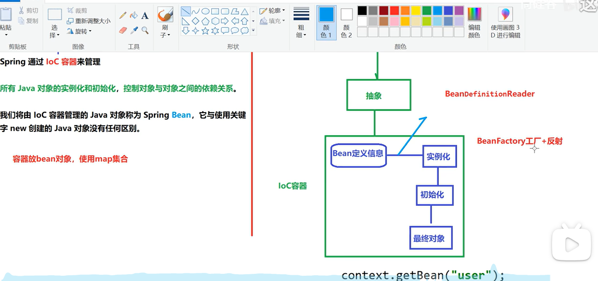

# Spring6
## 入门


如图所示，一个 Spring入门案例，需要熟悉 Maven的相关使用

第三步，`按照Spring要求创建配置文件(xml格式)`，为什么叫做 `bean`？？

### Spring配置文件中的`<bean>`元素介绍

#### 什么是`<bean>` 
`<bean>`是Spring框架配置文件（通常是`applicationContext.xml`或`beans.xml`）中的一个核心元素。它用于定义一个Java对象，这些对象被称为Spring容器中的“Bean”。Bean是Spring框架管理的对象实例，是Spring框架的核心概念之一。

- **Bean的定义**：***在Spring配置文件中，`<bean>`元素通过`class`属性指定一个具体的Java类，Spring容器会根据这个类创建对象实例***。例如：
  ```xml
  <bean id="userService" class="com.example.UserService" />
  ```
  这表示Spring容器会创建`com.example.UserService`类的一个实例，并将其命名为`userService`。

- **Bean的作用域**：`<bean>`元素可以通过`scope`属性定义Bean的作用域。常见的作用域包括：
  - `singleton`（默认值）：Spring容器中只存在一个Bean实例，每次获取都是同一个对象。
  - `prototype`：每次请求都会创建一个新的Bean实例。
  - `request`、`session`、`application`等：这些作用域通常用于Web应用中，分别对应HTTP请求、HTTP会话和全局应用上下文。

#### `<bean>`的作用 
`<bean>`在Spring框架中起着至关重要的作用，主要体现在以下几个方面：

##### （1）对象实例化 
***`<bean>`元素告诉Spring容器如何创建一个对象实例***。

***Spring会根据`class`属性指定的类，通过反射机制调用类的无参构造函数来创建对象***。例如：
```xml
<bean id="userDao" class="com.example.UserDaoImpl" />
```
Spring会创建`UserDaoImpl`类的一个实例，并将其命名为`userDao`。

##### （2）依赖注入（DI） 
***`<bean>`可以通过`property`或`constructor-arg`子元素实现依赖注入。***

***依赖注入是Spring框架的核心功能之一，它允许将Bean之间的依赖关系通过配置文件或注解的方式注入，而不是通过代码硬编码***。例如：
```xml
<bean id="userService" class="com.example.UserService">
    <property name="userDao" ref="userDao" />
</bean>
```
这里，`userService`依赖于`userDao`，Spring会将`userDao`的实例注入到`userService`的`userDao`属性中。

##### （3）生命周期管理 
***Spring通过`<bean>`元素可以管理Bean的生命周期***。Bean的生命周期包括实例化、初始化和销毁等阶段。通过`init-method`和`destroy-method`属性，可以在Bean的生命周期中执行特定的方法。例如：
```xml
<bean id="userService" class="com.example.UserService" init-method="init" destroy-method="destroy" />
```
当Spring容器创建`userService`实例后，会调用`init`方法进行初始化；当Spring容器销毁`userService`实例时，会调用`destroy`方法进行清理。

##### （4）配置信息的集中管理 
***`<bean>`元素将对象的创建和配置信息集中管理在配置文件中，使得代码更加清晰、易于维护***。

开发者可以通过修改配置文件来调整Bean的属性和依赖关系，而无需修改代码。

#### `<bean>`的配置方式 
`<bean>`的配置方式主要有以下几种：

##### （1）通过`property`注入属性
```xml
<bean id="userService" class="com.example.UserService">
    <property name="userDao" ref="userDao" />
    <property name="timeout" value="3000" />
</bean>
```
这里，`userDao`是一个引用类型的属性，通过`ref`指定另一个Bean；`timeout`是一个基本类型的属性，通过`value`指定值。

##### （2）通过`constructor-arg`注入构造参数
```xml
<bean id="userService" class="com.example.UserService">
    <constructor-arg ref="userDao" />
    <constructor-arg value="3000" />
</bean>
```
这种方式通过构造函数注入依赖和属性值。

##### （3）使用`factory-method`创建Bean
如果Bean的实例化需要通过一个工厂方法，可以通过`factory-method`指定。例如：
```xml
<bean id="userService" class="com.example.UserServiceFactory" factory-method="createUserService" />
```
这里，`UserServiceFactory`类的`createUserService`方法将返回一个`UserService`的实例。

#### 总结
`<bean>`是Spring配置文件中的核心元素，它用于定义Spring容器中的Bean对象。通过`<bean>`，Spring可以实现对象的实例化、依赖注入、生命周期管理等功能，使得开发者能够以声明式的方式配置对象之间的关系，从而提高代码的灵活性和可维护性。


## IoC



可以从图中看到
- “抽象” 是指 `BeanDefinitionReader` 接口，其中提供了很多用“读取`xml`配置文件” 的实现类、方法等 
- 配置文件经过“抽象”读取到IoC容器中的 `Bean定义信息`
- 然后通过 “`BeanFactory`工厂方法+反射” 进行类的实例化、初始化并构造对象
- 最后调用 `ApplicationContext.getBean()` 方法来获取Bean类的实例对象

### 依赖注入

```java

/*
    * PS: !!!!!!!!!!!!!!!!!!!!!!!!!!!!!!!!!!
    *       只需要单独定义不同类的内容
    *       类之间的关系，如 A 是 B 的内部类，或外部类，这都是通过 xml 来配置这种关系的
    *   
    *       外部类 配置：
    *           先在<bean id="OuterClass class="...">... 之前配置好外部类，然后其他类的配置中 引用配置即可
    *               <property name="clazz" ref="OuterClass"></property>
    * 
    *       内部类 配置：
    *           直接将所有配置转移到内部：
    *           <property name="clazz">
    *               <bean id="InnerClass", class="com.xxx">
    *                   <property name="..." value="..."></property>
    *                   ...
    *               </bean>
    *           </property>
    * */
```

在Spring框架中，`util`命名空间提供了一组工具性的配置元素，用于简化某些常见的配置任务。这些工具性的配置元素可以帮助你更方便地定义和管理Bean，尤其是在处理集合类型（如`List`、`Map`、`Set`等）和常量时。

#### `util`命名空间作用 

***`util`命名空间的主要作用是提供一些便利的配置方式***，使得Spring的XML配置文件更加简洁和易于维护。它包含以下几种常用的配置元素：

- **`<util:constant>`**：用于引用Java类中的常量。
- **`<util:list>`**：用于定义一个`List`类型的Bean。
- **`<util:set>`**：用于定义一个`Set`类型的Bean。
- **`<util:map>`**：用于定义一个`Map`类型的Bean。
- **`<util:properties>`**：用于定义一个`Properties`类型的Bean。

#### 使用`util`命名空间 

要在Spring的配置文件中使用`util`命名空间，首先需要在`<beans>`标签中声明`util`命名空间。例如：
```xml
<beans xmlns="http://www.springframework.org/schema/beans"
       xmlns:xsi="http://www.w3.org/2001/XMLSchema-instance"
       xmlns:util="http://www.springframework.org/schema/util"
       xsi:schemaLocation="http://www.springframework.org/schema/beans
                           http://www.springframework.org/schema/beans/spring-beans.xsd
                           http://www.springframework.org/schema/util
                           http://www.springframework.org/schema/util/spring-util.xsd">
```

#### 常用`util`配置元素 

##### `<util:constant>` 
用于引用Java类中的常量。例如：
```xml
<util:constant id="maxValue" static-field="java.lang.Integer.MAX_VALUE" />
```
这里，`static-field`属性指定了要引用的常量的全限定名。

##### `<util:list>` 
用于定义一个`List`类型的Bean。例如：
```xml
<util:list id="myList">
    <value>item1</value>
    <value>item2</value>
    <value>item3</value>
</util:list>
```
这里，`<util:list>`定义了一个`List`类型的Bean，其中包含多个值。

##### `<util:set>` 
用于定义一个`Set`类型的Bean。例如：
```xml
<util:set id="mySet">
    <value>item1</value>
    <value>item2</value>
    <value>item3</value>
</util:set>
```
这里，`<util:set>`定义了一个`Set`类型的Bean，其中包含多个值。

##### `<util:map>` 
用于定义一个`Map`类型的Bean。例如：
```xml
<util:map id="myMap">
    <entry key="key1" value="value1" />
    <entry key="key2" value="value2" />
</util:map>
```
这里，`<util:map>`定义了一个`Map`类型的Bean，其中包含多个键值对。

##### `<util:properties>` 
用于定义一个`Properties`类型的Bean。例如：
```xml
<util:properties id="myProperties" location="classpath:my.properties" />
```
这里，`<util:properties>`定义了一个`Properties`类型的Bean，其内容从指定的资源文件中加载。

#### 使用`util`命名空间 

假设你有一个类`MyService`，它需要一个`List`类型的依赖和一个`Properties`类型的依赖：
```java
public class MyService {
    private List<String> items;
    private Properties config;

    public void setItems(List<String> items) {
        this.items = items;
    }

    public void setConfig(Properties config) {
        this.config = config;
    }

    public void doSomething() {
        System.out.println("Items: " + items);
        System.out.println("Config: " + config);
    }
}
```

在Spring的配置文件中，你可以这样配置：
```xml
<beans xmlns="http://www.springframework.org/schema/beans"
       xmlns:xsi="http://www.w3.org/2001/XMLSchema-instance"
       xmlns:util="http://www.springframework.org/schema/util"
       xsi:schemaLocation="http://www.springframework.org/schema/beans
                           http://www.springframework.org/schema/beans/spring-beans.xsd
                           http://www.springframework.org/schema/util
                           http://www.springframework.org/schema/util/spring-util.xsd">

    <util:list id="myList">
        <value>item1</value>
        <value>item2</value>
        <value>item3</value>
    </util:list>

    <util:properties id="myProperties" location="classpath:my.properties" />

    <bean id="myService" class="com.example.MyService">
        <property name="items" ref="myList" />
        <property name="config" ref="myProperties" />
    </bean>
</beans>
```

#### 总结 

- **`util`命名空间**：提供了一组工具性的配置元素，用于简化某些常见的配置任务，如定义集合类型和常量。
- **常用元素**：
  - `<util:constant>`：引用Java类中的常量。
  - `<util:list>`：定义一个`List`类型的Bean。
  - `<util:set>`：定义一个`Set`类型的Bean。
  - `<util:map>`：定义一个`Map`类型的Bean。
  - `<util:properties>`：定义一个`Properties`类型的Bean。
- **使用方法**：在Spring的配置文件中声明`util`命名空间，并使用相应的配置元素。

通过使用`util`命名空间，你可以更方便地定义和管理复杂的Bean依赖关系，使Spring的配置文件更加简洁和易于维护。

# SpringMVC


## 分层概念

你理解得 **基本正确**，我们来逐层详细解释这句“三层架构”的含义，并说明每一层都对应哪些内容。

---

### 三层架构详解

```
⛳ 用户请求 --> 表述层 --> 业务逻辑层 --> 数据访问层 --> 数据库
```

---

#### 表述层（Presentation Layer）

> “表述层表示前台页面和后台 servlet/controller”

##### 主要作用：

* 负责接收用户请求和返回响应。
* 与用户打交道，控制页面跳转或接口响应。

##### 主要包括：

* 前台页面（HTML、JSP、Thymeleaf、Vue 等）
* 后端控制器（SpringMVC 的 `@Controller` 或 `@RestController`）

##### 举例：

```java
@Controller
public class UserController {
    @Autowired
    private UserService userService;

    @GetMapping("/user/list")
    public String list(Model model) {
        model.addAttribute("users", userService.getAllUsers());
        return "userList";  // 返回 userList.html 页面
    }
}
```

---

#### 业务逻辑层（Business Layer）

##### 主要作用：

* 封装核心业务逻辑。
* 协调多个 DAO 的操作，进行业务处理、校验等。
* 提供服务给 controller 调用。

##### 主要包括：

* `@Service` 注解的类
* 核心业务算法和逻辑判断

##### 举例：

```java
@Service
public class UserServiceImpl implements UserService {
    @Autowired
    private UserDao userDao;

    public List<User> getAllUsers() {
        // 可能包含数据过滤、权限判断等业务逻辑
        return userDao.findAll();
    }
}
```

---

#### 数据访问层（Data Access Layer / DAO 层）

##### 主要作用：

* 与数据库直接交互，执行 CRUD（增删改查）操作。
* 将数据库结果转换为 Java 对象。

##### 主要包括：

* DAO 接口和实现类（MyBatis 或 JPA Repository）
* `@Repository` 注解的类

##### 举例（MyBatis）：

```java
@Repository
public class UserDaoImpl implements UserDao {
    @Autowired
    private SqlSession sqlSession;

    public List<User> findAll() {
        return sqlSession.selectList("com.xxx.mapper.UserMapper.findAll");
    }
}
```

---

### 总结：三层架构职责划分

| 层级    | 对应内容                        | 注解            | 职责说明             |
| ----- | --------------------------- | ------------- | ---------------- |
| 表述层   | Controller、JSP/HTML/Vue 页面等 | `@Controller` | 接收请求、返回响应        |
| 业务逻辑层 | Service、ServiceImpl 类       | `@Service`    | 编写业务处理逻辑         |
| 数据访问层 | DAO 接口及其实现，MyBatis Mapper 等 | `@Repository` | 与数据库交互，执行 SQL 语句 |

---

 

